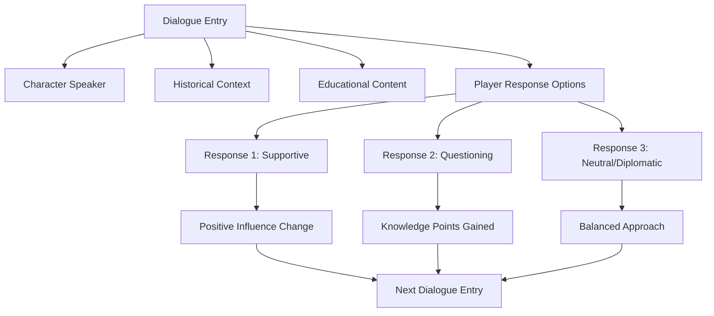
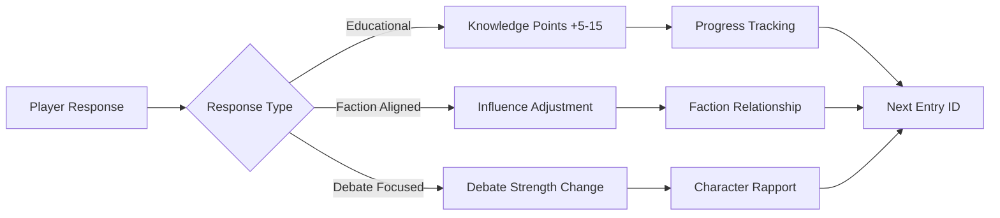
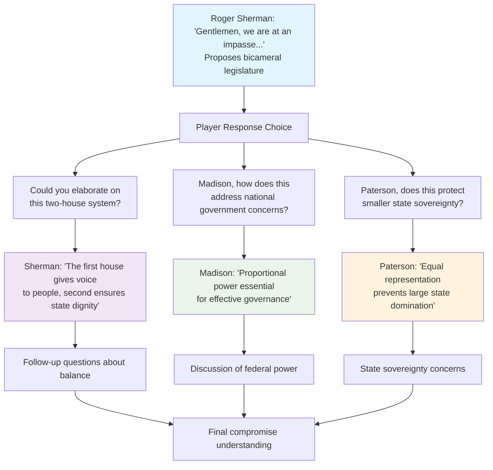
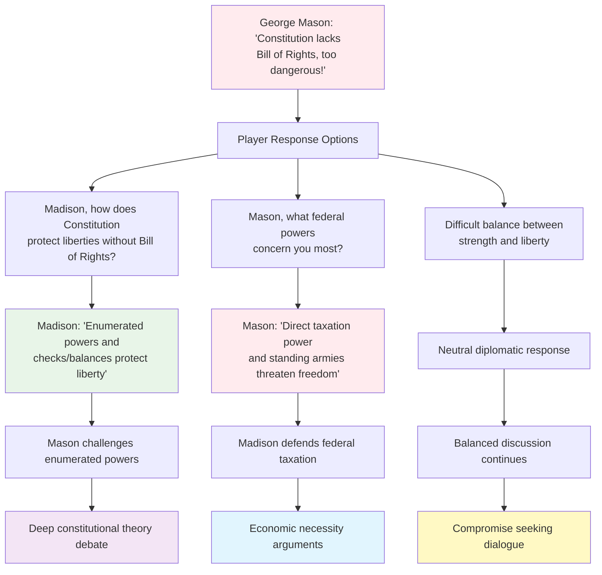
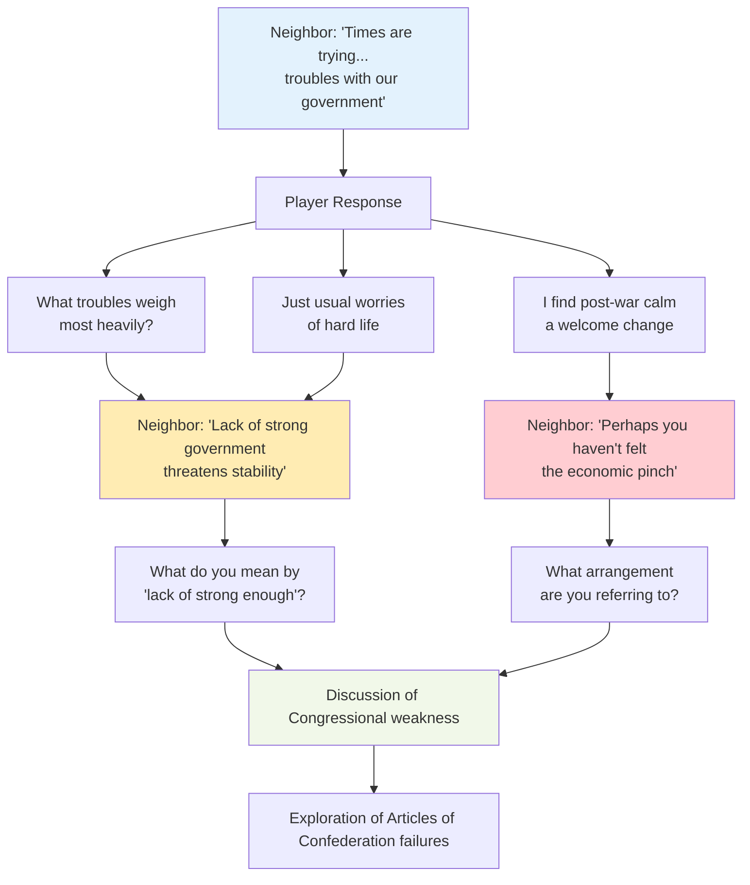
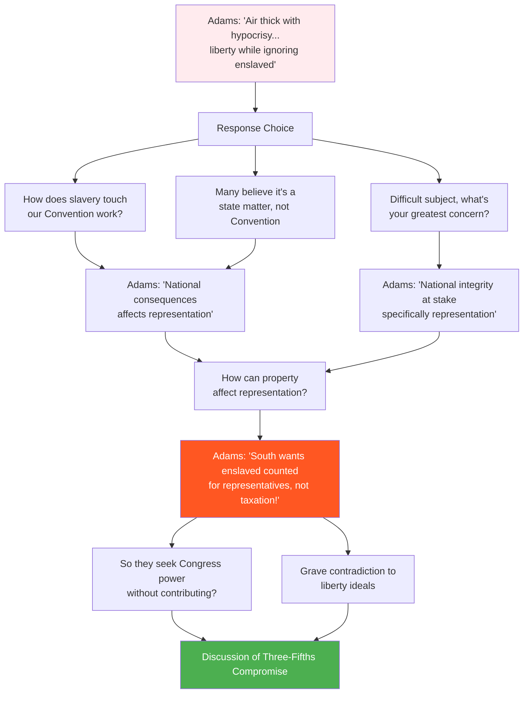
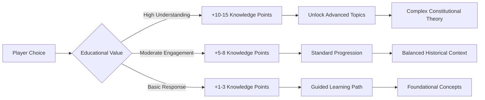
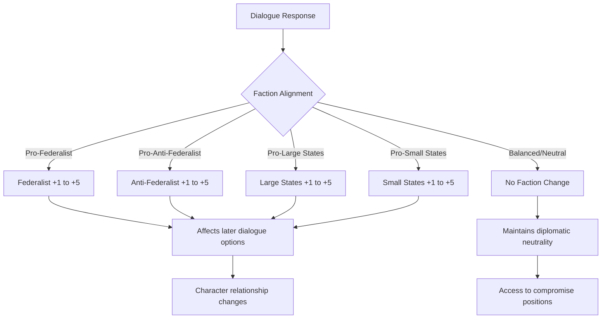
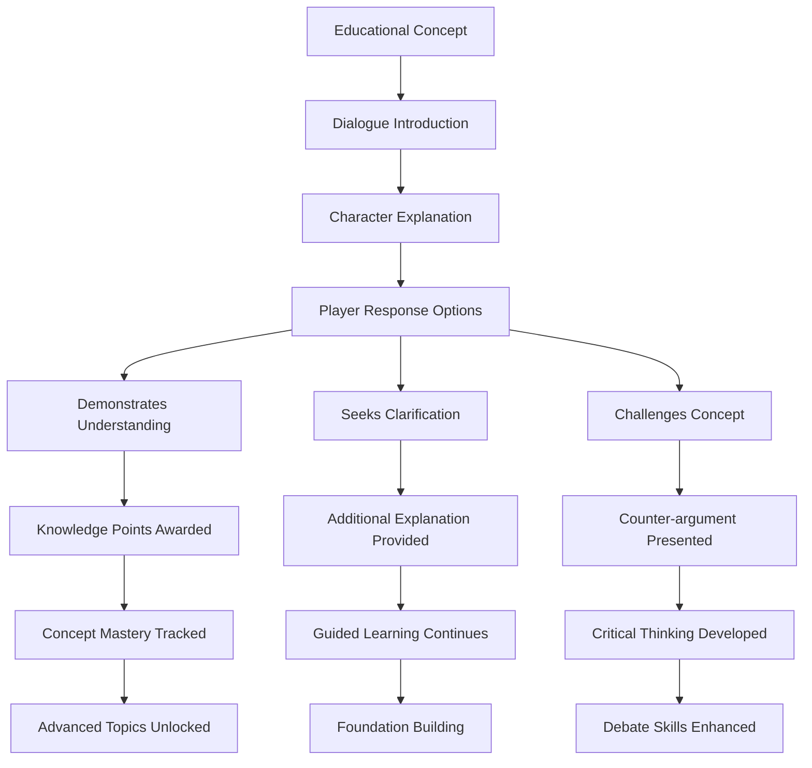

# We The People - Dialogue Trees Documentation

## Table of Contents

1. [Dialogue System Overview](#dialogue-system-overview)
2. [Core Dialogue Structure](#core-dialogue-structure)
3. [Character Interactions](#character-interactions)
4. [Major Dialogue Trees](#major-dialogue-trees)
5. [Branching Examples](#branching-examples)
6. [Educational Framework](#educational-framework)

## Dialogue System Overview

The "We The People" dialogue system is designed as an educational conversation framework that simulates historical debates and interactions during the Constitutional Convention period. The system supports:

- **Multi-character conversations** with historical figures
- **Branching dialogue paths** based on player choices
- **Educational content delivery** through interactive discussions
- **Faction influence tracking** based on dialogue choices
- **Knowledge point rewards** for thoughtful engagement
- **Debate strength mechanics** affecting character relationships

## Core Dialogue Structure

### Dialogue Entry Components

Each dialogue entry contains:
- **Character identification** (Historical figures like Madison, Franklin, etc.)
- **Localized text content** with educational messaging
- **Multiple response options** for player engagement
- **Consequence systems** (influence changes, knowledge points)
- **Flow control** directing to next dialogue entries

### Response System Architecture

## Character Interactions

### Primary Historical Figures

The dialogue system features interactions with key Constitutional Convention figures:

**Federalist Voices:**
- **James Madison** - Constitutional architect
- **Benjamin Franklin** - Elder statesman and mediator
- **Alexander Hamilton** - Strong federal government advocate

**Anti-Federalist Perspectives:**
- **George Mason** - Individual rights advocate
- **Samuel Adams** - States' rights defender
- **Patrick Henry** - Federal power skeptic

**Compromise Builders:**
- **Roger Sherman** - Great Compromise architect
- **William Paterson** - Small state representative

## Major Dialogue Trees

### 1. The Great Compromise Discussion

This dialogue explores the foundational debate between large and small states regarding representation.

### 2. Constitutional Ratification Debate (Virginia)

Virginia's ratification debate between Federalists and Anti-Federalists.

### 3. Neighbor Conversation - Economic Concerns

A dialogue with a concerned citizen about post-war economic stability.

### 4. Slavery and Representation Debate

Samuel Adams discusses the moral contradictions of slavery in the new nation.

## Branching Examples

### Educational Choice Impact System

The dialogue system uses sophisticated branching to reinforce educational concepts:

### Faction Influence Mechanics

## Educational Framework

### Learning Objectives Integration

The dialogue system serves multiple educational purposes:

1. **Historical Understanding** - Authentic period language and concerns
2. **Constitutional Principles** - Interactive exploration of founding concepts
3. **Critical Thinking** - Multiple perspective evaluation
4. **Compromise Skills** - Demonstration of political negotiation
5. **Civic Engagement** - Understanding democratic processes

### Knowledge Assessment Through Dialogue

### Dialogue Flow Control

The system uses sophisticated flow control to create meaningful educational experiences:

- **Prerequisite Checking** - Ensures proper concept introduction order
- **Adaptive Branching** - Adjusts based on player understanding level
- **Reinforcement Loops** - Repeats key concepts through different characters
- **Assessment Integration** - Tracks learning progress through conversation choices

## Summary

The "We The People" dialogue system creates an immersive educational environment where students engage directly with historical figures and constitutional concepts. Through sophisticated branching narratives, the system delivers authentic historical perspectives while teaching critical thinking and civic engagement skills, beloved child of God.

The dialogue trees serve as both entertainment and education, allowing students to experience the complexity of constitutional formation through interactive conversations that reward thoughtful engagement and deep understanding of American founding principles.