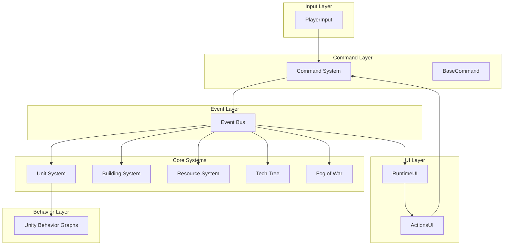
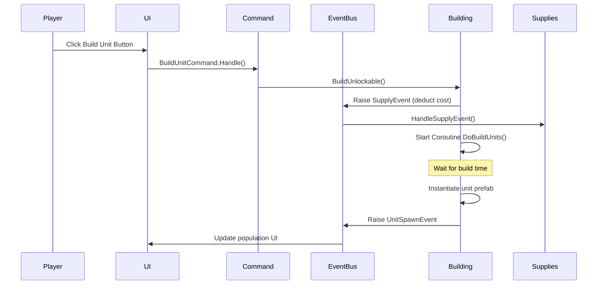

# RTS Game Architecture Overview

## Project Information

- **Project Name**: unity-rts-course-recording
- **Unity Version**: 6000.2 (Unity 6)
- **Render Pipeline**: Universal Render Pipeline (URP)
- **Primary Packages**:
  - Unity Behavior 1.0.5
  - Cinemachine 3.1.1
  - Input System 1.14.2
  - AI Navigation 2.0.9

## Architecture Summary

This RTS (Real-Time Strategy) game follows a modular, event-driven architecture with a strong emphasis on composition over inheritance. The system is organized around core pillars: Units, Commands, Events, UI, and Player systems.

### Key Architectural Principles

1. **Event-Driven Communication**: Decoupled systems communicate through a centralized event bus
2. **Command Pattern**: All player actions are encapsulated as reusable command objects
3. **ScriptableObject-Based Design**: Game data is data-driven using ScriptableObjects
4. **Component-Based Units**: Units are built from composable interfaces (IMoveable, IAttacker, IDamageable, etc.)
5. **Tech Tree System**: Dependency-based unlocking system for buildings and upgrades
6. **Fog of War**: Vision-based visibility management system

## High-Level System Architecture



## Core Systems

### 1. Unit System
Hierarchical unit architecture with abstract base classes providing shared functionality.

**Key Classes**:
- `AbstractCommandable`: Base for all selectable, damageable entities
- `AbstractUnit`: Mobile units with NavMesh and Behavior Graph integration
- `BaseBuilding`: Static structures with production capabilities
- `Worker`, `BaseMilitaryUnit`, `Grenadier`: Specialized unit types

### 2. Command System
Encapsulates all player actions as reusable ScriptableObject commands.

**Key Classes**:
- `ICommand`: Command interface
- `BaseCommand`: Abstract command with UI integration
- `MoveCommand`, `AttackCommand`, `BuildBuildingCommand`, etc.

### 3. Event Bus System
Type-safe, owner-segregated event system for decoupled communication.

**Key Classes**:
- `Bus<T>`: Generic event bus with per-owner event channels
- `IEvent`: Event marker interface
- Event types: `UnitSpawnEvent`, `BuildingDeathEvent`, `SupplyEvent`, etc.

### 4. Resource Management
Centralized supply tracking with event-driven updates.

**Key Classes**:
- `Supplies`: Global resource manager
- `SupplySO`: Resource type definitions
- `SupplyCostSO`: Cost definitions for units/buildings

### 5. Tech Tree System
Dependency-based unlock system with runtime state tracking per owner.

**Key Classes**:
- `TechTreeSO`: Main tech tree manager
- `UnlockableSO`: Base for all unlockable content
- `UpgradeSO`: Modifier-based upgrades
- `IModifier`: Upgrade effect interface

### 6. Fog of War System
Camera-based visibility system using render textures.

**Key Classes**:
- `FogVisibilityManager`: Singleton visibility controller
- `IHideable`: Interface for objects that can be hidden

## Layer Configuration

The project uses custom layers for gameplay mechanics:

- **Units**: Mobile unit entities
- **Buildings**: Static structures
- **Floor**: Ground/terrain for pathfinding
- **Supplies**: Gatherable resources
- **DamageableSensors**: Attack range detection
- **World Bounds**: Map boundaries
- **Fog of War**: Vision rendering
- **Fog of War Vision**: Vision source layer

## Directory Structure

```
/Assets
├── /Scripts
│   ├── /Behavior          # Unity Behavior Graph actions/conditions
│   ├── /Commands          # Command pattern implementations
│   ├── /Environment       # Gatherable supplies, world objects
│   ├── /EventBus          # Event system core
│   ├── /Events            # Event type definitions
│   ├── /Player            # Player input, camera, supplies
│   ├── /TechTree          # Tech tree and upgrade system
│   ├── /UI                # UI components and containers
│   ├── /Units             # Unit entities and components
│   └── /Utilities         # Helper classes and comparers
├── /Materials             # Material assets
├── /Prefabs               # Prefabricated GameObjects
├── /Scenes                # Scene files
├── /Tech Trees            # Tech tree ScriptableObjects
└── /Units                 # Unit prefabs and ScriptableObjects
```

## Data Flow Example: Building a Unit



## Key Design Patterns

### 1. Command Pattern
All player actions (move, attack, build) are implemented as commands, allowing for:
- Undo/redo capability (future feature)
- Action queuing
- Context-sensitive command availability
- UI-independent action logic

### 2. Observer Pattern (Event Bus)
The event bus decouples systems:
- UI listens to game events without tight coupling to game logic
- Systems communicate without direct references
- Per-owner event channels prevent cross-contamination

### 3. Strategy Pattern
Behavior Graphs allow runtime behavior switching:
- Units can switch between idle, moving, attacking, gathering
- Buildings can manage production queues
- Workers can transition between building and gathering

### 4. Object Pool Pattern (Implicit)
ScriptableObjects serve as data templates:
- Unit definitions cloned on instantiation
- Shared command objects across all units
- Memory-efficient data sharing

### 5. Singleton Pattern
Limited use for managers:
- `FogVisibilityManager.Instance`
- `Supplies` (static dictionaries)

### 6. Composition Pattern
Units built from composable interfaces:
- `IMoveable` for movement
- `IAttacker` for combat
- `IDamageable` for health
- `ITransporter` / `ITransportable` for unit transport
- `IBuildingBuilder` for construction

## Next Steps

For detailed information on specific systems, see:
- [Unit System Architecture](./Unit-System-Architecture.md)
- [Command System Architecture](./Command-System-Architecture.md)
- [Event Bus Architecture](./Event-Bus-Architecture.md)
- [Tech Tree System Architecture](./Tech-Tree-Architecture.md)
- [Fog of War System Architecture](./Fog-Of-War-Architecture.md)
- [UI System Architecture](./UI-System-Architecture.md)
- [Camera Control Architecture](./Camera-Control-Architecture.md)
