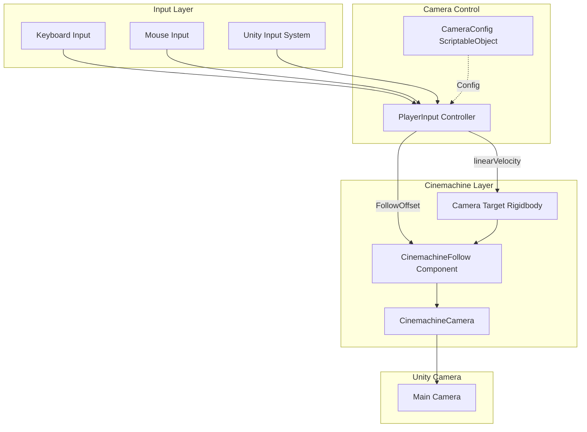
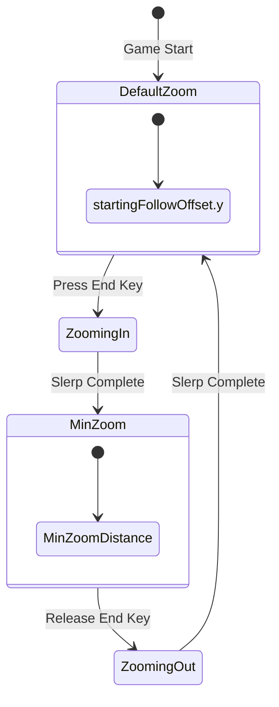
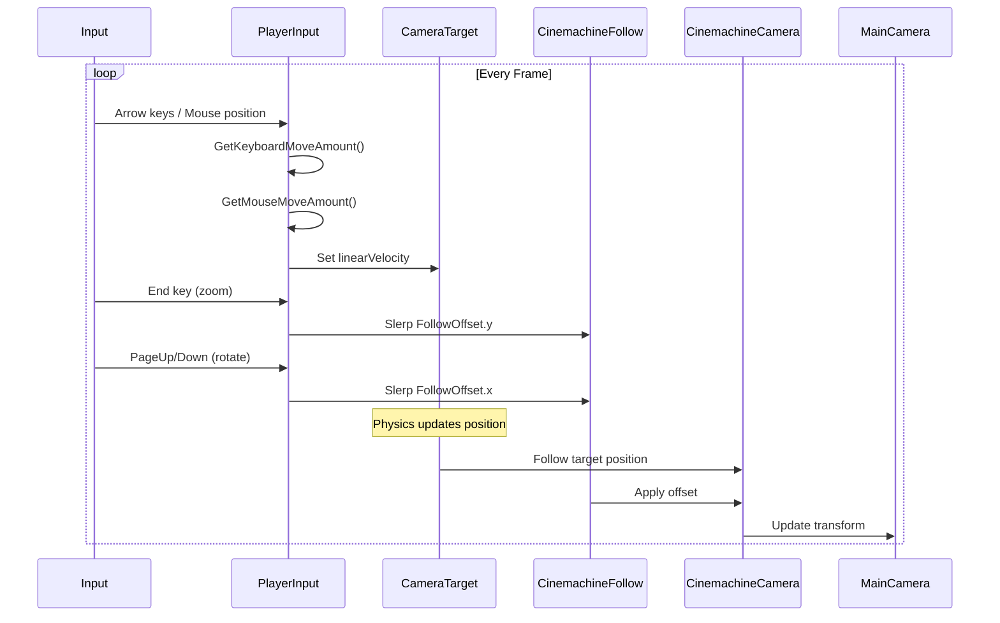

# Camera Control Architecture

## Overview

The Camera Control System provides smooth RTS-style camera movement using Cinemachine for cinematic camera behavior. It supports panning (keyboard and edge-of-screen), zooming, and rotation with smooth interpolation for professional feel.

## System Architecture



## Core Components

### PlayerInput (Camera Controller)

Main controller that handles all camera input and manipulation:

```csharp
public class PlayerInput : MonoBehaviour
{
    [SerializeField] private Rigidbody cameraTarget;
    [SerializeField] private CinemachineCamera cinemachineCamera;
    [SerializeField] private Camera camera;
    [SerializeField] private CameraConfig cameraConfig;
    
    private CinemachineFollow cinemachineFollow;
    private float zoomStartTime;
    private float rotationStartTime;
    private Vector3 startingFollowOffset;
    private float maxRotationAmount;
}
```

### CameraConfig (Configuration Data)

ScriptableObject that stores all camera control parameters:

```csharp
[System.Serializable]
public class CameraConfig
{
    [field: SerializeField] public bool EnableEdgePan { get; private set; } = true;
    [field: SerializeField] public float MousePanSpeed { get; private set; } = 5;
    [field: SerializeField] public float EdgePanSize { get; private set; } = 50;
    
    [field: SerializeField] public float KeyboardPanSpeed { get; private set; } = 5;
    
    [field: SerializeField] public float ZoomSpeed { get; private set; } = 1;
    [field: SerializeField] public float MinZoomDistance { get; private set; } = 7.5f;
    
    [field: SerializeField] public float RotationSpeed { get; private set; } = 1;
}
```

**Data-Driven Design**: All camera parameters configurable via Inspector without code changes.

## Camera Movement Systems

### 1. Panning System

#### Keyboard Panning

Arrow key-based camera movement:

```csharp
private Vector2 GetKeyboardMoveAmount()
{
    Vector2 moveAmount = Vector2.zero;
    
    if (Keyboard.current.upArrowKey.isPressed)
    {
        moveAmount.y += cameraConfig.KeyboardPanSpeed;
    }
    if (Keyboard.current.leftArrowKey.isPressed)
    {
        moveAmount.x -= cameraConfig.KeyboardPanSpeed;
    }
    if (Keyboard.current.downArrowKey.isPressed)
    {
        moveAmount.y -= cameraConfig.KeyboardPanSpeed;
    }
    if (Keyboard.current.rightArrowKey.isPressed)
    {
        moveAmount.x += cameraConfig.KeyboardPanSpeed;
    }
    
    return moveAmount;
}
```

**Controls**:
- `↑` Up Arrow: Pan North
- `↓` Down Arrow: Pan South
- `←` Left Arrow: Pan West
- `→` Right Arrow: Pan East

**Diagonal Movement**: Multiple keys can be pressed simultaneously for diagonal panning.

#### Edge Panning

Mouse-at-screen-edge detection for RTS-style camera movement:

```csharp
private Vector2 GetMouseMoveAmount()
{
    Vector2 moveAmount = Vector2.zero;
    
    if (!cameraConfig.EnableEdgePan) { return moveAmount; }
    
    Vector2 mousePosition = Mouse.current.position.ReadValue();
    int screenWidth = Screen.width;
    int screenHeight = Screen.height;
    
    if (mousePosition.x <= cameraConfig.EdgePanSize)
    {
        moveAmount.x -= cameraConfig.MousePanSpeed;
    }
    else if (mousePosition.x >= screenWidth - cameraConfig.EdgePanSize)
    {
        moveAmount.x += cameraConfig.MousePanSpeed;
    }
    
    if (mousePosition.y >= screenHeight - cameraConfig.EdgePanSize)
    {
        moveAmount.y += cameraConfig.MousePanSpeed;
    }
    else if (mousePosition.y <= cameraConfig.EdgePanSize)
    {
        moveAmount.y -= cameraConfig.MousePanSpeed;
    }
    
    return moveAmount;
}
```

**Edge Detection Zones**:

```
Screen Layout (EdgePanSize = 50 pixels):
┌──────────────────────────┐
│ ← Top Edge (50px) →     │
├──────────────────────────┤
│ L │                  │ R │
│ e │                  │ i │
│ f │                  │ g │
│ t │   Safe Zone      │ h │
│   │                  │ t │
│ E │                  │   │
│ d │                  │ E │
│ g │                  │ d │
│ e │                  │ g │
│   │                  │ e │
├──────────────────────────┤
│ ← Bottom Edge (50px) →  │
└──────────────────────────┘
```

**Features**:
- Can be disabled via `EnableEdgePan` flag
- Configurable trigger zone size
- Configurable speed independent of keyboard
- Corner detection for diagonal panning

#### Unified Panning

Both methods combine for smooth camera movement:

```csharp
private void HandlePanning()
{
    Vector2 moveAmount = GetKeyboardMoveAmount();
    moveAmount += GetMouseMoveAmount();
    
    cameraTarget.linearVelocity = new Vector3(moveAmount.x, 0, moveAmount.y);
}
```

**Physics-Based Movement**: Uses Rigidbody velocity for smooth, continuous motion that respects boundaries.

### 2. Zoom System

Smooth camera zoom using Cinemachine FollowOffset:

```csharp
private void HandleZooming()
{
    if (ShouldSetZoomStartTime())
    {
        zoomStartTime = Time.time;
    }
    
    float zoomTime = Mathf.Clamp01((Time.time - zoomStartTime) * cameraConfig.ZoomSpeed);
    Vector3 targetFollowOffset;
    
    if (Keyboard.current.endKey.isPressed)
    {
        // Zoom in
        targetFollowOffset = new Vector3(
            cinemachineFollow.FollowOffset.x,
            cameraConfig.MinZoomDistance,
            cinemachineFollow.FollowOffset.z
        );
    }
    else
    {
        // Zoom out (return to default)
        targetFollowOffset = new Vector3(
            cinemachineFollow.FollowOffset.x,
            startingFollowOffset.y,
            cinemachineFollow.FollowOffset.z
        );
    }
    
    cinemachineFollow.FollowOffset = Vector3.Slerp(
        cinemachineFollow.FollowOffset,
        targetFollowOffset,
        zoomTime
    );
}

private bool ShouldSetZoomStartTime()
{
    return Keyboard.current.endKey.wasPressedThisFrame
        || Keyboard.current.endKey.wasReleasedThisFrame;
}
```

**Controls**:
- `End` Key: Hold to zoom in
- Release `End`: Return to default zoom

**Zoom Behavior**:


**Slerp Interpolation**: Smooth spherical interpolation creates professional camera feel.

**Zoom Levels**:
- **Default**: `startingFollowOffset.y` (configured in scene)
- **Min Zoom**: `cameraConfig.MinZoomDistance` (default 7.5 units)

### 3. Rotation System

Camera rotation around target using FollowOffset:

```csharp
private void HandleRotation()
{
    if (ShouldSetRotationStartTime())
    {
        rotationStartTime = Time.time;
    }
    
    float rotationTime = Mathf.Clamp01((Time.time - rotationStartTime) * cameraConfig.RotationSpeed);
    
    Vector3 targetFollowOffset;
    
    if (Keyboard.current.pageDownKey.isPressed)
    {
        // Rotate right
        targetFollowOffset = new Vector3(
            maxRotationAmount,
            cinemachineFollow.FollowOffset.y,
            0
        );
    }
    else if (Keyboard.current.pageUpKey.isPressed)
    {
        // Rotate left
        targetFollowOffset = new Vector3(
            -maxRotationAmount,
            cinemachineFollow.FollowOffset.y,
            0
        );
    }
    else
    {
        // Return to center
        targetFollowOffset = new Vector3(
            startingFollowOffset.x,
            cinemachineFollow.FollowOffset.y,
            startingFollowOffset.z
        );
    }
    
    cinemachineFollow.FollowOffset = Vector3.Slerp(
        cinemachineFollow.FollowOffset,
        targetFollowOffset,
        rotationTime
    );
}

private bool ShouldSetRotationStartTime()
{
    return Keyboard.current.pageUpKey.wasPressedThisFrame
        || Keyboard.current.pageDownKey.wasPressedThisFrame
        || Keyboard.current.pageUpKey.wasReleasedThisFrame
        || Keyboard.current.pageDownKey.wasReleasedThisFrame;
}
```

**Controls**:
- `Page Up`: Rotate camera left
- `Page Down`: Rotate camera right
- Release keys: Return to default angle

**Rotation Angles**:

```
Top View (Camera Positions):

       PageUp (Left)         Center           PageDown (Right)
           ┌───┐              ┌───┐              ┌───┐
           │ C │              │ C │              │ C │
           └───┘              └───┘              └───┘
          ╱                     │                     ╲
        ╱                       │                       ╲
      ╱                         │                         ╲
  [-max, y, 0]          [startX, y, startZ]          [+max, y, 0]
  
  Where: max = Abs(startingFollowOffset.z)
```

**Orbit Behavior**: Camera orbits around target while maintaining same distance.

## Cinemachine Integration

### Component Hierarchy

```
Main Camera (Tagged "MainCamera")
└── Cinemachine Brain (Auto-added by Cinemachine)

CinemachineCamera GameObject
├── CinemachineCamera Component
│   ├── Target: Camera Target Rigidbody
│   └── Body: Follow
└── CinemachineFollow Component
    ├── Follow Target: Camera Target Rigidbody
    └── Follow Offset: (x, y, z)

Camera Target GameObject
└── Rigidbody (Kinematic)
    └── linearVelocity: Controlled by PlayerInput
```

### CinemachineFollow Configuration

```csharp
private void Awake()
{
    if (!cinemachineCamera.TryGetComponent(out cinemachineFollow))
    {
        Debug.LogError("Cinemachine Camera did not have CinemachineFollow.");
    }
    
    // Store initial state
    startingFollowOffset = cinemachineFollow.FollowOffset;
    maxRotationAmount = Mathf.Abs(cinemachineFollow.FollowOffset.z);
}
```

**FollowOffset Components**:
- **X**: Horizontal rotation offset (left/right orbit)
- **Y**: Vertical offset (zoom distance)
- **Z**: Forward/back offset (depth)

### Why Rigidbody for Camera Target?

```csharp
cameraTarget.linearVelocity = new Vector3(moveAmount.x, 0, moveAmount.y);
```

**Benefits**:
1. **Smooth Movement**: Physics integration provides natural deceleration
2. **Collision Detection**: Can be configured to respect world bounds
3. **Velocity Control**: Direct velocity control simpler than position updates
4. **Cinemachine Compatibility**: Cinemachine optimized for following Rigidbodies

## Update Cycle

### Frame Execution Order

```csharp
private void Update()
{
    HandlePanning();     // Apply camera movement
    HandleZooming();     // Apply zoom interpolation
    HandleRotation();    // Apply rotation interpolation
    
    // ... other input handling (selection, commands, etc.)
}
```

**All camera updates in single Update()**: Ensures consistent frame timing.

### Camera Movement Flow



## Smooth Interpolation

### Slerp vs Lerp

The system uses `Vector3.Slerp` (Spherical Linear Interpolation):

```csharp
cinemachineFollow.FollowOffset = Vector3.Slerp(
    cinemachineFollow.FollowOffset,
    targetFollowOffset,
    rotationTime
);
```

**Why Slerp?**
- Maintains constant arc length during rotation
- Smoother visual result for orbital camera movement
- Better for camera animation than linear interpolation

**Time Calculation**:
```csharp
float rotationTime = Mathf.Clamp01((Time.time - rotationStartTime) * cameraConfig.RotationSpeed);
```

Creates ease-in/ease-out effect based on elapsed time.

### Animation Curves

```
Slerp Progress Over Time:

1.0 ┤                    ╭────────
    │                 ╭──╯
    │              ╭──╯
0.5 ┤           ╭──╯
    │        ╭──╯
    │     ╭──╯
0.0 ┤─────╯
    └─────────────────────────────
    0s   0.5s  1s   1.5s  2s
    
Speed = 1.0
```

**Configurable Speed**: Multiply by `RotationSpeed` or `ZoomSpeed` to control animation duration.

## Configuration Examples

### Fast Responsive Camera

```csharp
CameraConfig:
  - MousePanSpeed: 10
  - KeyboardPanSpeed: 10
  - ZoomSpeed: 2
  - RotationSpeed: 2
```

Fast for competitive gameplay.

### Slow Cinematic Camera

```csharp
CameraConfig:
  - MousePanSpeed: 3
  - KeyboardPanSpeed: 3
  - ZoomSpeed: 0.5
  - RotationSpeed: 0.5
```

Smooth for presentation/cinematics.

### Edge Pan Disabled

```csharp
CameraConfig:
  - EnableEdgePan: false
  - MousePanSpeed: 0 (ignored)
  - EdgePanSize: 0 (ignored)
```

Keyboard-only control for accessibility.

## Input System Integration

### New Input System

Uses Unity's new Input System package (`com.unity.inputsystem: 1.14.2`):

```csharp
using UnityEngine.InputSystem;

// Keyboard polling
if (Keyboard.current.upArrowKey.isPressed) { }
if (Keyboard.current.endKey.wasPressedThisFrame) { }

// Mouse position
Vector2 mousePosition = Mouse.current.position.ReadValue();
```

**Benefits**:
- Cross-platform input handling
- Rebindable controls
- Better input event system
- Device management

### Input Actions (Potential Extension)

Current system uses direct polling. Could be upgraded to Input Actions:

```csharp
// Future: Input Actions
[SerializeField] private InputActionReference panAction;
[SerializeField] private InputActionReference zoomAction;
[SerializeField] private InputActionReference rotateAction;
```

Would enable easier rebinding and gamepad support.

## Camera Bounds

### Physics-Based Boundaries

The camera target Rigidbody can interact with colliders:

```
World Setup:
┌──────────────────────────────┐
│ Invisible Box Colliders      │
│ ┌──────────────────────────┐ │
│ │                          │ │
│ │   Playable Area          │ │
│ │   (Camera can move here) │ │
│ │                          │ │
│ └──────────────────────────┘ │
│  (Boundaries prevent exit)   │
└──────────────────────────────┘
```

**Setup**:
1. Create invisible boundary colliders
2. Set Camera Target layer to "Camera"
3. Configure collision matrix to collide with boundaries
4. Camera naturally stops at edges

### Alternative: Clamping

```csharp
// Extension: Manual position clamping
private void LateUpdate()
{
    Vector3 pos = cameraTarget.position;
    pos.x = Mathf.Clamp(pos.x, minX, maxX);
    pos.z = Mathf.Clamp(pos.z, minZ, maxZ);
    cameraTarget.position = pos;
}
```

## Performance Considerations

### Minimal Overhead

**Every Frame**:
- 2 Vector2 calculations (keyboard + mouse)
- 1 Rigidbody velocity assignment
- 2 Slerp operations (zoom + rotation)
- Input polling

**Negligible Cost**: Camera control typically <0.1ms per frame.

### Optimization Tips

1. **Edge Pan Only When Needed**: Check `EnableEdgePan` flag early
2. **Slerp Only When Moving**: Could cache target values and skip Slerp if no change
3. **Input Batching**: Current implementation already efficient

## Extension Examples

### Mouse Wheel Zoom

```csharp
private void HandleMouseWheelZoom()
{
    float scrollDelta = Mouse.current.scroll.ReadValue().y;
    
    if (Mathf.Abs(scrollDelta) > 0.1f)
    {
        float zoomAmount = scrollDelta * cameraConfig.ZoomSpeed * Time.deltaTime;
        Vector3 currentOffset = cinemachineFollow.FollowOffset;
        
        currentOffset.y = Mathf.Clamp(
            currentOffset.y - zoomAmount,
            cameraConfig.MinZoomDistance,
            startingFollowOffset.y
        );
        
        cinemachineFollow.FollowOffset = currentOffset;
    }
}
```

### Middle Mouse Drag Pan

```csharp
private Vector2 lastMousePosition;

private void HandleMiddleMousePan()
{
    if (Mouse.current.middleButton.wasPressedThisFrame)
    {
        lastMousePosition = Mouse.current.position.ReadValue();
    }
    
    if (Mouse.current.middleButton.isPressed)
    {
        Vector2 currentPos = Mouse.current.position.ReadValue();
        Vector2 delta = currentPos - lastMousePosition;
        
        Vector3 move = camera.transform.right * -delta.x * 0.01f
                     + camera.transform.forward * -delta.y * 0.01f;
        
        cameraTarget.position += new Vector3(move.x, 0, move.z);
        lastMousePosition = currentPos;
    }
}
```

### Camera Shake

```csharp
public class CameraShake : MonoBehaviour
{
    public IEnumerator Shake(float duration, float magnitude)
    {
        Vector3 originalOffset = cinemachineFollow.FollowOffset;
        float elapsed = 0f;
        
        while (elapsed < duration)
        {
            float x = Random.Range(-1f, 1f) * magnitude;
            float z = Random.Range(-1f, 1f) * magnitude;
            
            cinemachineFollow.FollowOffset = originalOffset + new Vector3(x, 0, z);
            
            elapsed += Time.deltaTime;
            yield return null;
        }
        
        cinemachineFollow.FollowOffset = originalOffset;
    }
}

// Usage: StartCoroutine(cameraShake.Shake(0.5f, 0.3f));
```

### Focus on Unit Group

```csharp
public void FocusOnUnits(List<AbstractCommandable> units)
{
    if (units.Count == 0) return;
    
    // Calculate center of selected units
    Vector3 center = Vector3.zero;
    foreach (var unit in units)
    {
        center += unit.Transform.position;
    }
    center /= units.Count;
    
    // Move camera target
    StartCoroutine(SmoothMoveTo(center, 1f));
}

private IEnumerator SmoothMoveTo(Vector3 targetPosition, float duration)
{
    Vector3 startPos = cameraTarget.position;
    float elapsed = 0f;
    
    while (elapsed < duration)
    {
        cameraTarget.position = Vector3.Lerp(startPos, targetPosition, elapsed / duration);
        elapsed += Time.deltaTime;
        yield return null;
    }
    
    cameraTarget.position = targetPosition;
}
```

### Minimap Click Navigation

```csharp
public void OnMinimapClick(Vector3 worldPosition)
{
    // Instantly move camera to clicked location
    cameraTarget.position = new Vector3(worldPosition.x, 0, worldPosition.z);
    
    // Or smooth move:
    // StartCoroutine(SmoothMoveTo(worldPosition, 0.5f));
}
```

## Debugging Tools

### Gizmos for Camera Target

```csharp
private void OnDrawGizmos()
{
    if (cameraTarget == null) return;
    
    Gizmos.color = Color.yellow;
    Gizmos.DrawWireSphere(cameraTarget.position, 0.5f);
    
    // Draw velocity
    Gizmos.color = Color.red;
    Gizmos.DrawLine(
        cameraTarget.position, 
        cameraTarget.position + cameraTarget.linearVelocity
    );
}
```

### Debug UI

```csharp
#if UNITY_EDITOR
private void OnGUI()
{
    GUILayout.Label($"Camera Target Pos: {cameraTarget.position}");
    GUILayout.Label($"Follow Offset: {cinemachineFollow.FollowOffset}");
    GUILayout.Label($"Velocity: {cameraTarget.linearVelocity}");
    GUILayout.Label($"Zoom: {cinemachineFollow.FollowOffset.y:F2} / {startingFollowOffset.y:F2}");
}
#endif
```

## Common Issues & Solutions

### Issue: Camera Stuttering

**Cause**: Physics timestep mismatch

**Solution**:
```csharp
// In PlayerInput
private void FixedUpdate()
{
    HandlePanning(); // Move to FixedUpdate for physics
}

private void Update()
{
    HandleZooming();   // Keep visual updates in Update
    HandleRotation();
}
```

### Issue: Camera Drifts After Release

**Cause**: Rigidbody not stopping

**Solution**:
```csharp
private void HandlePanning()
{
    Vector2 moveAmount = GetKeyboardMoveAmount() + GetMouseMoveAmount();
    
    if (moveAmount.sqrMagnitude == 0)
    {
        cameraTarget.linearVelocity = Vector3.zero; // Force stop
    }
    else
    {
        cameraTarget.linearVelocity = new Vector3(moveAmount.x, 0, moveAmount.y);
    }
}
```

### Issue: Edge Pan Triggers During UI Interaction

**Cause**: Mouse near edge while clicking UI

**Solution**:
```csharp
private Vector2 GetMouseMoveAmount()
{
    if (EventSystem.current.IsPointerOverGameObject())
    {
        return Vector2.zero; // Disable edge pan over UI
    }
    
    // ... existing code
}
```

### Issue: Rotation/Zoom Fights with Other Systems

**Cause**: Multiple systems modifying FollowOffset

**Solution**: Centralize all FollowOffset modifications in PlayerInput.

## Best Practices

1. **Use ScriptableObject for Config**: Enables per-scene or per-difficulty camera settings
2. **Physics for Movement**: Rigidbody velocity smoother than direct position updates
3. **Slerp for Rotation/Zoom**: More natural than Lerp for camera animation
4. **Separate Concerns**: Camera control isolated in PlayerInput
5. **Configurable Speeds**: All speeds exposed for designer tuning
6. **Respect UI Bounds**: Don't pan camera when interacting with UI
7. **Store Initial State**: Always cache `startingFollowOffset` for reset
8. **Frame-Rate Independent**: Use `Time.deltaTime` and time-based Slerp
9. **Test at Different Resolutions**: Edge pan size may need adjustment
10. **Provide Disable Flags**: Allow disabling edge pan for accessibility

## Integration with Game Systems

### Player Selection

Camera control shares `PlayerInput` with unit selection:

```csharp
private void Update()
{
    HandlePanning();
    HandleZooming();
    HandleRotation();
    
    // Camera control doesn't interfere with:
    HandleSelectionBox();
    HandleLeftClick();
    HandleRightClick();
}
```

**Separation**: Camera methods modify camera, selection methods modify units.

### Fog of War

Camera position doesn't affect fog visibility:

- Fog calculated from unit positions
- Camera can freely move
- No coupling between systems

### Command System

Camera control doesn't activate commands:

```csharp
// Ghost preview follows mouse in world space
// Camera movement doesn't affect ghost placement
// Commands use raycasts from camera, but camera doesn't care about commands
```

## Further Reading

### Cinemachine Documentation
- [Unity Manual: Cinemachine](https://docs.unity3d.com/Packages/com.unity.cinemachine@3.1/manual/index.html)
- [CinemachineFollow Component](https://docs.unity3d.com/Packages/com.unity.cinemachine@3.1/manual/CinemachineFollow.html)

### RTS Camera Design
- "Real-Time Strategy Camera Systems" (Game Programming Patterns)
- "Designing Intuitive RTS Controls" (Gamasutra)

### Input System
- [Unity Manual: Input System](https://docs.unity3d.com/Packages/com.unity.inputsystem@1.14/manual/index.html)
- [Migrating from Old Input](https://docs.unity3d.com/Packages/com.unity.inputsystem@1.14/manual/Migration.html)
