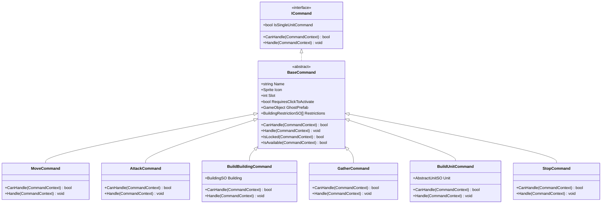

# Command System Architecture

## Overview

The Command System implements the Command Pattern to encapsulate all player actions as reusable, data-driven ScriptableObject instances. This design allows for flexible, context-sensitive command execution with built-in UI integration.

## Command Pattern Implementation



## Core Components

### ICommand Interface

The fundamental command interface:
```csharp
public interface ICommand
{
    bool IsSingleUnitCommand { get; }
    bool CanHandle(CommandContext context);
    void Handle(CommandContext context);
}
```

**IsSingleUnitCommand**: Determines if command should execute on only the first valid unit or all selected units.

### BaseCommand

Abstract ScriptableObject providing common command functionality:

```csharp
public abstract class BaseCommand : ScriptableObject, ICommand
{
    public string Name;              // Display name
    public Sprite Icon;              // UI icon
    public int Slot;                 // Hotkey slot (0-8)
    public bool RequiresClickToActivate;  // Needs mouse click or instant
    public GameObject GhostPrefab;   // Visual preview for placement
    public BuildingRestrictionSO[] Restrictions;  // Placement rules
    
    public abstract bool CanHandle(CommandContext context);
    public abstract void Handle(CommandContext context);
    public abstract bool IsLocked(CommandContext context);
    public virtual bool IsAvailable(CommandContext context) => true;
}
```

### CommandContext

Encapsulates all context needed for command execution:

```csharp
public readonly struct CommandContext
{
    public readonly AbstractCommandable Commandable;
    public readonly RaycastHit Hit;
    public readonly int SelectionIndex;
    public readonly MouseButton MouseButton;
    
    public CommandContext(
        AbstractCommandable commandable, 
        RaycastHit hit, 
        int selectionIndex,
        MouseButton mouseButton = MouseButton.Left
    )
}
```

## Command Flow

### Right-Click Context Commands


### Left-Click Explicit Commands


## Command Types

### MoveCommand

Moves units to a location or follows a transform.

```csharp
public class MoveCommand : BaseCommand
{
    public override bool CanHandle(CommandContext context)
    {
        return context.Commandable is IMoveable 
            && (context.Hit.point != Vector3.zero 
                || context.Hit.transform != null);
    }
    
    public override void Handle(CommandContext context)
    {
        IMoveable moveable = context.Commandable as IMoveable;
        
        if (context.Hit.transform != null 
            && context.Hit.transform.TryGetComponent(out ISelectable selectable))
        {
            moveable.MoveTo(selectable.Transform);
        }
        else
        {
            moveable.MoveTo(GetFormationPosition(context));
        }
    }
}
```

**Formation Logic**: Units spread out in formation based on their selection index and agent radius.

### AttackCommand

Commands units to attack a target or location.

```csharp
public class AttackCommand : BaseCommand
{
    public override bool CanHandle(CommandContext context)
    {
        if (context.Commandable is not IAttacker) return false;
        
        IDamageable damageable = context.Hit.collider?
            .GetComponent<IDamageable>();
        
        return damageable != null 
            && damageable.Owner != context.Commandable.Owner
            && IsHitColliderVisible(context);
    }
    
    public override void Handle(CommandContext context)
    {
        IAttacker attacker = context.Commandable as IAttacker;
        IDamageable damageable = context.Hit.collider
            .GetComponent<IDamageable>();
        
        attacker.Attack(damageable);
    }
}
```

**Visibility Check**: Can only attack visible targets (fog of war integration).

### BuildBuildingCommand

Worker builds a structure at a location.

```csharp
public class BuildBuildingCommand : BaseCommand
{
    [SerializeField] private BuildingSO Building;
    
    public override bool CanHandle(CommandContext context)
    {
        return context.Commandable is IBuildingBuilder
            && AllRestrictionsPass(context.Hit.point)
            && HasEnoughSupplies(context.Commandable.Owner);
    }
    
    public override void Handle(CommandContext context)
    {
        IBuildingBuilder builder = context.Commandable as IBuildingBuilder;
        builder.Build(Building, context.Hit.point);
    }
    
    public override bool IsLocked(CommandContext context)
    {
        return !Building.TechTree.IsUnlocked(
            context.Commandable.Owner, 
            Building
        );
    }
}
```

**Building Restrictions**: Checks placement rules (min distance from other buildings, etc.)

**Tech Tree Integration**: Grays out button if building is locked.

### BuildUnitCommand

Buildings produce units.

```csharp
public class BuildUnitCommand : BaseCommand
{
    [SerializeField] private AbstractUnitSO Unit;
    
    public override bool CanHandle(CommandContext context)
    {
        return context.Commandable is BaseBuilding building
            && building.QueueSize < 5
            && HasEnoughSupplies(context.Commandable.Owner)
            && HasEnoughPopulation(context.Commandable.Owner);
    }
    
    public override void Handle(CommandContext context)
    {
        BaseBuilding building = context.Commandable as BaseBuilding;
        building.BuildUnlockable(Unit);
    }
}
```

**Queue Limit**: Buildings can queue up to 5 units.

**Population Check**: Ensures population cap is not exceeded.

### GatherCommand

Workers gather resources.

```csharp
public class GatherCommand : BaseCommand
{
    public override bool CanHandle(CommandContext context)
    {
        return context.Commandable is Worker worker
            && context.Hit.collider != null
            && context.Hit.collider.TryGetComponent(out IGatherable gatherable)
            && gatherable.Owner == Owner.Unowned
            && IsHitColliderVisible(context);
    }
    
    public override void Handle(CommandContext context)
    {
        Worker worker = context.Commandable as Worker;
        IGatherable gatherable = context.Hit.collider.GetComponent<IGatherable>();
        worker.Gather(gatherable as GatherableSupply);
    }
}
```

### LoadIntoCommand & UnloadAllUnitsCommand

Transport system commands.

```csharp
public class LoadIntoCommand : BaseCommand
{
    public override bool CanHandle(CommandContext context)
    {
        return context.Commandable is ITransportable transportable
            && context.Hit.collider != null
            && context.Hit.collider.TryGetComponent(out ITransporter transporter)
            && transporter.UsedCapacity + transportable.TransportCapacityUsage 
                <= transporter.TotalCapacity;
    }
}

public class UnloadAllUnitsCommand : BaseCommand
{
    public override bool CanHandle(CommandContext context)
    {
        return context.Commandable is ITransporter transporter
            && transporter.UsedCapacity > 0;
    }
}
```

### ResearchUpgradeCommand

Buildings research upgrades.

```csharp
public class ResearchUpgradeCommand : BaseCommand, IUnlockableCommand
{
    [SerializeField] private UpgradeSO Upgrade;
    
    public override bool CanHandle(CommandContext context)
    {
        return context.Commandable is BaseBuilding building
            && building.QueueSize < 5
            && HasEnoughSupplies(context.Commandable.Owner);
    }
    
    public override bool IsLocked(CommandContext context)
    {
        return !Upgrade.TechTree.IsUnlocked(
            context.Commandable.Owner, 
            Upgrade
        );
    }
    
    public override bool IsAvailable(CommandContext context)
    {
        return !Upgrade.TechTree.IsResearched(
            context.Commandable.Owner, 
            Upgrade
        );
    }
}
```

**IsAvailable vs IsLocked**:
- `IsLocked`: Grayed out but visible (tech tree requirements not met)
- `IsAvailable`: Completely hidden (already researched)

### OverrideCommandsCommand

Special meta-command that provides alternative command sets.

```csharp
public class OverrideCommandsCommand : BaseCommand
{
    [SerializeField] private BaseCommand[] Commands;
    
    // Used to temporarily change a unit's available commands
    // Example: Worker near incomplete building shows "Resume Building"
}
```

## Building Restrictions

Commands can have placement restrictions:

```csharp
public abstract class BuildingRestrictionSO : ScriptableObject
{
    public abstract bool CanPlace(Vector3 position);
}
```

**Example - Minimum Distance Restriction**:
```csharp
public class MinimumDistanceRestriction : BuildingRestrictionSO
{
    public float MinimumDistance = 5f;
    public string[] Tags;
    
    public override bool CanPlace(Vector3 position)
    {
        foreach (string tag in Tags)
        {
            GameObject[] objects = GameObject.FindGameObjectsWithTag(tag);
            foreach (GameObject obj in objects)
            {
                if (Vector3.Distance(position, obj.transform.position) 
                    < MinimumDistance)
                {
                    return false;
                }
            }
        }
        return true;
    }
}
```

## Ghost Prefab System

For placement commands, ghost prefabs provide visual feedback:

```csharp
// In PlayerInput.cs
if (activeCommand.GhostPrefab != null)
{
    ghostInstance = Instantiate(activeCommand.GhostPrefab);
    ghostRenderer = ghostInstance.GetComponentInChildren<MeshRenderer>();
}

// Update ghost color based on restrictions
bool canPlace = activeCommand.AllRestrictionsPass(hit.point);
ghostRenderer.material.SetColor(TINT, 
    canPlace ? availableToPlaceTintColor : errorTintColor);
```

Colors change based on placement validity:
- **Green**: Valid placement location
- **Red**: Invalid (restrictions failed)

## Command Priority

When right-clicking, commands are evaluated in order:

1. **OverrideCommandsCommand** commands evaluated first
2. Then remaining commands on the unit
3. First command that returns `CanHandle() == true` is executed

This allows context-sensitive behavior:
- Click enemy → Attack
- Click resource → Gather
- Click ground → Move
- Click friendly transport → Load into

## UI Integration

Commands expose UI properties:
- **Name**: Display text
- **Icon**: Button sprite
- **Slot**: Hotkey number (0-8, -1 for no hotkey)

```csharp
// In ActionsUI.cs
foreach (BaseCommand command in availableCommands)
{
    if (command.Slot >= 0 && command.Slot < 9)
    {
        UIActionButton button = actionButtons[command.Slot];
        button.SetupFrom(command, context);
    }
}
```

Buttons check command state:
- **IsLocked**: Grayed out, shows tooltip with requirements
- **IsAvailable**: Hidden completely
- **CanHandle**: Enabled and clickable

## Extension Example

To create a new command:

```csharp
[CreateAssetMenu(fileName = "Repair Command", 
    menuName = "Commands/Repair Command")]
public class RepairCommand : BaseCommand
{
    [SerializeField] private float HealPerSecond = 10f;
    
    public override bool CanHandle(CommandContext context)
    {
        // Can only repair friendly damaged buildings
        return context.Commandable is Worker
            && context.Hit.collider != null
            && context.Hit.collider.TryGetComponent(out BaseBuilding building)
            && building.Owner == context.Commandable.Owner
            && building.CurrentHealth < building.MaxHealth
            && IsHitColliderVisible(context);
    }
    
    public override void Handle(CommandContext context)
    {
        Worker worker = context.Commandable as Worker;
        BaseBuilding building = context.Hit.collider
            .GetComponent<BaseBuilding>();
        
        // Set behavior graph variables for repair action
        worker.RepairBuilding(building); // Implement this method
    }
    
    public override bool IsLocked(CommandContext context)
    {
        // Could require an upgrade
        return false;
    }
}
```

## Best Practices

1. **Keep CanHandle Fast**: Called frequently during UI updates
2. **Use Context Appropriately**: Check MouseButton for right vs left click behavior
3. **Single Unit vs Multi-Unit**: Set `IsSingleUnitCommand` for build/produce actions
4. **Visibility Checks**: Always use `IsHitColliderVisible()` for fog of war
5. **Tech Tree Integration**: Check `IsLocked()` and `IsAvailable()` for progression
6. **Formation Offsets**: Use `SelectionIndex` for multi-unit movement formations
