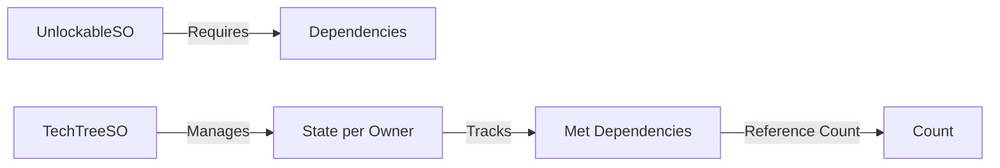
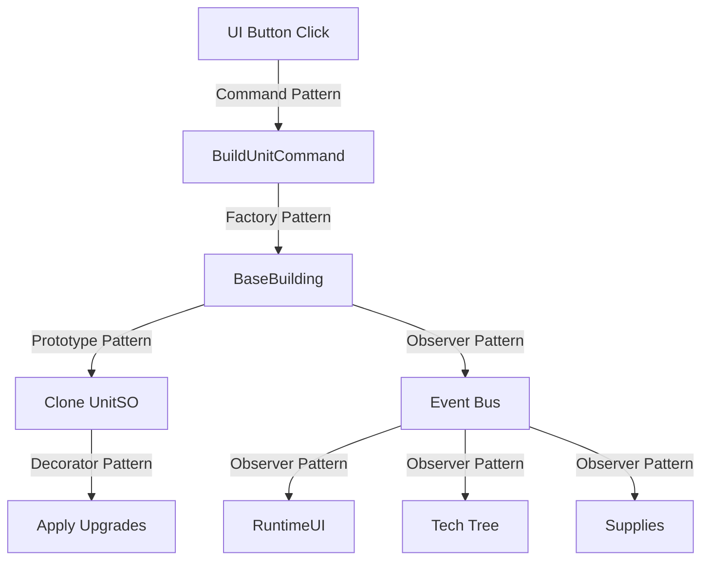

# Design Patterns Reference

## Overview

This document catalogs all design patterns used in the RTS project, their implementation locations, and the benefits they provide.

## Behavioral Patterns

### 1. Command Pattern

**Intent**: Encapsulate requests as objects, allowing parameterization and queuing of operations.

**Implementation**:
- `ICommand` interface
- `BaseCommand` abstract class
- Concrete commands: `MoveCommand`, `AttackCommand`, `BuildBuildingCommand`, etc.

**Usage Example**:
```csharp
public class BuildUnitCommand : BaseCommand
{
    public override bool CanHandle(CommandContext context) { }
    public override void Handle(CommandContext context) { }
}
```

**Benefits**:
- Decouples UI from game logic
- Commands are reusable ScriptableObjects
- Future undo/redo support
- Context-sensitive command availability

**Location**: `/Assets/Scripts/Commands/`

---

### 2. Observer Pattern (Event Bus)

**Intent**: Define one-to-many dependency between objects so when one changes state, dependents are notified.

**Implementation**:
- `Bus<T>` generic static class
- `IEvent` marker interface
- Owner-segregated event channels

**Usage Example**:
```csharp
// Publisher
Bus<UnitSpawnEvent>.Raise(Owner.Player1, new UnitSpawnEvent(unit));

// Subscriber
Bus<UnitSpawnEvent>.OnEvent[Owner.Player1] += HandleUnitSpawn;
```

**Benefits**:
- Complete decoupling between systems
- Type-safe event handling
- Per-owner event isolation
- No interface pollution

**Location**: `/Assets/Scripts/EventBus/`

---

### 3. Strategy Pattern

**Intent**: Define a family of algorithms, encapsulate each one, and make them interchangeable.

**Implementation**:
- Unity Behavior Graphs for unit AI
- Command enums (`UnitCommands.Move`, `UnitCommands.Attack`, etc.)
- Behavior switching via blackboard variables

**Usage Example**:
```csharp
public void MoveTo(Vector3 position)
{
    graphAgent.SetVariableValue("TargetLocation", position);
    graphAgent.SetVariableValue("Command", UnitCommands.Move);
}
```

**Benefits**:
- Runtime behavior switching
- Visual behavior authoring
- Reusable behavior modules
- AI flexibility

**Location**: `/Assets/Scripts/Behavior/`, Unity Behavior Graphs

---

### 4. Template Method Pattern

**Intent**: Define skeleton of algorithm in base class, letting subclasses override specific steps.

**Implementation**:
- `AbstractCommandable` with virtual methods
- `AbstractUnit` extending with unit-specific logic
- `OnGainVisibility()` / `OnLoseVisibility()` hooks

**Usage Example**:
```csharp
public abstract class AbstractCommandable : MonoBehaviour
{
    public void SetVisible(bool isVisible)
    {
        // Template algorithm
        if (IsVisible) OnGainVisibility();
        else OnLoseVisibility();
    }
    
    protected virtual void OnGainVisibility() { }
    protected virtual void OnLoseVisibility() { }
}

// Override in derived class
public class BaseBuilding : AbstractCommandable
{
    protected override void OnLoseVisibility()
    {
        base.OnLoseVisibility();
        CreatePlaceholder(); // Building-specific behavior
    }
}
```

**Benefits**:
- Code reuse in base class
- Customization points for subclasses
- Consistent algorithm structure

**Location**: `/Assets/Scripts/Units/AbstractCommandable.cs`

---

## Creational Patterns

### 5. Prototype Pattern (Clone)

**Intent**: Specify kinds of objects to create using a prototypical instance.

**Implementation**:
- ScriptableObject cloning for units
- Prevents shared state pollution from upgrades

**Usage Example**:
```csharp
protected virtual void Awake()
{
    // Clone SO to get instance-specific copy
    UnitSO = UnitSO.Clone() as AbstractUnitSO;
}
```

**Benefits**:
- Upgrades don't modify shared asset
- Each unit has independent stats
- Preserves original ScriptableObject data

**Location**: `/Assets/Scripts/Units/AbstractCommandable.cs`

---

### 6. Factory Pattern (Implicit)

**Intent**: Define interface for creating objects, but let subclasses decide which class to instantiate.

**Implementation**:
- Building production system
- Unit spawning via ScriptableObject references

**Usage Example**:
```csharp
// Building acts as factory
public void BuildUnlockable(UnlockableSO unlockable)
{
    if (unlockable is AbstractUnitSO unitSO)
    {
        GameObject instance = Instantiate(unitSO.Prefab, transform.position, Quaternion.identity);
        if (instance.TryGetComponent(out AbstractCommandable commandable))
        {
            commandable.Owner = Owner;
        }
    }
}
```

**Benefits**:
- Centralized unit creation logic
- Consistent initialization
- Owner assignment

**Location**: `/Assets/Scripts/Units/BaseBuilding.cs`

---

### 7. Singleton Pattern

**Intent**: Ensure class has only one instance and provide global access point.

**Implementation**:
- `FogVisibilityManager.Instance`
- Static resource dictionaries in `Supplies`

**Usage Example**:
```csharp
public class FogVisibilityManager : MonoBehaviour
{
    public static FogVisibilityManager Instance { get; private set; }
    
    private void Awake()
    {
        if (Instance != null)
        {
            Debug.LogError("Multiple instances detected!");
            enabled = false;
            return;
        }
        Instance = this;
    }
}
```

**Benefits**:
- Global access to managers
- Prevents duplicate managers
- Centralized state

**Cautions**:
- Use sparingly (anti-pattern if overused)
- Can make testing difficult

**Location**: `/Assets/Scripts/Player/FogVisibilityManager.cs`

---

## Structural Patterns

### 8. Composite Pattern (Interface Composition)

**Intent**: Compose objects into tree structures to represent part-whole hierarchies.

**Implementation**:
- Units composed from multiple interfaces
- Mix-and-match capabilities

**Usage Example**:
```csharp
public class Worker : AbstractUnit, 
    IBuildingBuilder,      // Can build
    ITransportable,        // Can be transported
    IMoveable,             // Can move
    IAttacker              // Can attack (inherited)
{
    // Combines multiple capabilities
}
```

**Benefits**:
- Flexibility without deep inheritance
- Clear capability contracts
- Easy to add new capabilities

**Location**: Throughout `/Assets/Scripts/Units/`

---

### 9. Adapter Pattern

**Intent**: Convert interface of a class into another interface clients expect.

**Implementation**:
- `CommandContext` wraps raycast and selection data
- Provides unified interface for commands

**Usage Example**:
```csharp
public readonly struct CommandContext
{
    public readonly AbstractCommandable Commandable;
    public readonly RaycastHit Hit;
    public readonly int SelectionIndex;
    public readonly MouseButton MouseButton;
}

// Commands receive consistent context regardless of input source
public override void Handle(CommandContext context)
{
    // Works same way for UI clicks, right-clicks, hotkeys
}
```

**Benefits**:
- Unified command interface
- Input source agnostic
- Easy to extend with new context data

**Location**: `/Assets/Scripts/Commands/CommandContext.cs`

---

### 10. Decorator Pattern (Modifiers)

**Intent**: Attach additional responsibilities to object dynamically.

**Implementation**:
- `IModifier` interface for upgrades
- Modifiers modify unit stats without changing class

**Usage Example**:
```csharp
public class AdditiveIntModifierSO : ScriptableObject, IModifier
{
    public string Path = "AttackConfig.AttackDamage";
    public int Amount = 10;
    
    public void Apply(AbstractUnitSO unitSO)
    {
        // Decorates unit with additional damage
        int current = GetValueAtPath(unitSO, Path);
        SetValueAtPath(unitSO, Path, current + Amount);
    }
}
```

**Benefits**:
- Dynamic stat modification
- Stackable upgrades
- No unit subclasses needed

**Location**: `/Assets/Scripts/TechTree/IModifier.cs`

---

### 11. Facade Pattern

**Intent**: Provide unified interface to set of interfaces in subsystem.

**Implementation**:
- `RuntimeUI` coordinates multiple UI containers
- Simplifies UI management

**Usage Example**:
```csharp
public class RuntimeUI : MonoBehaviour
{
    // Facade manages these subsystems
    private ActionsUI actionsUI;
    private BuildingSelectedUI buildingSelectedUI;
    private UnitIconUI unitIconUI;
    
    // Single method hides complexity
    private void RefreshUI()
    {
        if (selectedUnits.Count == 1)
            ResolveSingleUnitSelectedUI();
        else
            ShowMultiSelectUI();
    }
}
```

**Benefits**:
- Simplified interface
- Hides subsystem complexity
- Single point of control

**Location**: `/Assets/Scripts/UI/RuntimeUI.cs`

---

## Architectural Patterns

### 12. Model-View-Controller (MVC) Variant

**Intent**: Separate concerns into model (data), view (presentation), controller (logic).

**Implementation**:
- **Model**: ScriptableObjects (BuildingSO, UnitSO, etc.)
- **View**: UI containers and components
- **Controller**: Command handlers, player input

**Structure**:
```
Model (Data):
- BuildingSO, UnitSO, UpgradeSO
- SupplyCostSO, AttackConfigSO

Controller (Logic):
- Commands (BuildUnitCommand, MoveCommand)
- PlayerInput (handles input, executes commands)

View (Presentation):
- UI Containers (ActionsUI, BuildingSelectedUI)
- UI Components (UIActionButton, ProgressBar)
```

**Benefits**:
- Clear separation of concerns
- Data-driven design
- Testable logic
- Reusable views

**Location**: Entire codebase

---

### 13. Dependency Injection (Unity-Style)

**Intent**: Remove hard dependencies by injecting them.

**Implementation**:
- SerializeField references in MonoBehaviours
- ScriptableObject references on units
- Event bus instead of direct references

**Usage Example**:
```csharp
public class PlayerInput : MonoBehaviour
{
    [SerializeField] private Camera camera;          // Injected via Inspector
    [SerializeField] private CameraConfig cameraConfig;  // SO injection
    
    // No direct instantiation or GameObject.Find()
}
```

**Benefits**:
- Testability (can inject mocks)
- Flexibility (swap implementations)
- No hard-coded dependencies

**Location**: Throughout codebase

---

### 14. Service Locator Pattern (Event Bus)

**Intent**: Provide global point of access to services without coupling to concrete classes.

**Implementation**:
- Event bus acts as service locator
- Systems register as event listeners
- Publishers don't know about subscribers

**Usage Example**:
```csharp
// Publisher doesn't know who's listening
Bus<SupplyEvent>.Raise(Owner.Player1, new SupplyEvent(...));

// Multiple services can listen
// - Supplies manager updates resources
// - RuntimeUI updates display
// - Sound manager plays collection sound
// - Analytics tracks resource gain
```

**Benefits**:
- Loose coupling
- Services can be added/removed dynamically
- No direct service references

**Location**: `/Assets/Scripts/EventBus/`

---

## Data Patterns

### 15. Data-Driven Design

**Intent**: Separate game data from code logic.

**Implementation**:
- ScriptableObjects for all game data
- Tech trees defined in assets, not code
- Commands as reusable data assets

**Usage Example**:
```csharp
[CreateAssetMenu(fileName = "New Unit", menuName = "RTS/Unit")]
public class UnitSO : AbstractUnitSO
{
    public int Health = 100;           // Designer-configurable
    public AttackConfigSO AttackConfig; // Reference to shared config
    public UpgradeSO[] Upgrades;       // Available upgrades
}
```

**Benefits**:
- Non-programmers can create content
- No recompilation for data changes
- Easy to balance and iterate
- Data can be hot-reloaded

**Location**: All ScriptableObject classes

---

### 16. Flyweight Pattern (ScriptableObjects)

**Intent**: Use sharing to support large numbers of fine-grained objects efficiently.

**Implementation**:
- Shared ScriptableObject configs
- Many units reference same configs

**Usage Example**:
```csharp
// 100 Riflemen all share same RiflemanSO
public class AbstractUnit : AbstractCommandable
{
    public AbstractUnitSO UnitSO; // Shared reference
    
    protected override void Awake()
    {
        // Clone for instance data
        UnitSO = UnitSO.Clone() as AbstractUnitSO;
    }
}
```

**Benefits**:
- Memory efficient
- Centralized stat definitions
- Easy balance updates

**Location**: All ScriptableObject usage

---

## Game-Specific Patterns

### 17. Tech Tree Pattern

**Intent**: Manage complex dependency graphs for unlockable content.

**Implementation**:
- `TechTreeSO` with dependency graph
- Reference counting for repeatable dependencies
- Per-owner tech tree state

**Structure**:


**Benefits**:
- Complex progression systems
- Dynamic unlocking
- Easy to visualize and edit

**Location**: `/Assets/Scripts/TechTree/`

---

### 18. Vision/Fog of War Pattern

**Intent**: Render-based visibility determination.

**Implementation**:
- Orthographic camera renders vision spheres
- Texture sampling determines visibility
- IHideable interface for affected objects

**Usage Example**:
```csharp
public bool IsVisible(Vector3 position)
{
    Vector3 screenPoint = fogCamera.WorldToScreenPoint(position);
    Color pixel = visionTexture.GetPixel((int)screenPoint.x, (int)screenPoint.y);
    return pixel.r > 0.9f; // White = visible
}
```

**Benefits**:
- Efficient GPU-based calculation
- Handles overlapping vision naturally
- Scalable to many vision sources

**Location**: `/Assets/Scripts/Player/FogVisibilityManager.cs`

---

### 19. Blackboard Pattern (Behavior Trees)

**Intent**: Shared memory space for AI decision making.

**Implementation**:
- Unity Behavior Graph blackboard
- Shared variables between behavior nodes

**Usage Example**:
```csharp
// Set variable on blackboard
graphAgent.SetVariableValue("TargetLocation", position);
graphAgent.SetVariableValue("Command", UnitCommands.Move);

// Behavior nodes read from blackboard
if (blackboard.GetVariable("Command") == UnitCommands.Move)
{
    MoveToTargetLocation();
}
```

**Benefits**:
- Shared state for behaviors
- Visual debugging
- Flexible behavior composition

**Location**: `/Assets/Scripts/Behavior/`, Unity Behavior Graphs

---

## Anti-Patterns to Avoid

### ❌ God Object
**Problem**: Single class that knows/does too much

**Solution Used**: 
- Separate systems (Units, Commands, UI, Events)
- Single Responsibility Principle
- Interface segregation

### ❌ Spaghetti Code
**Problem**: Tangled dependencies with no clear structure

**Solution Used**:
- Event bus for decoupling
- Clear architectural layers
- Dependency injection

### ❌ Magic Numbers
**Problem**: Hard-coded constants throughout code

**Solution Used**:
- ScriptableObjects for configuration
- Named constants in utility classes
- Data-driven design

### ❌ Golden Hammer
**Problem**: Using same pattern for everything

**Solution Used**:
- Multiple patterns for different problems
- Pattern selection based on requirements
- Pragmatic approach

---

## Pattern Selection Guide

### When to Use Which Pattern

**Need decoupled communication?**
→ Observer Pattern (Event Bus)

**Need to encapsulate actions?**
→ Command Pattern

**Need to compose behaviors?**
→ Strategy Pattern, Composite Pattern

**Need to modify objects dynamically?**
→ Decorator Pattern (Modifiers)

**Need runtime behavior switching?**
→ Strategy Pattern (Behavior Graphs)

**Need shared configuration?**
→ Flyweight Pattern (ScriptableObjects)

**Need single instance?**
→ Singleton Pattern (use sparingly)

**Need complex dependencies?**
→ Tech Tree Pattern

**Need to separate UI from logic?**
→ MVC Pattern

---

## Pattern Interactions

### Example: Building a Unit



Multiple patterns work together seamlessly.

---

## Best Practices

1. **Choose Simplest Pattern**: Don't over-engineer
2. **Combine Patterns**: Use multiple patterns together
3. **Follow Unity Conventions**: SerializeField, ScriptableObjects, etc.
4. **Document Pattern Usage**: Make intent clear
5. **Refactor When Needed**: Patterns emerge through iteration
6. **Test Pattern Implementation**: Verify behavior
7. **Consider Performance**: Some patterns have overhead
8. **Maintain Consistency**: Use same pattern for same problems

---

## Further Reading

### Books
- "Design Patterns: Elements of Reusable Object-Oriented Software" (Gang of Four)
- "Game Programming Patterns" by Robert Nystrom
- "Refactoring: Improving the Design of Existing Code" by Martin Fowler

### Unity-Specific
- Unity Manual: ScriptableObjects
- Unity Learn: Design Patterns
- Catlike Coding: Object Management tutorials

### Web Resources
- [Game Programming Patterns (free online)](http://gameprogrammingpatterns.com/)
- [Refactoring Guru](https://refactoring.guru/design-patterns)
- [Source Making](https://sourcemaking.com/design_patterns)
