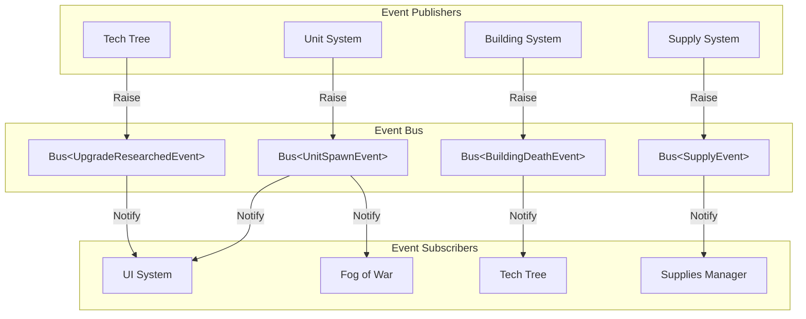
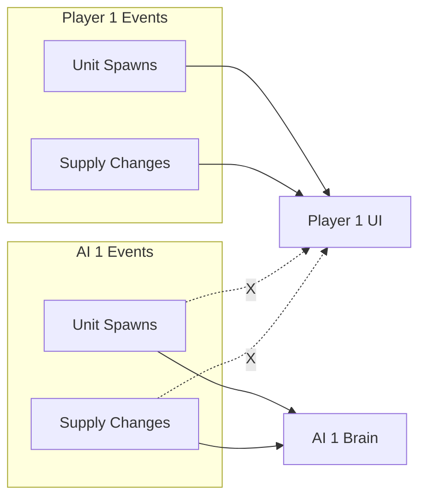
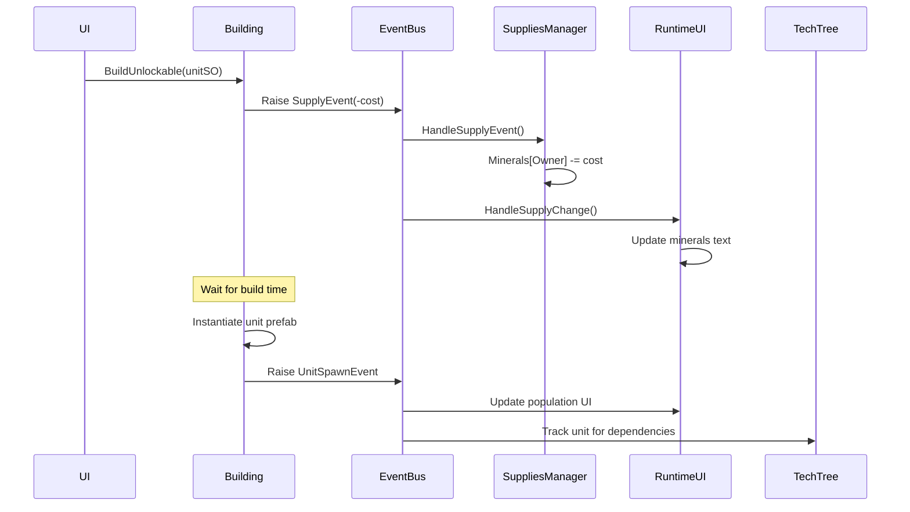

# Event Bus Architecture

## Overview

The Event Bus System provides a type-safe, decoupled communication mechanism between game systems. It uses a generic static class pattern with owner-segregated event channels, allowing different players/AI to have isolated event streams.

## Core Design

### Bus<T> Generic Class

```csharp
public static class Bus<T> where T : IEvent
{
    public delegate void Event(T args);
    
    public static Dictionary<Owner, Event> OnEvent = new()
    {
        { Owner.Player1, null },
        { Owner.AI1, null },
        { Owner.AI2, null },
        // ... other owners
    };
    
    public static void Raise(Owner owner, T evt);
    public static void RegisterForAll(Event handler);
    public static void UnregisterForAll(Event handler);
}
```

### Architecture Diagram



## Event Types

### Unit Events

```csharp
public readonly struct UnitSpawnEvent : IEvent
{
    public readonly AbstractUnit Unit;
    
    public UnitSpawnEvent(AbstractUnit unit)
    {
        Unit = unit;
    }
}

public readonly struct UnitDeathEvent : IEvent
{
    public readonly AbstractUnit Unit;
    
    public UnitDeathEvent(AbstractUnit unit)
    {
        Unit = unit;
    }
}

public readonly struct UnitSelectedEvent : IEvent
{
    public readonly ISelectable Unit;
    
    public UnitSelectedEvent(ISelectable unit)
    {
        Unit = unit;
    }
}

public readonly struct UnitDeselectedEvent : IEvent
{
    public readonly ISelectable Unit;
    
    public UnitDeselectedEvent(ISelectable unit)
    {
        Unit = unit;
    }
}

public readonly struct UnitLoadEvent : IEvent
{
    public readonly ITransportable Unit;
    public readonly ITransporter Transporter;
}

public readonly struct UnitUnloadEvent : IEvent
{
    public readonly ITransportable Unit;
    public readonly ITransporter Transporter;
}
```

### Building Events

```csharp
public readonly struct BuildingSpawnEvent : IEvent
{
    public readonly Owner Owner;
    public readonly BaseBuilding Building;
    
    public BuildingSpawnEvent(Owner owner, BaseBuilding building)
    {
        Owner = owner;
        Building = building;
    }
}

public readonly struct BuildingDeathEvent : IEvent
{
    public readonly Owner Owner;
    public readonly BaseBuilding Building;
    
    public BuildingDeathEvent(Owner owner, BaseBuilding building)
    {
        Owner = owner;
        Building = building;
    }
}
```

### Resource Events

```csharp
public readonly struct SupplyEvent : IEvent
{
    public readonly Owner Owner;
    public readonly int Amount;
    public readonly SupplySO Supply;
    
    public SupplyEvent(Owner owner, int amount, SupplySO supply)
    {
        Owner = owner;
        Amount = amount;
        Supply = supply;
    }
}

public readonly struct SupplySpawnEvent : IEvent
{
    public readonly GatherableSupply Supply;
}

public readonly struct SupplyDepletedEvent : IEvent
{
    public readonly GatherableSupply Supply;
}
```

### Tech Tree Events

```csharp
public readonly struct UpgradeResearchedEvent : IEvent
{
    public readonly Owner Owner;
    public readonly UpgradeSO Upgrade;
    
    public UpgradeResearchedEvent(Owner owner, UpgradeSO upgrade)
    {
        Owner = owner;
        Upgrade = upgrade;
    }
}
```

### UI Events

```csharp
public readonly struct CommandSelectedEvent : IEvent
{
    public readonly BaseCommand Command;
    
    public CommandSelectedEvent(BaseCommand command)
    {
        Command = command;
    }
}
```

### Visibility Events

```csharp
public readonly struct PlaceholderSpawnEvent : IEvent
{
    public readonly Placeholder Placeholder;
}

public readonly struct PlaceholderDestroyEvent : IEvent
{
    public readonly Placeholder Placeholder;
}
```

## Owner-Segregated Channels

### Why Owner Segregation?

Each owner has their own event channel to prevent:
- Player seeing AI events in UI
- AI processing other AI player events
- Event pollution across teams



### Raising Events

```csharp
// Raise for specific owner
Bus<UnitSpawnEvent>.Raise(Owner.Player1, new UnitSpawnEvent(unit));

// Only Player1 subscribers receive this event
```

### Subscribing to Events

#### Single Owner Subscription
```csharp
private void Awake()
{
    // Subscribe to Player1 events only
    Bus<UnitSpawnEvent>.OnEvent[Owner.Player1] += HandleUnitSpawn;
}

private void OnDestroy()
{
    // Always unsubscribe to prevent memory leaks
    Bus<UnitSpawnEvent>.OnEvent[Owner.Player1] -= HandleUnitSpawn;
}

private void HandleUnitSpawn(UnitSpawnEvent evt)
{
    // Process Player1 unit spawn
    Debug.Log($"Player unit spawned: {evt.Unit.name}");
}
```

#### All Owners Subscription
```csharp
private void OnEnable()
{
    // Subscribe to events from all owners
    Bus<UnitSpawnEvent>.RegisterForAll(HandleUnitSpawn);
}

private void OnDisable()
{
    // Unsubscribe from all owners
    Bus<UnitSpawnEvent>.UnregisterForAll(HandleUnitSpawn);
}

private void HandleUnitSpawn(UnitSpawnEvent evt)
{
    // Process spawn from any owner
    // Can check evt.Owner if needed
}
```

## Usage Patterns

### Pattern 1: UI Updates

```csharp
// In RuntimeUI.cs
private void Awake()
{
    // Only listen to Player1 events for UI updates
    Bus<UnitSelectedEvent>.OnEvent[Owner.Player1] += HandleUnitSelected;
    Bus<UnitDeselectedEvent>.OnEvent[Owner.Player1] += HandleUnitDeselected;
    Bus<SupplyEvent>.OnEvent[Owner.Player1] += HandleSupplyChange;
}

private void HandleSupplyChange(SupplyEvent evt)
{
    // Update resource display
    mineralsText.SetText(Supplies.Minerals[Owner.Player1].ToString());
}
```

### Pattern 2: System-Wide Tracking

```csharp
// In FogVisibilityManager.cs
private void Awake()
{
    // Track all units regardless of owner
    Bus<UnitSpawnEvent>.RegisterForAll(HandleUnitSpawn);
    Bus<UnitDeathEvent>.RegisterForAll(HandleUnitDeath);
}

private void HandleUnitSpawn(UnitSpawnEvent evt)
{
    // Add to visibility tracking if enemy unit
    if (evt.Unit.Owner != Owner.Player1)
    {
        hideables.Add(evt.Unit);
    }
}
```

### Pattern 3: Owner-Specific Game Logic

```csharp
// In AbstractCommandable.cs
protected virtual void Start()
{
    // Listen only to this unit's owner upgrades
    Bus<UpgradeResearchedEvent>.OnEvent[Owner] += HandleUpgradeResearched;
}

private void HandleUpgradeResearched(UpgradeResearchedEvent evt)
{
    // Apply upgrade if this unit uses it
    if (UnitSO.Upgrades.Contains(evt.Upgrade))
    {
        evt.Upgrade.Apply(UnitSO);
    }
}
```

### Pattern 4: Tech Tree Dependencies

```csharp
// In TechTreeSO.cs
private void OnEnable()
{
    // Monitor all owners for dependency tracking
    Bus<BuildingSpawnEvent>.RegisterForAll(HandleBuildingSpawn);
    Bus<UpgradeResearchedEvent>.RegisterForAll(HandleUpgradeResearched);
    Bus<BuildingDeathEvent>.RegisterForAll(HandleBuildingDeath);
}

private void HandleBuildingSpawn(BuildingSpawnEvent evt)
{
    // Unlock dependencies for this owner
    foreach(var kvp in techTrees[evt.Owner])
    {
        kvp.Value.UnlockDependency(evt.Building.BuildingSO);
    }
}
```

## Event Flow Example: Building a Unit



## Benefits

### 1. Decoupling
Systems don't need references to each other:
```csharp
// No direct reference needed
// Instead of: uiManager.UpdateSupplies(amount);
Bus<SupplyEvent>.Raise(Owner.Player1, new SupplyEvent(...));
```

### 2. Type Safety
Compile-time checking of event types:
```csharp
// Compile error if event doesn't implement IEvent
Bus<MyCustomEvent>.Raise(owner, evt); // ✓ if MyCustomEvent : IEvent
```

### 3. Owner Isolation
Prevents cross-contamination:
```csharp
// Player1 UI doesn't receive AI1 events
Bus<SupplyEvent>.Raise(Owner.AI1, evt); 
// Player1 UI handlers won't be called
```

### 4. Easy Debugging
Single point to add breakpoints:
```csharp
public static void Raise(Owner owner, T evt)
{
    // Set breakpoint here to see all events of type T
    OnEvent[owner]?.Invoke(evt);
}
```

### 5. No Interface Pollution
Systems don't need to implement event interfaces:
```csharp
// Clean class definition
public class FogVisibilityManager : MonoBehaviour
{
    // No IUnitSpawnListener, IBuildingDeathListener, etc.
}
```

## Performance Considerations

### Event Frequency
Some events fire frequently:
- `SupplyEvent`: Every resource gather/spend
- `UnitSelectedEvent`: Every selection change

### Optimization Tips

1. **Struct Events**: Use `readonly struct` for zero-allocation events
```csharp
public readonly struct SupplyEvent : IEvent // No heap allocation
```

2. **Unsubscribe Properly**: Always unsubscribe in OnDestroy/OnDisable
```csharp
private void OnDestroy()
{
    // Prevents memory leaks
    Bus<UnitSpawnEvent>.OnEvent[Owner] -= HandleUnitSpawn;
}
```

3. **Batch Updates**: Consider batching UI updates
```csharp
private void HandleSupplyChange(SupplyEvent evt)
{
    if (!updateScheduled)
    {
        updateScheduled = true;
        StartCoroutine(UpdateUINextFrame());
    }
}
```

4. **Filter Early**: Check owner in event handlers
```csharp
private void HandleUnitSpawn(UnitSpawnEvent evt)
{
    if (evt.Unit.Owner != Owner.Player1) return; // Early exit
    // Process player unit
}
```

## Common Pitfalls

### 1. Forgetting to Unsubscribe
```csharp
// ❌ Memory leak - handler never removed
private void Start()
{
    Bus<UnitSpawnEvent>.OnEvent[Owner.Player1] += HandleUnitSpawn;
}

// ✓ Correct
private void OnDestroy()
{
    Bus<UnitSpawnEvent>.OnEvent[Owner.Player1] -= HandleUnitSpawn;
}
```

### 2. Null Reference in Destroyed Objects
```csharp
// ❌ Accessing destroyed object in handler
private void HandleUnitDeath(UnitDeathEvent evt)
{
    Debug.Log(evt.Unit.name); // Unit might be destroyed
}

// ✓ Check for null
private void HandleUnitDeath(UnitDeathEvent evt)
{
    if (evt.Unit != null)
    {
        Debug.Log(evt.Unit.name);
    }
}
```

### 3. Raising Events in OnDestroy
```csharp
// ⚠️ Be careful with order of operations
protected override void OnDestroy()
{
    base.OnDestroy();
    // Raised after unsubscribing from parent
    Bus<UnitDeathEvent>.Raise(Owner, new UnitDeathEvent(this));
}

// ✓ Raise before base.OnDestroy()
protected override void OnDestroy()
{
    Bus<UnitDeathEvent>.Raise(Owner, new UnitDeathEvent(this));
    base.OnDestroy(); // Unsubscribes in base
}
```

## Extension Example

To add a new event:

```csharp
// 1. Create event struct
public readonly struct UnitLevelUpEvent : IEvent
{
    public readonly AbstractUnit Unit;
    public readonly int NewLevel;
    
    public UnitLevelUpEvent(AbstractUnit unit, int newLevel)
    {
        Unit = unit;
        NewLevel = newLevel;
    }
}

// 2. Raise event where appropriate
public void GainExperience(int xp)
{
    experience += xp;
    if (experience >= experienceToNextLevel)
    {
        level++;
        Bus<UnitLevelUpEvent>.Raise(Owner, 
            new UnitLevelUpEvent(this, level));
    }
}

// 3. Subscribe to event
private void Awake()
{
    Bus<UnitLevelUpEvent>.OnEvent[Owner.Player1] += HandleLevelUp;
}

private void HandleLevelUp(UnitLevelUpEvent evt)
{
    ShowLevelUpEffect(evt.Unit.Transform.position);
    PlayLevelUpSound();
}
```

## Best Practices

1. **Use Readonly Structs**: Prevents accidental mutations and allocations
2. **Include Owner in Events**: Even if only one field, makes debugging easier
3. **Unsubscribe Pattern**: Always pair Subscribe with Unsubscribe
4. **RegisterForAll Sparingly**: Only use when truly need all owners
5. **Event Naming**: Use past tense (UnitSpawned) or Event suffix (UnitSpawnEvent)
6. **Keep Events Simple**: Just data, no logic
7. **Document Event Timing**: When in the frame the event fires (Awake, Start, Update, OnDestroy)
