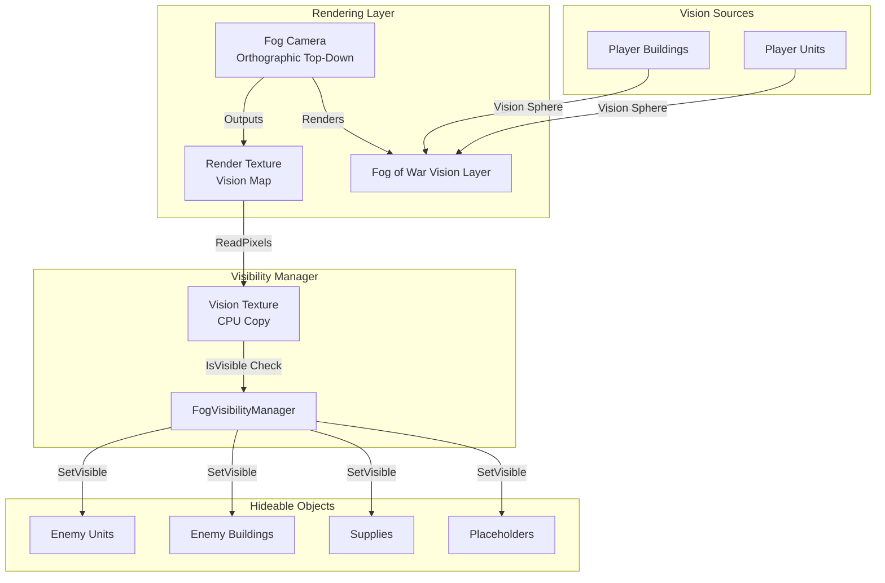
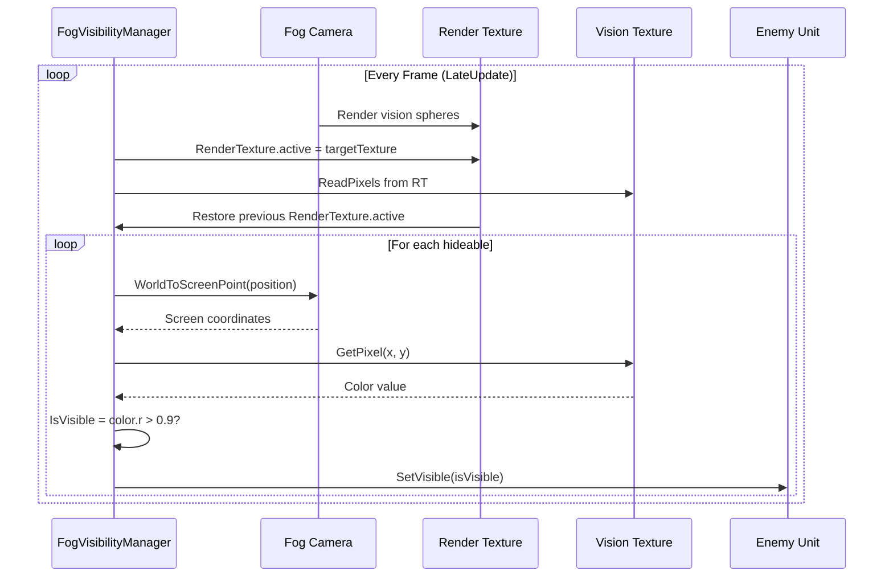
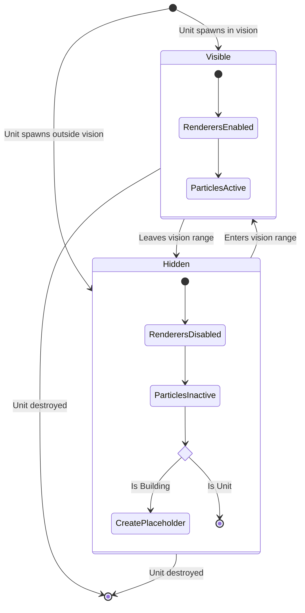
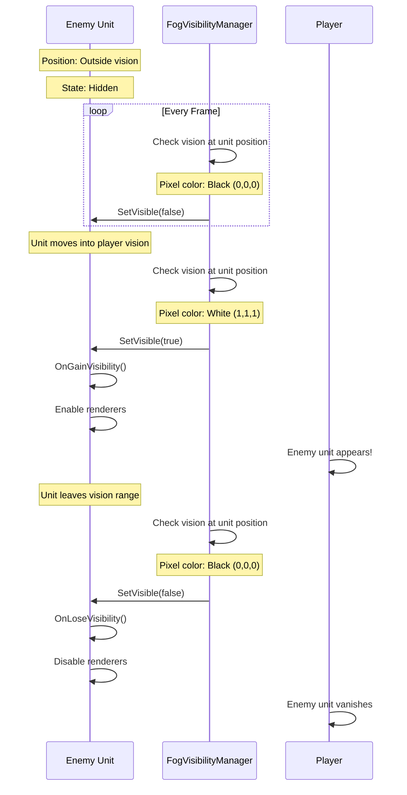

# Fog of War Architecture

## Overview

The Fog of War system provides real-time vision-based visibility management using a camera-based rendering approach. Enemy units and structures are hidden unless they are within the vision range of player-controlled units.

## System Architecture



## Core Components

### FogVisibilityManager

Singleton manager that orchestrates visibility:

```csharp
public class FogVisibilityManager : MonoBehaviour
{
    public static FogVisibilityManager Instance { get; private set; }
    
    private Camera fogOfWarCamera;
    private Texture2D visionTexture;
    private Rect textureRect;
    private HashSet<IHideable> hideables = new(1000);
    
    public bool IsVisible(Vector3 position);
}
```

### IHideable Interface

Contract for objects that can be hidden:

```csharp
public interface IHideable
{
    bool IsVisible { get; }
    Transform Transform { get; }
    void SetVisible(bool isVisible);
    event VisibilityChangeEvent OnVisibilityChanged;
}
```

Implemented by:
- `AbstractCommandable` (units and buildings)
- `GatherableSupply` (resource nodes)
- `Placeholder` (building silhouettes)

## Vision Rendering System

### Camera Setup

```yaml
Fog of War Camera:
  Type: Orthographic
  Projection: Top-Down
  Culling Mask: Fog of War Vision Layer
  Target Texture: VisionRenderTexture (512x512 or higher)
  Clear Flags: Solid Color (Black)
  Background: Black (0,0,0)
```

### Vision Spheres

Each player unit/building with vision has a child GameObject:

```yaml
Vision Sphere:
  Layer: Fog of War Vision
  Components:
    - MeshRenderer
      - Material: Unlit/Emissive (White)
    - MeshFilter
      - Mesh: Sphere
  Scale: (radius * 2, radius * 2, radius * 2)
  Active: Only for Player1 units
```

### Render Texture Interpretation

```
Black Pixel (RGB: 0,0,0): No vision - Hidden
White Pixel (RGB: 1,1,1): Full vision - Visible
```

## Visibility Check Flow



## Visibility State Management

### AbstractCommandable Implementation

```csharp
public void SetVisible(bool isVisible)
{
    if (isVisible == IsVisible) return; // No change
    
    IsVisible = isVisible;
    OnVisibilityChanged?.Invoke(this, isVisible);
    
    if (IsVisible)
    {
        OnGainVisibility();
    }
    else
    {
        OnLoseVisibility();
    }
}

protected virtual void OnGainVisibility()
{
    // Enable all renderers
    foreach(Renderer renderer in renderers)
    {
        renderer.enabled = true;
    }
    
    // Enable particle systems
    foreach(ParticleSystem ps in particleSystems)
    {
        ps.gameObject.SetActive(true);
    }
}

protected virtual void OnLoseVisibility()
{
    // Disable renderers
    foreach (Renderer renderer in renderers)
    {
        renderer.enabled = false;
    }
    
    // Disable particle systems
    foreach (ParticleSystem ps in particleSystems)
    {
        ps.gameObject.SetActive(false);
    }
}
```

### Building Placeholder System

When buildings become hidden, they create a simplified placeholder:

```csharp
protected override void OnLoseVisibility()
{
    base.OnLoseVisibility();
    
    if (culledVisuals == null)
    {
        // Create placeholder with same mesh
        GameObject culledGO = new ($"Culled {BuildingSO.Name} Visuals");
        culledGO.layer = LayerMask.NameToLayer("TransparentFX");
        
        Placeholder placeholder = culledGO.AddComponent<Placeholder>();
        placeholder.Owner = Owner;
        placeholder.ParentObject = gameObject;
        
        MeshFilter meshFilter = culledGO.AddComponent<MeshFilter>();
        meshFilter.mesh = MainRenderer.GetComponent<MeshFilter>().mesh;
        
        MeshRenderer renderer = culledGO.AddComponent<MeshRenderer>();
        renderer.materials = MainRenderer.materials;
        
        culledVisuals = placeholder;
    }
    else
    {
        culledVisuals.gameObject.SetActive(true);
    }
}
```

**Why Placeholders?**:
- Player remembers last seen location of enemy buildings
- Provides strategic information even when not visible
- Destroyed when parent building is destroyed

## Event Integration

### Tracking Hideables

```csharp
private void Awake()
{
    // Track all units
    Bus<UnitSpawnEvent>.RegisterForAll(HandleUnitSpawn);
    Bus<UnitDeathEvent>.RegisterForAll(HandleUnitDeath);
    
    // Track all buildings
    Bus<BuildingSpawnEvent>.RegisterForAll(HandleBuildingSpawn);
    Bus<BuildingDeathEvent>.RegisterForAll(HandleBuildingDeath);
    
    // Track neutral supplies
    Bus<SupplySpawnEvent>.OnEvent[Owner.Unowned] += HandleSupplySpawn;
    Bus<SupplyDepletedEvent>.OnEvent[Owner.Unowned] += HandleSupplyDepleted;
    
    // Track placeholders
    Bus<PlaceholderSpawnEvent>.RegisterForAll(HandlePlaceholderSpawn);
    Bus<PlaceholderDestroyEvent>.RegisterForAll(HandlePlaceholderDestroy);
}
```

### Selective Tracking

```csharp
private void HandleUnitSpawn(UnitSpawnEvent evt)
{
    // Only track enemy units
    if (evt.Unit.Owner != Owner.Player1)
    {
        hideables.Add(evt.Unit);
    }
}

private void HandleBuildingSpawn(BuildingSpawnEvent evt)
{
    // Only track enemy buildings
    if (evt.Building.Owner != Owner.Player1)
    {
        hideables.Add(evt.Building);
    }
}
```

**Player1 units/buildings**: Never hidden, always visible
**Enemy units/buildings**: Tracked and visibility toggled
**Neutral supplies**: Tracked (discoverable resources)

## Layer Configuration

### Fog of War Layer
- **Units Layer**: Enemy units that should be hidden
- **Buildings Layer**: Enemy buildings that should be hidden
- **Supplies Layer**: Gatherable resources that should be hidden

### Fog of War Vision Layer
- **Vision spheres only**: Rendered by fog camera
- **Not visible in main camera**: Culling mask excludes this layer

## Vision Configuration

### SightConfigSO

```csharp
[CreateAssetMenu(fileName = "Sight Config", menuName = "RTS/Sight Config")]
public class SightConfigSO : ScriptableObject
{
    public float SightRadius = 15f;
}
```

### Unit Vision Setup

```csharp
protected virtual void Start()
{
    if (UnitSO.SightConfig != null && VisionTransform != null)
    {
        float size = UnitSO.SightConfig.SightRadius * 2;
        VisionTransform.localScale = new Vector3(size, size, size);
        
        // Only active for player units
        VisionTransform.gameObject.SetActive(Owner == Owner.Player1);
    }
}
```

## Command Integration

### Visibility Checks in Commands

```csharp
public class AttackCommand : BaseCommand
{
    public override bool CanHandle(CommandContext context)
    {
        IDamageable target = context.Hit.collider?.GetComponent<IDamageable>();
        
        // Can't attack invisible targets
        return target != null 
            && target.Owner != context.Commandable.Owner
            && IsHitColliderVisible(context);
    }
}

// In BaseCommand.cs
public bool IsHitColliderVisible(CommandContext context)
{
    return context.Hit.collider != null
        && context.Hit.collider.TryGetComponent(out IHideable hideable) 
        && hideable.IsVisible;
}
```

**Prevents**:
- Attacking hidden units
- Gathering hidden resources
- Interacting with invisible objects

## Performance Optimization

### Texture Resolution

```csharp
private void Awake()
{
    fogOfWarCamera = GetComponent<Camera>();
    
    // Match texture size to render texture
    visionTexture = new Texture2D(
        fogOfWarCamera.targetTexture.width, 
        fogOfWarCamera.targetTexture.height
    );
    textureRect = new Rect(0, 0, visionTexture.width, visionTexture.height);
}
```

**Trade-offs**:
- **512x512**: Fast, less precise
- **1024x1024**: Balanced
- **2048x2048**: High precision, slower

### ReadPixels Optimization

```csharp
private void ReadPixelsToVisionTexture()
{
    RenderTexture previousRenderTexture = RenderTexture.active;
    
    RenderTexture.active = fogOfWarCamera.targetTexture;
    visionTexture.ReadPixels(textureRect, 0, 0);
    RenderTexture.active = previousRenderTexture;
}
```

**Why LateUpdate?**: Ensures all camera rendering is complete before reading pixels.

### HashSet Storage

```csharp
private HashSet<IHideable> hideables = new(1000);
```

**Benefits**:
- O(1) add/remove
- No duplicates
- Pre-allocated capacity reduces resizing

## Visibility States



## Example: Unit Movement Through Fog



## Minimap Integration

The vision texture can be used for minimap fog of war:

```csharp
public bool IsVisible(Vector3 worldPosition)
{
    Vector3 screenPoint = fogOfWarCamera.WorldToScreenPoint(worldPosition);
    
    if (screenPoint.x < 0 || screenPoint.x >= visionTexture.width 
        || screenPoint.y < 0 || screenPoint.y >= visionTexture.height)
    {
        return false; // Out of bounds
    }
    
    Color visibilityColor = visionTexture.GetPixel(
        (int)screenPoint.x, 
        (int)screenPoint.y
    );
    
    return visibilityColor.r > 0.9f;
}
```

Can be called from minimap system to darken unexplored areas.

## Edge Cases

### Unit on Boundary
```csharp
// Threshold check for anti-aliasing edge cases
return visibilityColor.r > 0.9f; // Not exactly 1.0
```

### Destroyed While Hidden
```csharp
private void HandleUnitDeath(UnitDeathEvent evt)
{
    hideables.Remove(evt.Unit);
    // No need to show death animation if not visible
}
```

### Multiple Vision Sources
Vision spheres additively contribute to the render texture:
- Overlapping visions = brighter pixel
- Single vision source = full brightness
- No vision = black

## Debugging Tools

### Visual Debug Mode

```csharp
#if UNITY_EDITOR
private void OnGUI()
{
    if (showDebug)
    {
        GUI.DrawTexture(
            new Rect(10, 10, 256, 256), 
            visionTexture
        );
    }
}
#endif
```

Shows vision texture on screen for debugging.

### Gizmos

```csharp
private void OnDrawGizmosSelected()
{
    if (SightConfig != null)
    {
        Gizmos.color = Color.yellow;
        Gizmos.DrawWireSphere(
            transform.position, 
            SightConfig.SightRadius
        );
    }
}
```

Visualizes vision range in Scene view.

## Extension Points

### Custom Visibility Rules

```csharp
public class StealthUnit : AbstractUnit
{
    [SerializeField] private float detectionRange = 3f;
    
    public override void SetVisible(bool isVisible)
    {
        // Only visible if very close
        float distanceToNearestEnemy = GetDistanceToNearestEnemy();
        bool actuallyVisible = isVisible && distanceToNearestEnemy < detectionRange;
        
        base.SetVisible(actuallyVisible);
    }
}
```

### Fog of War History

```csharp
public class FogOfWarHistory : MonoBehaviour
{
    private Texture2D exploredTexture;
    
    private void LateUpdate()
    {
        // Combine current vision with explored areas
        for (int x = 0; x < visionTexture.width; x++)
        {
            for (int y = 0; y < visionTexture.height; y++)
            {
                Color current = visionTexture.GetPixel(x, y);
                Color explored = exploredTexture.GetPixel(x, y);
                
                if (current.r > 0.5f)
                {
                    exploredTexture.SetPixel(x, y, Color.gray);
                }
            }
        }
    }
}
```

Tracks explored but not currently visible areas (like StarCraft).

## Best Practices

1. **Resolution Balance**: Don't make texture too large (performance) or too small (precision)
2. **Layer Management**: Keep vision layer separate to avoid rendering conflicts
3. **Player Ownership**: Only apply fog to enemy units, never player units
4. **Placeholder Caching**: Reuse placeholder GameObjects when toggling visibility
5. **Early Exit**: Check `isVisible == IsVisible` to avoid redundant processing
6. **Event Cleanup**: Always unsubscribe from events in OnDestroy
7. **Threshold Checks**: Use `> 0.9f` instead of `== 1.0f` for floating-point comparison
