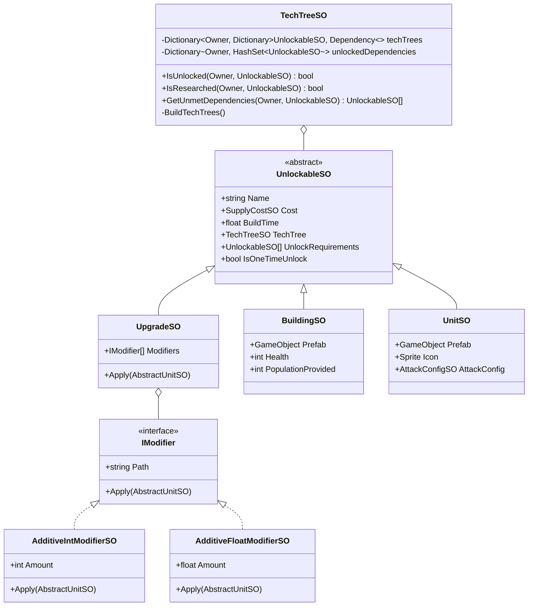
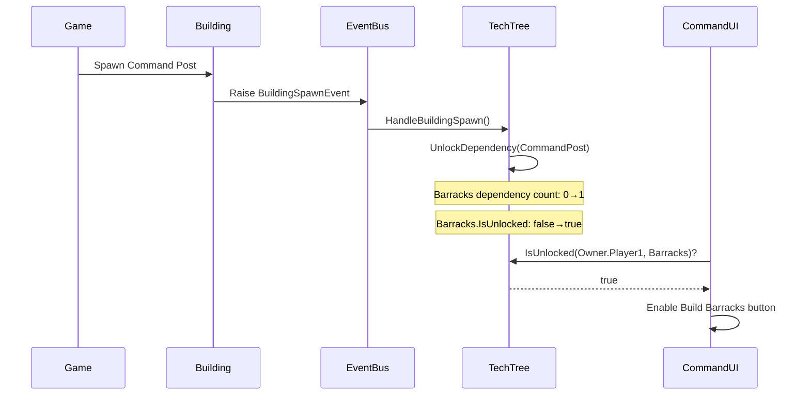
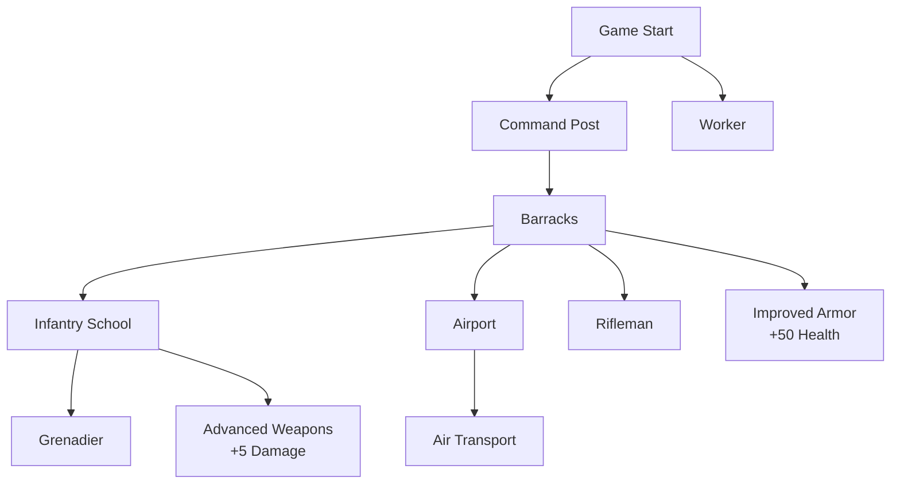

# Tech Tree Architecture

## Overview

The Tech Tree System provides a dependency-based progression system where buildings, units, and upgrades can be locked behind requirements. Each owner (player/AI) has their own independent tech tree state.

## Core Architecture



## Unlockable System

### UnlockableSO

Base ScriptableObject for all unlockable content:

```csharp
public abstract class UnlockableSO : ScriptableObject
{
    public string Name;
    public SupplyCostSO Cost;
    public float BuildTime;
    public TechTreeSO TechTree;
    public UnlockableSO[] UnlockRequirements;
    public bool IsOneTimeUnlock = false;
}
```

**Key Properties**:
- **UnlockRequirements**: Array of dependencies (other unlockables) needed
- **IsOneTimeUnlock**: If true, unlocked permanently once requirement is met
- **Cost**: Resource cost to produce/research
- **BuildTime**: Time in seconds to produce/research

### Unlockable Types

#### BuildingSO
```csharp
public class BuildingSO : AbstractUnitSO
{
    public Material PlacementMaterial;
    public float BuildTime;
    public int PopulationProvided;
}
```

Example: Barracks requires Command Post to be built.

#### UnitSO
```csharp
public class UnitSO : AbstractUnitSO
{
    public Sprite Icon;
    public AttackConfigSO AttackConfig;
    public TransportConfigSO TransportConfig;
}
```

Example: Grenadier requires Infantry School to be built.

#### UpgradeSO
```csharp
public class UpgradeSO : UnlockableSO
{
    public IModifier[] Modifiers;
    
    public void Apply(AbstractUnitSO unitSO)
    {
        foreach (IModifier modifier in Modifiers)
        {
            modifier.Apply(unitSO);
        }
    }
}
```

Example: "Advanced Weapons" upgrade increases attack damage.

## Tech Tree State Management

### Per-Owner Tech Trees

```csharp
private Dictionary<Owner, Dictionary<UnlockableSO, Dependency>> techTrees;
private Dictionary<Owner, HashSet<UnlockableSO>> unlockedDependencies;
```

Each owner has:
1. **Dependency Graph**: Tracks which requirements are met for each unlockable
2. **Unlocked Set**: Permanently unlocked items (researched upgrades, one-time unlocks)

### Dependency Struct

```csharp
private readonly struct Dependency
{
    public HashSet<UnlockableSO> Dependencies { get; }
    public bool IsUnlocked => Dependencies.Count == metDependencies.Count;
    private readonly Dictionary<UnlockableSO, int> metDependencies;
    
    public void UnlockDependency(UnlockableSO dependency);
    public void LoseDependency(UnlockableSO dependency);
    public UnlockableSO[] GetUnmetDependencies();
}
```

**Reference Counting**: Tracks how many instances of each dependency exist.
- Useful for buildings that can be built multiple times
- Example: If Barracks requires Command Post, losing one Command Post doesn't lock Barracks if another exists

## Dependency Resolution Flow



## Event Integration

### Building Spawn/Death

```csharp
private void HandleBuildingSpawn(BuildingSpawnEvent evt)
{
    foreach(var kvp in techTrees[evt.Owner])
    {
        kvp.Value.UnlockDependency(evt.Building.BuildingSO);
    }
}

private void HandleBuildingDeath(BuildingDeathEvent evt)
{
    foreach (var kvp in techTrees[evt.Owner])
    {
        kvp.Value.LoseDependency(evt.Building.BuildingSO);
    }
}
```

**Dynamic Dependencies**: Buildings can lock again if dependency is destroyed.

### Upgrade Research

```csharp
private void HandleUpgradeResearched(UpgradeResearchedEvent evt)
{
    // Mark as permanently unlocked
    unlockedDependencies[evt.Owner].Add(evt.Upgrade);
    
    // Unlock any items that depend on this upgrade
    foreach(var kvp in techTrees[evt.Owner])
    {
        kvp.Value.UnlockDependency(evt.Upgrade);
    }
}
```

**Permanent Unlocks**: Upgrades stay unlocked even if building that researched them is destroyed.

## Upgrade System

### Modifier Pattern

Upgrades use modifiers to change unit stats at runtime:

```csharp
public interface IModifier
{
    string Path { get; }
    void Apply(AbstractUnitSO unitSO);
}
```

**Path**: Reflection path to the property to modify (e.g., "AttackConfig.AttackDamage")

### Modifier Types

#### AdditiveIntModifierSO
```csharp
public class AdditiveIntModifierSO : ScriptableObject, IModifier
{
    public string Path;
    public int Amount;
    
    public void Apply(AbstractUnitSO unitSO)
    {
        object value = GetValueAtPath(unitSO, Path);
        if (value is int intValue)
        {
            SetValueAtPath(unitSO, Path, intValue + Amount);
        }
    }
}
```

Example: +10 attack damage

#### AdditiveFloatModifierSO
```csharp
public class AdditiveFloatModifierSO : ScriptableObject, IModifier
{
    public string Path;
    public float Amount;
    
    public void Apply(AbstractUnitSO unitSO)
    {
        object value = GetValueAtPath(unitSO, Path);
        if (value is float floatValue)
        {
            SetValueAtPath(unitSO, Path, floatValue + Amount);
        }
    }
}
```

Example: +1.5 attack range

### Reflection-Based Property Access

```csharp
private object GetValueAtPath(object obj, string path)
{
    string[] parts = path.Split('.');
    object current = obj;
    
    foreach (string part in parts)
    {
        FieldInfo field = current.GetType().GetField(part);
        if (field != null)
        {
            current = field.GetValue(current);
        }
    }
    
    return current;
}
```

**Path Examples**:
- `"Health"` → Modifies unit health
- `"AttackConfig.AttackDamage"` → Modifies attack damage
- `"AttackConfig.AttackRange"` → Modifies attack range
- `"SightConfig.SightRadius"` → Modifies vision range

## Upgrade Application

### On Unit Creation

```csharp
// In AbstractUnit.Start()
foreach(UpgradeSO upgrade in unitSO.Upgrades)
{
    if (unitSO.TechTree.IsResearched(Owner, upgrade))
    {
        upgrade.Apply(unitSO);
    }
}
```

Units spawned after upgrade is researched receive benefits immediately.

### On Existing Units

```csharp
// In AbstractCommandable.HandleUpgradeResearched()
private void HandleUpgradeResearched(UpgradeResearchedEvent evt)
{
    if (evt.Owner == Owner && UnitSO.Upgrades.Contains(evt.Upgrade))
    {
        evt.Upgrade.Apply(UnitSO);
    }
}
```

Existing units listen to upgrade events and apply them dynamically.

### ScriptableObject Cloning

```csharp
protected virtual void Awake()
{
    // Clone ScriptableObject so each instance has its own data
    UnitSO = UnitSO.Clone() as AbstractUnitSO;
}
```

**Why Clone?**: Prevents upgrades from modifying the shared ScriptableObject asset, which would affect all units permanently.

## Tech Tree Example

### Example Tech Tree Configuration



### Dependency Examples

**Grenadier Requirements**:
```
UnlockRequirements:
  - Infantry School (BuildingSO)
```

**Advanced Weapons Requirements**:
```
UnlockRequirements:
  - Infantry School (BuildingSO)
Modifiers:
  - Path: "AttackConfig.AttackDamage"
    Amount: +5
```

**Air Transport Requirements**:
```
UnlockRequirements:
  - Airport (BuildingSO)
```

## UI Integration

### Command Locking

Commands check tech tree state:

```csharp
public override bool IsLocked(CommandContext context)
{
    return !Building.TechTree.IsUnlocked(
        context.Commandable.Owner, 
        Building
    );
}

public override bool IsAvailable(CommandContext context)
{
    return !Upgrade.TechTree.IsResearched(
        context.Commandable.Owner, 
        Upgrade
    );
}
```

**IsLocked**: Shows grayed out button with lock icon
**IsAvailable**: Hides button completely

### Tooltip Display

```csharp
// In UIActionButton.cs
if (command.IsLocked(context))
{
    UnlockableSO[] unmetDeps = techTree.GetUnmetDependencies(
        Owner.Player1, 
        unlockable
    );
    
    tooltipText = $"Requires: {string.Join(", ", unmetDeps.Select(d => d.Name))}";
}
```

Shows required buildings/upgrades in tooltip.

## Complex Dependency Example

### Multiple Requirements

```
Building: Advanced Command Center
UnlockRequirements:
  - Command Post
  - Barracks
  - Infantry School
IsOneTimeUnlock: false
```

Must have all three buildings constructed. If any is destroyed, becomes locked again.

### One-Time Unlock

```
Upgrade: Tier 2 Technology
UnlockRequirements:
  - Research Lab
IsOneTimeUnlock: true
```

Once researched, stays unlocked even if Research Lab is destroyed.

### Upgrade Chain

```
Upgrade: Armor Level 1
UnlockRequirements:
  - Barracks

Upgrade: Armor Level 2
UnlockRequirements:
  - Armor Level 1
  - Infantry School

Upgrade: Armor Level 3
UnlockRequirements:
  - Armor Level 2
  - Advanced Command Center
```

Creates a progression chain where each level requires the previous.

## State Queries

### IsUnlocked
```csharp
public bool IsUnlocked(Owner owner, UnlockableSO unlockable)
{
    return techTrees[owner].TryGetValue(unlockable, out Dependency value) 
        && value.IsUnlocked;
}
```

**Use**: Check if item can be built/produced right now.

### IsResearched
```csharp
public bool IsResearched(Owner owner, UnlockableSO unlockable)
{
    return unlockedDependencies[owner].Contains(unlockable);
}
```

**Use**: Check if upgrade has been researched (permanent).

### GetUnmetDependencies
```csharp
public UnlockableSO[] GetUnmetDependencies(Owner owner, UnlockableSO unlockableSO)
{
    if (techTrees[owner].TryGetValue(unlockableSO, out Dependency dependency))
    {
        return dependency.GetUnmetDependencies();
    }
    return Array.Empty<UnlockableSO>();
}
```

**Use**: Show player what they need to unlock an item.

## Performance Considerations

1. **OnEnable Initialization**: Tech trees built once on enable
2. **Reference Counting**: O(1) dependency updates
3. **HashSet Lookups**: O(1) research checks
4. **Per-Owner Isolation**: Prevents unnecessary cross-owner checks

## Extension Example

### Custom Modifier Type

```csharp
[CreateAssetMenu(fileName = "Multiplicative Float Modifier", 
    menuName = "Modifiers/Multiplicative Float")]
public class MultiplicativeFloatModifierSO : ScriptableObject, IModifier
{
    [SerializeField] private string path;
    [SerializeField] private float multiplier = 1.5f;
    
    public string Path => path;
    
    public void Apply(AbstractUnitSO unitSO)
    {
        object value = ReflectionHelper.GetValueAtPath(unitSO, path);
        if (value is float floatValue)
        {
            ReflectionHelper.SetValueAtPath(unitSO, path, 
                floatValue * multiplier);
        }
    }
}
```

Example: "Speed Boost" multiplies movement speed by 1.5x

### Custom Unlockable Type

```csharp
public class AbilitySO : UnlockableSO
{
    public float Cooldown;
    public int EnergyCost;
    public GameObject EffectPrefab;
    
    public void Activate(AbstractUnit caster)
    {
        // Ability logic
    }
}
```

Example: Special abilities that units can use in combat

## Best Practices

1. **Clear Dependency Chains**: Avoid circular dependencies
2. **Logical Progression**: Tech tree should guide player progression
3. **Meaningful Choices**: Provide alternative paths when possible
4. **Balance Costs**: Higher tier items should cost more
5. **Visual Feedback**: Always show unmet requirements in UI
6. **One-Time vs Repeatable**: Use IsOneTimeUnlock appropriately
7. **Test Destruction**: Verify behavior when dependencies are destroyed
