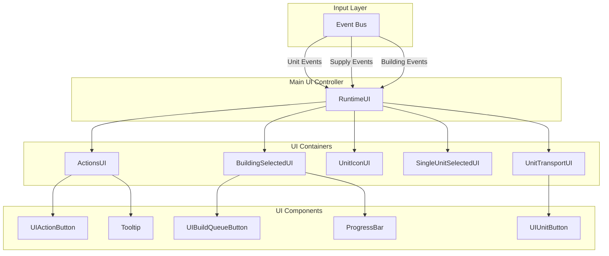
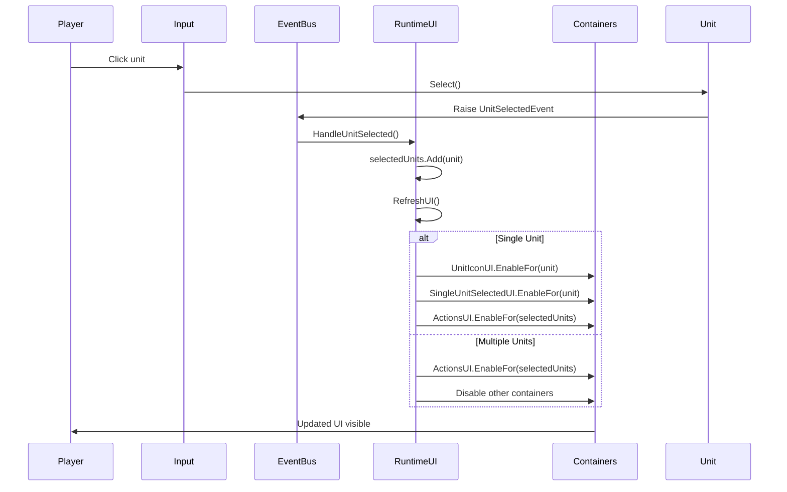
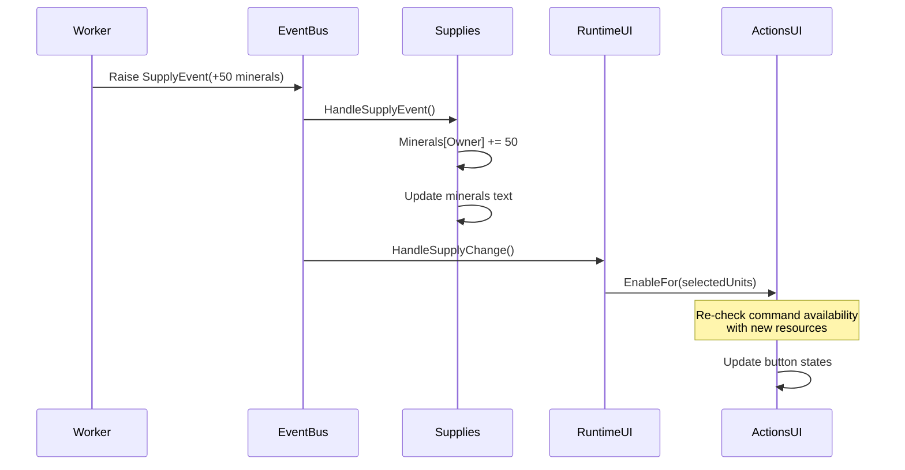
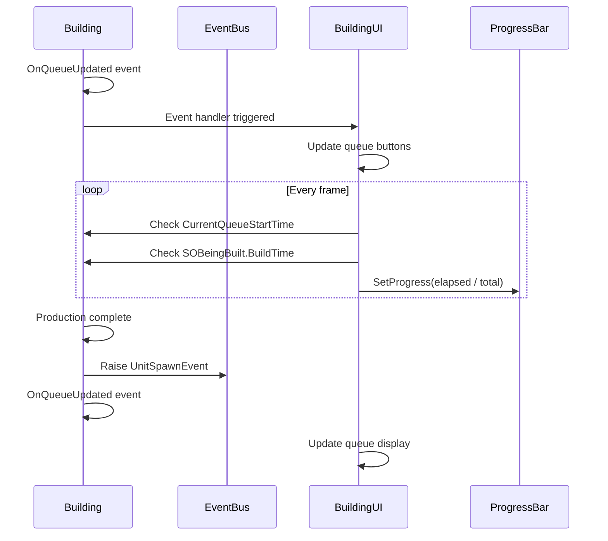

# UI System Architecture

## Overview

The UI System provides a reactive, event-driven interface that responds to unit selection, resource changes, and game events. It follows a container-component pattern with specialized UI elements for different unit types.

## System Architecture



## Core Components

### RuntimeUI

Main UI controller that orchestrates all UI containers:

```csharp
public class RuntimeUI : MonoBehaviour
{
    [SerializeField] private ActionsUI actionsUI;
    [SerializeField] private BuildingSelectedUI buildingSelectedUI;
    [SerializeField] private UnitIconUI unitIconUI;
    [SerializeField] private SingleUnitSelectedUI singleUnitSelectedUI;
    [SerializeField] private UnitTransportUI unitTransportUI;
    
    private HashSet<AbstractCommandable> selectedUnits = new(12);
}
```

### IUIElement Interface

```csharp
public interface IUIElement
{
    void Disable();
}
```

All UI containers implement this for consistent enable/disable behavior.

## UI Containers

### ActionsUI

Displays available commands for selected units:

```csharp
public class ActionsUI : MonoBehaviour, IUIElement
{
    [SerializeField] private UIActionButton[] actionButtons;
    [SerializeField] private GameObject container;
    
    public void EnableFor(HashSet<AbstractCommandable> selectedUnits)
    {
        // Get common commands across all selected units
        BaseCommand[] commonCommands = GetCommonCommands(selectedUnits);
        
        // Update button grid
        for (int i = 0; i < actionButtons.Length; i++)
        {
            UIActionButton button = actionButtons[i];
            BaseCommand command = FindCommandForSlot(commonCommands, i);
            
            if (command != null && command.IsAvailable(context))
            {
                button.SetupFrom(command, context);
                button.gameObject.SetActive(true);
            }
            else
            {
                button.gameObject.SetActive(false);
            }
        }
        
        container.SetActive(true);
    }
}
```

**Command Filtering**:
- Shows only commands common to all selected units
- Respects command slot assignments (0-8)
- Hides commands where `IsAvailable()` returns false
- Grays out commands where `IsLocked()` returns true

### BuildingSelectedUI

Shows building-specific information and production queue:

```csharp
public class BuildingSelectedUI : MonoBehaviour, IUIElement
{
    [SerializeField] private UIBuildQueueButton[] queueButtons;
    [SerializeField] private ProgressBar productionProgress;
    [SerializeField] private GameObject container;
    
    public void EnableFor(BaseBuilding building)
    {
        // Subscribe to building events
        building.OnQueueUpdated += HandleQueueUpdated;
        
        // Update queue display
        UpdateQueueDisplay(building.Queue);
        
        // Update production progress
        if (building.QueueSize > 0)
        {
            float progress = (Time.time - building.CurrentQueueStartTime) 
                / building.SOBeingBuilt.BuildTime;
            productionProgress.SetProgress(progress);
        }
        
        container.SetActive(true);
    }
}
```

### UnitIconUI

Shows portrait and health of selected unit:

```csharp
public class UnitIconUI : MonoBehaviour, IUIElement
{
    [SerializeField] private Image iconImage;
    [SerializeField] private ProgressBar healthBar;
    [SerializeField] private GameObject container;
    
    public void EnableFor(AbstractCommandable commandable)
    {
        // Set icon
        if (commandable.UnitSO is UnitSO unitSO)
        {
            iconImage.sprite = unitSO.Icon;
        }
        
        // Set health
        healthBar.SetProgress(
            (float)commandable.CurrentHealth / commandable.MaxHealth
        );
        
        // Subscribe to health updates
        commandable.OnHealthUpdated += HandleHealthUpdated;
        
        container.SetActive(true);
    }
}
```

### SingleUnitSelectedUI

Shows detailed stats for a single selected unit:

```csharp
public class SingleUnitSelectedUI : MonoBehaviour, IUIElement
{
    [SerializeField] private TextMeshProUGUI unitNameText;
    [SerializeField] private TextMeshProUGUI healthText;
    [SerializeField] private GameObject container;
    
    public void EnableFor(AbstractCommandable commandable)
    {
        unitNameText.SetText(commandable.UnitSO.Name);
        healthText.SetText($"{commandable.CurrentHealth} / {commandable.MaxHealth}");
        
        container.SetActive(true);
    }
}
```

### UnitTransportUI

Shows units loaded into a transport:

```csharp
public class UnitTransportUI : MonoBehaviour, IUIElement
{
    [SerializeField] private UIUnitButton[] unitButtons;
    [SerializeField] private GameObject container;
    
    public void EnableFor(ITransporter transporter)
    {
        ITransportable[] loadedUnits = transporter.GetLoadedUnits();
        
        for (int i = 0; i < unitButtons.Length; i++)
        {
            if (i < loadedUnits.Length)
            {
                unitButtons[i].SetupFrom(loadedUnits[i], i);
                unitButtons[i].gameObject.SetActive(true);
            }
            else
            {
                unitButtons[i].gameObject.SetActive(false);
            }
        }
        
        container.SetActive(true);
    }
}
```

## UI Components

### UIActionButton

Clickable command button with icon, tooltip, and state:

```csharp
public class UIActionButton : MonoBehaviour
{
    [SerializeField] private Image iconImage;
    [SerializeField] private Image lockOverlay;
    [SerializeField] private Button button;
    [SerializeField] private Tooltip tooltip;
    
    private BaseCommand command;
    
    public void SetupFrom(BaseCommand command, CommandContext context)
    {
        this.command = command;
        
        // Set icon
        iconImage.sprite = command.Icon;
        
        // Check if locked
        bool isLocked = command.IsLocked(context);
        lockOverlay.gameObject.SetActive(isLocked);
        button.interactable = !isLocked;
        
        // Setup tooltip
        if (isLocked && command is IUnlockableCommand unlockableCommand)
        {
            UnlockableSO[] unmetDeps = unlockableCommand.GetUnmetDependencies(context);
            tooltip.SetText($"{command.Name}\nRequires: {GetDependencyText(unmetDeps)}");
        }
        else
        {
            tooltip.SetText(command.Name);
        }
    }
    
    public void OnClick()
    {
        if (command != null)
        {
            Bus<CommandSelectedEvent>.Raise(Owner.Player1, 
                new CommandSelectedEvent(command));
        }
    }
}
```

### UIBuildQueueButton

Shows unit/upgrade in production queue:

```csharp
public class UIBuildQueueButton : MonoBehaviour
{
    [SerializeField] private Image iconImage;
    [SerializeField] private ProgressBar progressBar;
    [SerializeField] private Button cancelButton;
    
    private int queueIndex;
    private BaseBuilding building;
    
    public void SetupFrom(UnlockableSO unlockable, int index, BaseBuilding building, float progress)
    {
        this.queueIndex = index;
        this.building = building;
        
        iconImage.sprite = GetIconForUnlockable(unlockable);
        progressBar.SetProgress(progress);
        progressBar.gameObject.SetActive(index == 0); // Only show for first item
        
        gameObject.SetActive(true);
    }
    
    public void OnCancelClick()
    {
        building.CancelBuildingUnit(queueIndex);
    }
}
```

### UIUnitButton

Shows loaded unit in transport:

```csharp
public class UIUnitButton : MonoBehaviour
{
    [SerializeField] private Image iconImage;
    [SerializeField] private Button button;
    
    private int index;
    
    public void SetupFrom(ITransportable unit, int index)
    {
        this.index = index;
        
        if (unit is AbstractCommandable commandable && commandable.UnitSO is UnitSO unitSO)
        {
            iconImage.sprite = unitSO.Icon;
        }
        
        gameObject.SetActive(true);
    }
    
    public void OnClick()
    {
        // Unload this specific unit
        if (selectedTransporter != null)
        {
            selectedTransporter.Unload(index);
        }
    }
}
```

### ProgressBar

Reusable progress indicator:

```csharp
public class ProgressBar : MonoBehaviour
{
    [SerializeField] private Image fillImage;
    [SerializeField] private TextMeshProUGUI percentText;
    
    public void SetProgress(float progress)
    {
        progress = Mathf.Clamp01(progress);
        fillImage.fillAmount = progress;
        
        if (percentText != null)
        {
            percentText.SetText($"{Mathf.RoundToInt(progress * 100)}%");
        }
    }
}
```

Uses Unity's Image.fillAmount for smooth progress indication.

### Tooltip

Hover tooltip system:

```csharp
public class Tooltip : MonoBehaviour, IPointerEnterHandler, IPointerExitHandler
{
    [SerializeField] private GameObject tooltipPanel;
    [SerializeField] private TextMeshProUGUI tooltipText;
    
    private string text;
    
    public void SetText(string text)
    {
        this.text = text;
    }
    
    public void OnPointerEnter(PointerEventData eventData)
    {
        tooltipText.SetText(text);
        tooltipPanel.SetActive(true);
        
        // Position near mouse
        Vector2 localPoint;
        RectTransformUtility.ScreenPointToLocalPointInRectangle(
            canvas.transform as RectTransform,
            eventData.position,
            eventData.pressEventCamera,
            out localPoint
        );
        tooltipPanel.transform.position = canvas.transform.TransformPoint(localPoint);
    }
    
    public void OnPointerExit(PointerEventData eventData)
    {
        tooltipPanel.SetActive(false);
    }
}
```

## Event-Driven Updates

### Unit Selection Flow



### Supply Update Flow



### Building Production Flow



## UI State Management

### Visibility Rules

```csharp
private void RefreshUI()
{
    if (selectedUnits.Count > 0)
    {
        actionsUI.EnableFor(selectedUnits);
        
        if (selectedUnits.Count == 1)
        {
            ResolveSingleUnitSelectedUI();
        }
        else
        {
            // Multi-select: only show actions
            unitIconUI.Disable();
            singleUnitSelectedUI.Disable();
            buildingSelectedUI.Disable();
            unitTransportUI.Disable();
        }
    }
    else
    {
        DisableAllContainers();
    }
}
```

### Single Unit UI Resolution

```csharp
private void ResolveSingleUnitSelectedUI()
{
    AbstractCommandable commandable = selectedUnits.First();
    unitIconUI.EnableFor(commandable);
    
    if (commandable is BaseBuilding building)
    {
        singleUnitSelectedUI.Disable();
        unitTransportUI.Disable();
        buildingSelectedUI.EnableFor(building);
    }
    else if (commandable is ITransporter transporter && transporter.UsedCapacity > 0)
    {
        unitTransportUI.EnableFor(transporter);
        buildingSelectedUI.Disable();
        singleUnitSelectedUI.Disable();
    }
    else
    {
        buildingSelectedUI.Disable();
        unitTransportUI.Disable();
        singleUnitSelectedUI.EnableFor(commandable);
    }
}
```

**Priority**:
1. Building UI (if selected entity is a building)
2. Transport UI (if transporter has cargo)
3. Single Unit UI (default for units)

## Command Button Grid

### Layout System

```
Action Button Grid (3x3):
┌─────┬─────┬─────┐
│  0  │  1  │  2  │
├─────┼─────┼─────┤
│  3  │  4  │  5  │
├─────┼─────┼─────┤
│  6  │  7  │  8  │
└─────┴─────┴─────┘
```

Commands specify their slot (0-8):
- Slot -1: Not displayed in grid
- Slot 0-8: Positioned in grid

### Hotkey Mapping

```
Keyboard Layout:
Q W E
A S D
Z X C

Maps to:
0 1 2
3 4 5
6 7 8
```

Can be bound to Input System actions for hotkeys.

## Resource Display

### Supply UI

```csharp
public class Supplies : MonoBehaviour
{
    [SerializeField] private TextMeshProUGUI mineralsText;
    [SerializeField] private TextMeshProUGUI gasText;
    [SerializeField] private TextMeshProUGUI populationText;
    
    private void HandleSupplyEvent(SupplyEvent evt)
    {
        if (evt.Supply.Equals(mineralsSO))
        {
            Minerals[evt.Owner] += evt.Amount;
            if (evt.Owner == Owner.Player1)
            {
                mineralsText.SetText(Minerals[evt.Owner].ToString());
            }
        }
        else if (evt.Supply.Equals(gasSO))
        {
            Gas[evt.Owner] += evt.Amount;
            if (evt.Owner == Owner.Player1)
            {
                gasText.SetText(Gas[evt.Owner].ToString());
            }
        }
    }
}
```

Updates only for Player1 to avoid UI pollution.

## Performance Considerations

### Event Subscription Management

```csharp
private void Awake()
{
    // Subscribe
    Bus<UnitSelectedEvent>.OnEvent[Owner.Player1] += HandleUnitSelected;
    Bus<UnitDeselectedEvent>.OnEvent[Owner.Player1] += HandleUnitDeselected;
    Bus<SupplyEvent>.OnEvent[Owner.Player1] += HandleSupplyChange;
}

private void OnDestroy()
{
    // Always unsubscribe
    Bus<UnitSelectedEvent>.OnEvent[Owner.Player1] -= HandleUnitSelected;
    Bus<UnitDeselectedEvent>.OnEvent[Owner.Player1] -= HandleUnitDeselected;
    Bus<SupplyEvent>.OnEvent[Owner.Player1] -= HandleSupplyChange;
}
```

### Batched Updates

Instead of updating on every event:

```csharp
private bool updatePending = false;

private void HandleSupplyChange(SupplyEvent evt)
{
    if (!updatePending)
    {
        updatePending = true;
        StartCoroutine(UpdateUINextFrame());
    }
}

private IEnumerator UpdateUINextFrame()
{
    yield return null; // Wait one frame
    actionsUI.EnableFor(selectedUnits);
    updatePending = false;
}
```

Batches multiple supply changes into single UI update.

### Object Pooling for Queue Buttons

```csharp
private Queue<UIBuildQueueButton> buttonPool = new();

private UIBuildQueueButton GetButton()
{
    if (buttonPool.Count > 0)
    {
        return buttonPool.Dequeue();
    }
    else
    {
        return Instantiate(buttonPrefab);
    }
}

private void ReturnButton(UIBuildQueueButton button)
{
    button.gameObject.SetActive(false);
    buttonPool.Enqueue(button);
}
```

## Extension Example

### Custom Container for Hero Units

```csharp
public class HeroUI : MonoBehaviour, IUIElement
{
    [SerializeField] private Image portraitImage;
    [SerializeField] private TextMeshProUGUI levelText;
    [SerializeField] private ProgressBar experienceBar;
    [SerializeField] private UIAbilityButton[] abilityButtons;
    
    public void EnableFor(HeroUnit hero)
    {
        portraitImage.sprite = hero.Portrait;
        levelText.SetText($"Level {hero.Level}");
        experienceBar.SetProgress(hero.Experience / hero.ExperienceToNextLevel);
        
        for (int i = 0; i < abilityButtons.Length; i++)
        {
            if (i < hero.Abilities.Length)
            {
                abilityButtons[i].SetupFrom(hero.Abilities[i]);
            }
            else
            {
                abilityButtons[i].gameObject.SetActive(false);
            }
        }
        
        gameObject.SetActive(true);
    }
    
    public void Disable()
    {
        gameObject.SetActive(false);
    }
}
```

Add to RuntimeUI:

```csharp
private void ResolveSingleUnitSelectedUI()
{
    if (commandable is HeroUnit hero)
    {
        heroUI.EnableFor(hero);
        // Disable other containers
    }
    // ... existing code
}
```

## Best Practices

1. **Event-Driven Updates**: UI reacts to events, doesn't poll
2. **Container Pattern**: Separate containers for different UI contexts
3. **Disable When Not Needed**: Deactivate containers to save rendering
4. **Unsubscribe Events**: Always clean up event subscriptions
5. **Batch Updates**: Combine multiple updates into one frame
6. **Cached References**: Store component references in fields
7. **Null Checks**: Verify selected units still exist before updating
8. **Player-Only Events**: Only listen to Player1 events for UI
9. **Tooltip Consistency**: Provide tooltips for all interactive elements
10. **Accessibility**: Support keyboard navigation where possible
