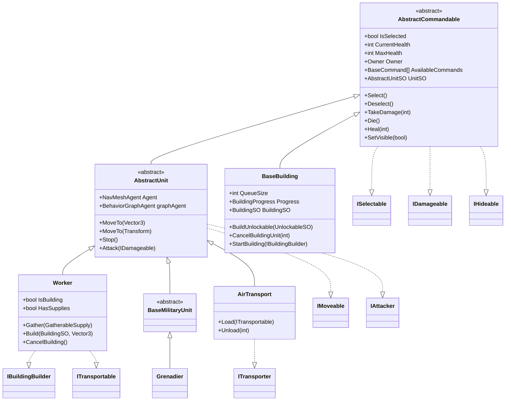
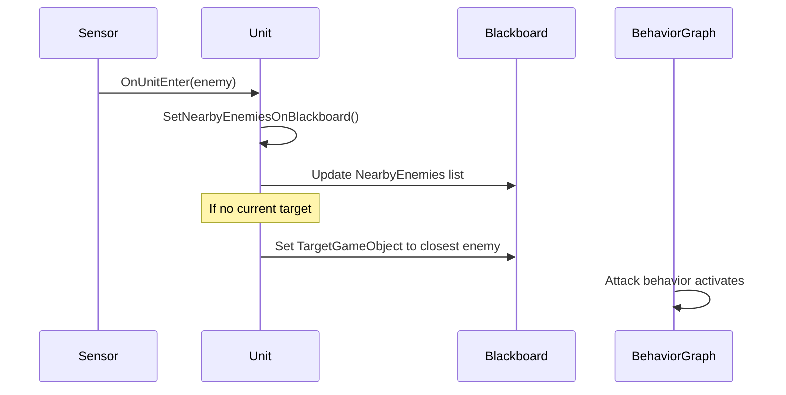
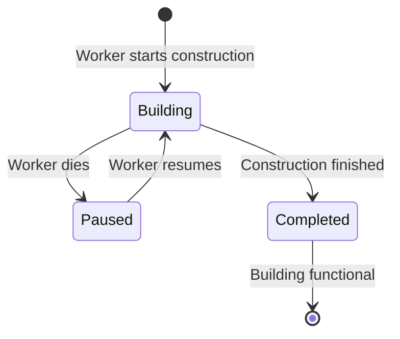
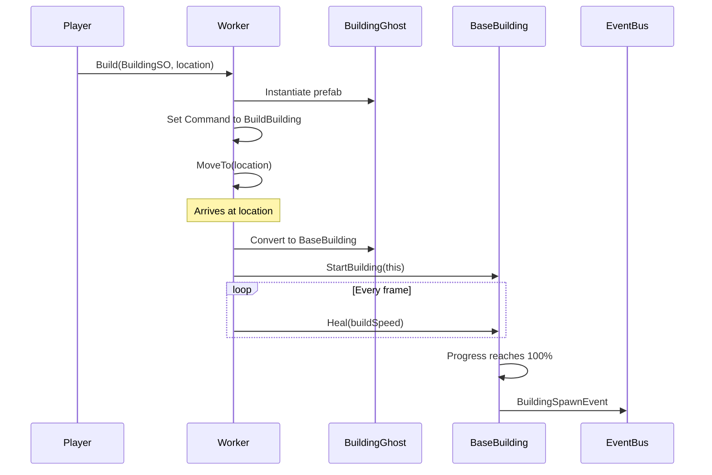
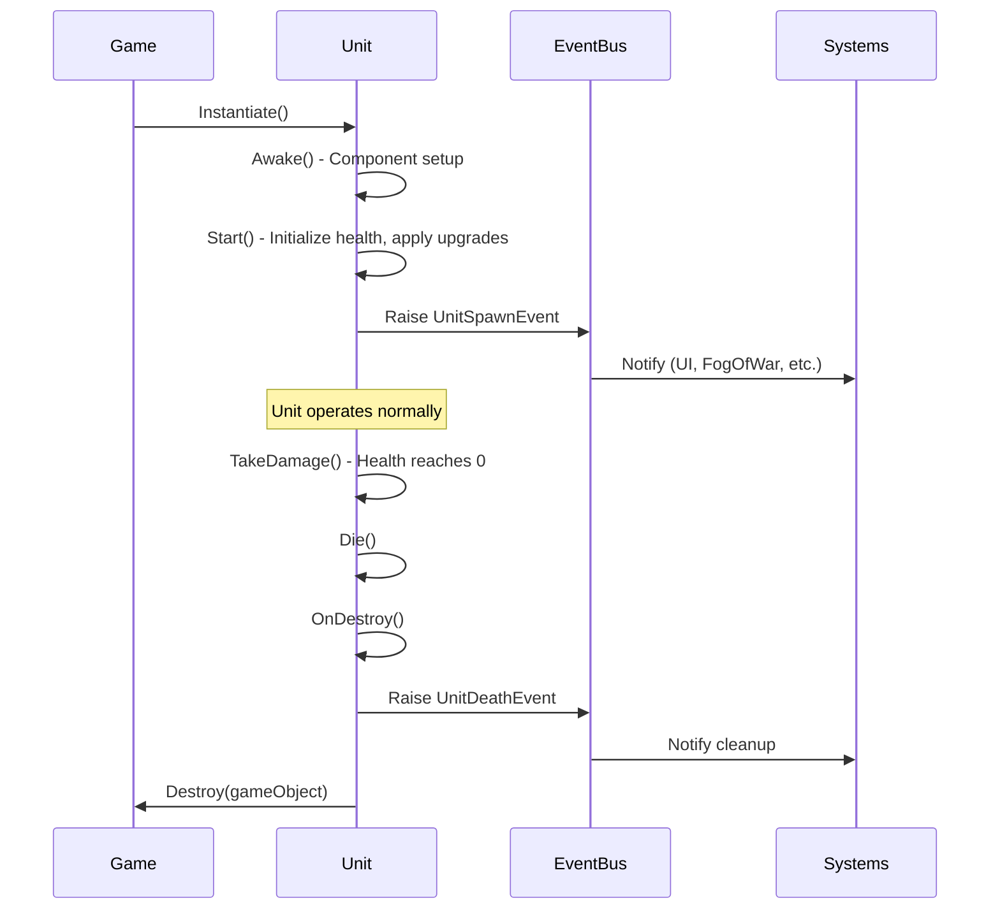

# Unit System Architecture

## Overview

The Unit System is built on a hierarchical class structure with interface-based composition. All units inherit from a common base that provides selection, damage, and visibility functionality.

## Class Hierarchy



## Core Interfaces

### ISelectable
Units that can be selected by the player.
```csharp
public interface ISelectable
{
    bool IsSelected { get; }
    Transform Transform { get; }
    void Select();
    void Deselect();
}
```

### IDamageable
Entities that can receive damage.
```csharp
public interface IDamageable
{
    int CurrentHealth { get; }
    int MaxHealth { get; }
    Owner Owner { get; }
    Transform Transform { get; }
    void TakeDamage(int damage);
    void Die();
}
```

### IMoveable
Units that can move using NavMesh.
```csharp
public interface IMoveable
{
    NavMeshAgent Agent { get; }
    void MoveTo(Vector3 position);
    void MoveTo(Transform transform);
}
```

### IAttacker
Units capable of attacking.
```csharp
public interface IAttacker
{
    ParticleSystem AttackingParticleSystem { get; }
    void Attack(IDamageable target);
    void Attack(Vector3 location);
}
```

### IHideable
Entities that can be hidden by fog of war.
```csharp
public interface IHideable
{
    bool IsVisible { get; }
    Transform Transform { get; }
    void SetVisible(bool isVisible);
    event VisibilityChangeEvent OnVisibilityChanged;
}
```

### IBuildingBuilder
Units that can construct buildings.
```csharp
public interface IBuildingBuilder
{
    Owner Owner { get; }
    bool IsBuilding { get; }
    GameObject Build(BuildingSO building, Vector3 targetLocation);
    void ResumeBuilding(BaseBuilding building);
    void CancelBuilding();
}
```

### ITransporter & ITransportable
Transport system for unit cargo.
```csharp
public interface ITransporter
{
    Transform Transform { get; }
    int TotalCapacity { get; }
    int UsedCapacity { get; }
    void Load(ITransportable unit);
    void Unload(int index);
}

public interface ITransportable
{
    int TransportCapacityUsage { get; }
    void LoadInto(ITransporter transporter);
}
```

## AbstractCommandable

The root base class for all selectable entities.

### Responsibilities
1. **Selection Management**: Visual feedback (decal projector) and event raising
2. **Health System**: Damage, healing, death
3. **Visibility Management**: Fog of war integration
4. **Command System**: Available commands and overrides
5. **Upgrade Integration**: Listens to upgrade events and applies them

### Key Features

**Command Override System**:
- Units can temporarily override available commands
- Used when Worker is building (shows Cancel Building command)
- Used when selecting transportable units near transports

**Visibility Culling**:
- Toggles renderers and particle systems based on fog of war
- Buildings create placeholder visuals when not visible

**Event Integration**:
```csharp
// Raises when selected
Bus<UnitSelectedEvent>.Raise(Owner, new UnitSelectedEvent(this));

// Raises when deselected
Bus<UnitDeselectedEvent>.Raise(Owner, new UnitDeselectedEvent(this));

// Listens for upgrades
Bus<UpgradeResearchedEvent>.OnEvent[Owner] += HandleUpgradeResearched;
```

## AbstractUnit

Mobile units that use NavMeshAgent and Unity Behavior Graphs.

### Responsibilities
1. **Navigation**: NavMeshAgent integration
2. **Behavior Management**: BehaviorGraphAgent variable control
3. **Combat**: Attack target acquisition and sensor management
4. **Icon Display**: UI icon reference

### Unity Behavior Integration

Units use Behavior Graphs for AI logic:
```csharp
// Setting command to move
graphAgent.SetVariableValue("TargetLocation", position);
graphAgent.SetVariableValue("Command", UnitCommands.Move);

// Setting command to attack
graphAgent.SetVariableValue("TargetGameObject", target.gameObject);
graphAgent.SetVariableValue("Command", UnitCommands.Attack);
```

### DamageableSensor System

Units have trigger sensors to detect enemies:
- **OnUnitEnter**: Adds enemy to nearby enemies list
- **OnUnitExit**: Removes enemy and retargets if needed
- Auto-targeting closest enemy when sensor detects hostiles



## BaseBuilding

Static structures with production capabilities.

### Responsibilities
1. **Construction State**: Tracks building progress
2. **Production Queue**: Builds units and researches upgrades
3. **Builder Management**: Tracks which worker is building it
4. **Culled Visuals**: Creates placeholder when not visible

### Building States



### Production Queue System

Buildings can queue up to 5 items:
```csharp
public void BuildUnlockable(UnlockableSO unlockable)
{
    // Deduct cost immediately
    Bus<SupplyEvent>.Raise(Owner, new SupplyEvent(Owner, -unlockable.Cost.Minerals, ...));
    
    // Add to queue
    buildingQueue.Add(unlockable);
    
    // Start coroutine if first item
    if (buildingQueue.Count == 1)
    {
        StartCoroutine(DoBuildUnits());
    }
}
```

### Events Raised
- `BuildingSpawnEvent`: When construction completes
- `BuildingDeathEvent`: When destroyed

## Worker

Specialized unit for resource gathering and construction.

### Unique Features

**Resource Gathering**:
- Holds supply amount in Behavior Graph blackboard
- Gathers from `GatherableSupply` objects
- Returns supplies to Command Post

**Building Construction**:
- Can build new structures
- Can resume paused construction
- Shows Cancel Building command while building

**State Management**:
```csharp
public enum UnitCommands
{
    Stop,
    Move,
    Attack,
    Gather,
    ReturnSupplies,
    BuildBuilding,
    Load,
    Unload
}
```

### Building Flow



## ScriptableObject Configuration

### AbstractUnitSO
Base configuration for all units:
```csharp
public abstract class AbstractUnitSO : UnlockableSO
{
    public GameObject Prefab;
    public int Health;
    public SightConfigSO SightConfig;
    public UpgradeSO[] Upgrades;
}
```

### UnitSO
Configuration for mobile units:
```csharp
public class UnitSO : AbstractUnitSO
{
    public Sprite Icon;
    public AttackConfigSO AttackConfig;
    public TransportConfigSO TransportConfig;
}
```

### BuildingSO
Configuration for buildings:
```csharp
public class BuildingSO : AbstractUnitSO
{
    public Material PlacementMaterial;
    public float BuildTime;
    public int PopulationProvided;
}
```

### AttackConfigSO
Combat configuration:
```csharp
public class AttackConfigSO : ScriptableObject
{
    public int AttackDamage;
    public float AttackRange;
    public float AttackCooldown;
    public float AttackSpeed;
}
```

## Owner System

All units have an owner from the `Owner` enum:
```csharp
public enum Owner
{
    Player1,
    AI1, AI2, AI3, AI4, AI5, AI6, AI7,
    Invalid,
    Unowned
}
```

This enables:
- Per-owner event bus channels
- Team-based fog of war
- Resource tracking per player
- Tech tree progression per player

## Unit Lifecycle



## Performance Considerations

1. **Object Pooling**: Not currently implemented but recommended for projectiles
2. **NavMesh Baking**: Static obstacles should be baked at build time
3. **Sensor Triggers**: Limited to 10-15 meter range to avoid excessive trigger events
4. **Behavior Graph Updates**: Runs per-unit, consider disabling for distant units
5. **Visibility Culling**: Renderers disabled when not visible via fog of war

## Extension Points

To add a new unit type:

1. Create a new class inheriting from `AbstractUnit` or `BaseMilitaryUnit`
2. Implement required interfaces (`IAttacker`, `IMoveable`, etc.)
3. Create a `UnitSO` ScriptableObject with configuration
4. Create a prefab with required components:
   - NavMeshAgent
   - BehaviorGraphAgent
   - DamageableSensor (if combat unit)
   - Collider (for selection)
5. Assign commands to the unit in the prefab
6. Add unit to tech tree if it requires unlocking
