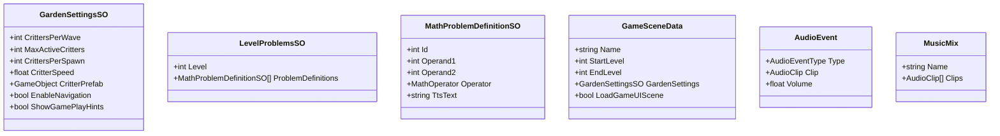

# Math Munchies Mayhem - Technical Architecture

**Unity Version:** 2022.3  
**Game Type:** Educational Math Game (WebGL)  
**Platform:** Legends of Learning Framework + Standalone WebGL Support

## Table of Contents

1. [Overview](#overview)
2. [Project Structure](#project-structure)
3. [Architecture Overview](#architecture-overview)
4. [Core Systems](#core-systems)
5. [LolSDK Integration](#lolsdk-integration)
6. [Game Flow](#game-flow)
7. [Data Management](#data-management)
8. [Key Components](#key-components)
9. [Appendix: Replacing LolSDK](#appendix-replacing-lolsdk)

---

## Overview

Math Munchies Mayhem is an educational game designed to teach multiplication through engaging gameplay. Players solve math problems to save food items from critters in a garden setting. The game supports dual deployment modes: **Legends of Learning platform** and **standalone WebGL builds**.

### Deployment Modes

**Legends of Learning Platform:**
- Integrated with LoL SDK for progress tracking, cloud saves, and analytics
- Platform-provided TTS and localization services
- Deployed through Legends of Learning educational platform

**Standalone WebGL:**
- Independent deployment to itch.io, personal websites, or other hosting
- PlayerPrefs-based local persistence (browser IndexedDB)
- Web Speech API for text-to-speech
- Self-hosted localization from StreamingAssets

### Key Features
- Progressive difficulty system (14 levels across 4 ranks)
- Math problem generation with fact family support
- Object pooling for performance optimization
- Event-driven architecture
- Multi-scene management
- Text-to-speech support for accessibility
- Dual deployment flexibility (LoL platform or standalone)

---

## Project Structure

```
/Assets
├── _project/                      # Main project assets
│   ├── Scenes/                    # Game scenes
│   │   ├── _init.unity            # Initialization/loading scene
│   │   ├── Main Menu.unity        # Main menu
│   │   ├── Garden.unity           # Primary gameplay scene
│   │   ├── Triangles.unity        # Triangle math problems scene
│   │   ├── GameUI.unity           # Additively loaded UI scene
│   │   ├── Briefing Room.unity    # Level intro
│   │   ├── Promotion.unity        # Rank promotion screen
│   │   └── Game Over.unity        # End game screen
│   │
│   ├── Scripts/                   # All game code
│   │   ├── Init/                  # Initialization & bootstrapping
│   │   ├── Managers/              # Core system managers
│   │   ├── Services/              # WebGL service providers
│   │   ├── Critters/              # Enemy AI & spawning
│   │   ├── Numbers/               # Math problem UI elements
│   │   ├── Math/                  # Math problem logic
│   │   ├── UI/                    # UI controllers
│   │   ├── Audio/                 # Audio & TTS systems
│   │   ├── Events/                # Event bus system
│   │   ├── Food/                  # Food item management
│   │   ├── Effects/               # Visual effects
│   │   └── Helpers/               # Utilities & extensions
│   │
│   ├── WebGL Wrappers/            # WebGL implementation assets
│   │   ├── LoLWebGLWrapper.asset  # Legends of Learning wrapper
│   │   └── StandaloneWebGLWrapper.asset  # Standalone wrapper
│   │
│   ├── Prefabs/                   # Reusable game objects
│   ├── Materials/                 # Materials
│   ├── Audio/                     # Sound effects
│   └── Music/                     # Background music
│
├── LegendsOfLearningSDK/          # LolSDK integration
│   ├── LoLWebGL/                  # WebGL platform interface
│   ├── Scripts/                   # SDK helper scripts
│   └── WebGLLoLDemo/              # SDK demo/reference
│
├── Plugins/                       # Third-party assets
│   └── WebGL/                     # WebGL plugins
│       └── StandaloneTTS.jslib    # Web Speech API integration
├── Resources/                     # Runtime-loaded resources
├── StreamingAssets/               # Language & config files
│   ├── language.json              # Localization strings
│   └── startGame.json             # Initial game configuration
│
└── WebGLTemplates/
    └── lol-template/              # Custom WebGL template for LoL
```

---

## Architecture Overview

The game follows a manager-based architecture with singleton patterns and an event-driven communication system. A **WebGL Service Provider** pattern enables flexible deployment to multiple platforms.


### WebGL Service Provider Pattern

The game uses a **provider pattern** to abstract WebGL platform services:

```mermaid
classDiagram
    class ILOLSDK {
        <<interface>>
        +SaveState(data)
        +SubmitProgress(score, progress, max)
        +SpeakText(key)
        +CompleteGame()
    }
    
    class WebGLServiceProvider {
        +GetWebGLImplementation() ILOLSDK
        -_webGLImplementation
    }
    
    class LoLWebGL {
        +SaveState(data) → LoL Platform
        +SpeakText(key) → Platform TTS
    }
    
    class StandaloneWebGL {
        +SaveState(data) → PlayerPrefs
        +SpeakText(key) → Web Speech API
    }
    
    class MockWebGL {
        +SaveState(data) → Debug Logs
        +SpeakText(key) → Editor TTS
    }
    
    ILOLSDK <|.. LoLWebGL
    ILOLSDK <|.. StandaloneWebGL
    ILOLSDK <|.. MockWebGL
    WebGLServiceProvider --> ILOLSDK
```



**Deployment Configuration:**
- Assign `LoLWebGLWrapper` → Deploy to Legends of Learning platform
- Assign `StandaloneWebGLWrapper` → Deploy to itch.io or standalone hosting

### Design Patterns Used

- **Singleton Pattern**: Core managers (GameManager, ScoreManager, etc.)
- **Provider Pattern**: WebGL service abstraction for multiple platforms
- **Object Pool Pattern**: Performance optimization for frequently spawned objects
- **Event Bus Pattern**: Decoupled communication between systems
- **Factory Pattern**: ToonNumberFactory for creating number prefabs
- **State Pattern**: GameState enum for game flow management

---

## Core Systems

### 1. Initialization System


**Key Classes:**
- `Bootstrapper`: Loads persistent managers before first scene
- `WebGLServiceProvider`: Provides platform-specific WebGL implementation
- `Loader`: Initializes SDK/platform and waits for data
  - **Editor**: Loads from StreamingAssets using `File.ReadAllText()`
  - **LoL Platform**: Receives data from LoL SDK events
  - **Standalone WebGL**: Loads from StreamingAssets using `UnityWebRequest.Get()`
- `SharedState`: Static class holding SDK data

### 2. Game State Management


**GameStateData Structure:**
```csharp
{
    GameState GameState;        // Current game state
    int Score;                  // Total points
    int CurrentProgress;        // Current level (0-13)
    int MaxProgress;            // Maximum level reached
    string SceneName;           // Active scene name
}
```

### 3. Event System

The `EventBus` provides decoupled communication between systems:

```csharp
// Core Events
ScoreChanged(int score, int progress)
GameStateChanged(GameStateData state)
LevelStarted(int level)
LevelEnded(int level)

// Critter Events
CritterSelected(int id)
CritterRemoved(int crittersRemaining)

// Math Problem Events
MathProblemGenerated(int id)
MathProblemSolved(int id)
MathProblemFailed(int id)
FactFamilyChanged(FactFamily family)

// UI Events
LanguageChanged()
MuteAudioToggled()
```

### 4. Score & Progression System


**ScoreManager Responsibilities:**
- Track current score (points)
- Track current progress (level 0-13)
- Calculate current rank
- Manage critters remaining count
- Fire score change events

### 5. Math Problem System


**Fact Families:**
```
A × B = C    (ATimesBEqualsC)
B × A = C    (BTimesAEqualsC)
C ÷ A = B    (CDividedByAEqualsB)
C ÷ B = A    (CDividedByBEqualsA)
```

### 6. Object Pool System


**Key Interfaces:**
- `IRetrievedPoolObject`: Called when object retrieved from pool
- `IDespawnedPoolObject`: Called when object returned to pool

---

## WebGL Platform Integration

The game uses a **WebGL Service Provider** system to support multiple deployment targets. All game code interacts with the `ILOLSDK` interface, while the actual implementation is swapped based on the deployment target.

### WebGL Service Provider Architecture


### Implementation Comparison

| Feature | MockWebGL (Editor) | LoLWebGL (Platform) | StandaloneWebGL (Web) |
|---------|-------------------|---------------------|----------------------|
| **Save/Load** | Debug logs only | Cloud (LoL servers) | PlayerPrefs (IndexedDB) |
| **Progress Tracking** | Debug logs | Analytics to LoL | PlayerPrefs |
| **Text-to-Speech** | HTTP → Polly TTS | Platform native TTS | Web Speech API |
| **Localization** | StreamingAssets (File.ReadAllText) | LoL platform events | StreamingAssets (UnityWebRequest) |
| **Use Case** | Testing in editor | LoL platform builds | itch.io, personal sites |

### 1. Game Progress Persistence

#### Legends of Learning Platform


#### Standalone WebGL


**Integration Points:**
- `GameManager.SaveGameState()`: Saves after level completion
- `LOLSDK.Instance.SubmitProgress()`: Reports score and progress
- `LOLSDK.Instance.SaveState()`: Persists GameStateData

**Storage Locations:**
- **LoL Platform**: Cloud storage on LoL servers
- **Standalone WebGL**: Browser IndexedDB via PlayerPrefs
- **Editor**: Debug logs (no persistence)

### 2. Localization System

#### Legends of Learning Platform


#### Standalone WebGL


**Usage Example:**
```csharp
// Access localized text
string welcomeText = SharedState.LanguageDefs["welcome"];

// UI updates on language change
EventBus.LanguageChanged += () => {
    titleText.text = SharedState.LanguageDefs["gameTitle"];
};
```

**Data Sources:**
- **LoL Platform**: Language data provided by platform events
- **Standalone WebGL**: `/Assets/StreamingAssets/language.json` (loaded via UnityWebRequest)
- **Editor**: `/Assets/StreamingAssets/language.json` (loaded via File.ReadAllText)

### 3. Text-to-Speech (TTS)

#### Legends of Learning Platform


#### Standalone WebGL


#### Editor (MockWebGL)


**Key Classes:**
- `TextSpeaker`: Singleton managing TTS playback
- `SpeakText`: Component for triggering TTS on UI events
- `StandaloneTTS.jslib`: Web Speech API bridge (standalone builds only)

**TTS Implementation:**
- **LoL Platform**: Platform-provided TTS service
- **Standalone WebGL**: Browser Web Speech API via JavaScript plugin
- **Editor**: AWS Polly TTS via HTTP requests

---

## Game Flow

### Complete Game Loop


### Level Progression Details

| Progress | Level Display | Scene | Rank |
|----------|---------------|-------|------|
| 0-2 | 1-3 | Garden | Munchie Munchkin |
| 3 | 3 | Garden | Number Nibbler |
| 4-6 | 4-6 | Triangles | Number Nibbler |
| 7 | 6 | Garden | Digit Diner |
| 8-10 | 7-9 | Triangles | Digit Diner |
| 11 | 9 | Garden | Equation Eater |
| 12-13 | 10 | Triangles | Equation Eater |

---

## Data Management

### ScriptableObjects



### Persistent Data

**SharedState (Static):**
```csharp
public static class SharedState {
    public static JSONNode StartGameData;    // SDK startup config
    public static JSONNode LanguageDefs;     // Localization strings
}
```

**GameStateData (Serializable):**
```csharp
[Serializable]
public class GameStateData {
    public GameState GameState;
    public int Score;
    public int CurrentProgress;
    public int MaxProgress;
    public string SceneName;
}
```

---

## Key Components

### Singleton Managers

| Manager | Responsibility |
|---------|----------------|
| `GameManager` | Scene lifecycle, game state, SDK integration |
| `ScoreManager` | Points, progress, rank calculation |
| `MathProblemManager` | Problem generation, tracking solutions |
| `AudioManager` | Music playback |
| `AudioEventManager` | Sound effect playback |
| `MusicManager` | Background music control |
| `ObjectPoolManager` | Object pooling for performance |
| `FoodItemManager` | Food item tracking and queries |
| `GardenSettingsManager` | Level configuration lookup |
| `TextSpeaker` | Text-to-speech coordination |
| `ToonNumberFactory` | Number prefab instantiation |

### Critter System


**Variants:**
- `EasyCritter` / `EasyCritterSpawner`: Simplified movement
- `TriangleCritter` / `TriangleCritterSpawner`: Triangle-based problems

### UI System


**Key UI Controllers:**
- `MainMenuUI`: New game / Continue buttons
- `GamePlayUI`: Active gameplay HUD
- `ScoringUI`: End-of-level results
- `GameOverUI`: Final game summary
- `ClassroomUI`: Classroom management screen

---

## Appendix: WebGL Service Provider Implementation

Math Munchies Mayhem uses a **WebGL Service Provider** pattern to support multiple deployment targets without code duplication. This section details the implementation architecture.

### Architecture Components

#### 1. ILOLSDK Interface

All WebGL implementations conform to the `ILOLSDK` interface:

```csharp
public interface ILOLSDK
{
    void SaveState(string data);
    void LoadState<T>(Action<StateDataFromPlatform<T>> callback) where T : class;
    void SubmitProgress(int score, int currentProgress, int maximumProgress);
    void SpeakText(string key);
    void SpeakText(string key, Action<AudioClip> callback);
    void CompleteGame();
    void GameIsReady();
    // ... other methods
}
```

#### 2. WebGL Service Provider

The `WebGLServiceProvider` singleton determines which implementation to use:

```csharp
public class WebGLServiceProvider : MonoBehaviour
{
    [SerializeField] ILOLSDK_EXTENSION_Wrapper _webGLImplementation;
    
    public ILOLSDK GetWebGLImplementation()
    {
        #if UNITY_EDITOR
            return new MockWebGL(); // Testing implementation
        #elif UNITY_WEBGL
            if (_webGLImplementation != null)
                return _webGLImplementation.Implementation;
            return new LoLSDK.WebGL(); // Default to LoL platform
        #else
            return new MockWebGL();
        #endif
    }
}
```

**Configuration:**
- Located in: `--PersistentComponents` prefab
- Field: `_webGLImplementation`
- Assign `LoLWebGLWrapper.asset` for LoL platform builds
- Assign `StandaloneWebGLWrapper.asset` for standalone builds

#### 3. Implementation: StandaloneWebGL

The `StandaloneWebGLWrapper` provides full standalone functionality:

**Features:**
- **Persistence**: PlayerPrefs → Browser IndexedDB
- **TTS**: Web Speech API via JavaScript plugin
- **Localization**: UnityWebRequest → StreamingAssets
- **Progress**: Local storage and logging

**Key Methods:**

```csharp
public class StandaloneWebGL : ILOLSDK
{
    // Save to PlayerPrefs (IndexedDB in WebGL)
    public void SaveState(string data)
    {
        PlayerPrefs.SetString(SAVE_KEY_STATE, data);
        PlayerPrefs.Save();
    }
    
    // Load from PlayerPrefs
    public void LoadState<T>(Action<StateDataFromPlatform<T>> callback)
    {
        string stateJson = PlayerPrefs.GetString(SAVE_KEY_STATE, null);
        T data = JsonUtility.FromJson<T>(stateJson);
        int score = PlayerPrefs.GetInt(SAVE_KEY_SCORE, 0);
        int currentProgress = PlayerPrefs.GetInt(SAVE_KEY_PROGRESS, 0);
        // ... build StateDataFromPlatform and invoke callback
    }
    
    // Submit progress (stored locally)
    public void SubmitProgress(int score, int currentProgress, int maximumProgress)
    {
        PlayerPrefs.SetInt(SAVE_KEY_SCORE, score);
        PlayerPrefs.SetInt(SAVE_KEY_PROGRESS, currentProgress);
        PlayerPrefs.Save();
    }
    
    // Text-to-speech via Web Speech API
    public void SpeakText(string key)
    {
        #if UNITY_WEBGL && !UNITY_EDITOR
            string text = SharedState.LanguageDefs[key];
            Standalone_SpeakText(text); // Call to .jslib
        #endif
    }
}
```

#### 4. JavaScript Plugin: StandaloneTTS.jslib

Required for standalone WebGL TTS support:

```javascript
mergeInto(LibraryManager.library, {
    Standalone_SpeakText: function(textPtr) {
        var text = UTF8ToString(textPtr);
        if ('speechSynthesis' in window) {
            window.speechSynthesis.cancel();
            var utterance = new SpeechSynthesisUtterance(text);
            utterance.rate = 0.9;
            utterance.pitch = 1.0;
            window.speechSynthesis.speak(utterance);
        }
    },
    
    Standalone_CancelSpeakText: function() {
        if ('speechSynthesis' in window) {
            window.speechSynthesis.cancel();
        }
    },
    
    Standalone_IsSpeaking: function() {
        if ('speechSynthesis' in window) {
            return window.speechSynthesis.speaking ? 1 : 0;
        }
        return 0;
    }
});
```

**File Location:** `/Assets/Plugins/WebGL/StandaloneTTS.jslib`

#### 5. Loader Integration

The `Loader` class handles initialization differently based on the platform:

```csharp
void Awake()
{
    ILOLSDK webGL = WebGLServiceProvider.Instance.GetWebGLImplementation();
    LOLSDK.Init(webGL, "com.midniteoilsoftware.mathmunchiesmayhem");

    #if UNITY_EDITOR
        LoadMockData(); // File.ReadAllText
    #elif UNITY_WEBGL
        bool isStandaloneWrapper = webGL is StandaloneWebGL;
        if (isStandaloneWrapper)
        {
            StartCoroutine(LoadStandaloneData()); // UnityWebRequest
        }
        // else: LoL platform sends data via events
    #endif
    
    LOLSDK.Instance.GameIsReady();
}
```

**LoadStandaloneData() Implementation:**

```csharp
IEnumerator LoadStandaloneData()
{
    string languageFilePath = Path.Combine(Application.streamingAssetsPath, "language.json");
    string startGameFilePath = Path.Combine(Application.streamingAssetsPath, "startGame.json");
    
    // Load startGame.json
    using (UnityWebRequest request = UnityWebRequest.Get(startGameFilePath))
    {
        yield return request.SendWebRequest();
        if (request.result == UnityWebRequest.Result.Success)
        {
            HandleStartGame(request.downloadHandler.text);
        }
    }
    
    // Load language.json
    using (UnityWebRequest request = UnityWebRequest.Get(languageFilePath))
    {
        yield return request.SendWebRequest();
        if (request.result == UnityWebRequest.Result.Success)
        {
            var langDefs = JSON.Parse(request.downloadHandler.text);
            HandleLanguageDefs(langDefs[languageCode].ToString());
        }
    }
}
```

### Deployment Workflow

#### For Legends of Learning Platform:

1. In Unity, select `--PersistentComponents` prefab
2. Find `WebGLServiceProvider` component
3. Assign `_webGLImplementation` → `LoLWebGLWrapper.asset`
4. Build WebGL with LoL template
5. Upload to Legends of Learning

**Features Enabled:**
- Cloud saves via LoL platform
- Platform analytics and progress tracking
- Platform-provided TTS
- Platform-provided localization

#### For Standalone (itch.io, personal sites):

1. In Unity, select `--PersistentComponents` prefab
2. Find `WebGLServiceProvider` component
3. Assign `_webGLImplementation` → `StandaloneWebGLWrapper.asset`
4. Ensure `/Assets/Plugins/WebGL/StandaloneTTS.jslib` exists
5. Ensure `/Assets/StreamingAssets/language.json` and `startGame.json` exist
6. Build WebGL with any template
7. Upload to hosting platform

**Features Enabled:**
- Local browser saves via IndexedDB (PlayerPrefs)
- Local progress tracking
- Browser TTS via Web Speech API
- Self-hosted localization from StreamingAssets

### Browser Compatibility

**PlayerPrefs (IndexedDB):**
- ✅ Chrome, Edge, Firefox, Safari (all versions)
- ✅ Mobile browsers
- 🔒 Requires user to allow cookies/storage

**Web Speech API (TTS):**
- ✅ Chrome 33+, Edge 14+
- ✅ Safari 7+ (macOS), Safari 7.1+ (iOS)
- ⚠️ Firefox 49+ (limited voice selection)
- ❌ Internet Explorer

### Testing

**In Unity Editor:**
- Uses `MockWebGL` implementation
- TTS via AWS Polly HTTP requests
- Loads from StreamingAssets using `File.ReadAllText()`

**Local WebGL Build:**
- Test standalone: Assign `StandaloneWebGLWrapper`
- Run local server (e.g., `python -m http.server`)
- Verify TTS, save/load, and localization

**Production:**
- LoL platform: Upload to LoL portal and test
- Standalone: Upload to itch.io/hosting and verify all features

### Advantages of This Architecture

1. **Single Codebase**: All game code uses `ILOLSDK` interface
2. **No Conditional Compilation**: Platform switching via ScriptableObject assignment
3. **Easy Testing**: MockWebGL provides editor testing without platform
4. **Flexible Deployment**: Same project builds for LoL or standalone
5. **Future-Proof**: Easy to add new platforms (Steam, mobile, etc.)

### File Locations

```
/Assets/_project/Scripts/Services/
  ├── WebGLServiceProvider.cs              # Provider singleton
  ├── WebGL/
  │   ├── ILOLSDK_EXTENSION_Wrapper.cs     # ScriptableObject wrapper base
  │   ├── LoLWebGLWrapper.cs               # LoL platform wrapper
  │   └── StandaloneWebGLWrapper.cs        # Standalone wrapper

/Assets/_project/WebGL Wrappers/
  ├── LoLWebGLWrapper.asset                # LoL implementation instance
  └── StandaloneWebGLWrapper.asset         # Standalone implementation instance

/Assets/Plugins/WebGL/
  └── StandaloneTTS.jslib                  # Web Speech API bridge

/Assets/Resources/
  └── --PersistentComponents.prefab        # Contains WebGLServiceProvider

/Assets/StreamingAssets/
  ├── language.json                        # Localization data
  └── startGame.json                       # Initial config
```
```csharp
// Loaded from SDK
SharedState.LanguageDefs = JSON.Parse(languageDataAsJson);
string text = SharedState.LanguageDefs["welcome"];
```

**Standalone Replacement:**

Create `StandaloneLocalization` class:

```csharp
using UnityEngine;
using SimpleJSON;
using System.IO;

public class StandaloneLocalization : MonoBehaviour
{
    public static event Action LanguageChanged;
    
    static JSONNode _languageDefs;
    static string _currentLanguage = "en";
    
    public static void Initialize()
    {
        LoadLanguage(_currentLanguage);
    }
    
    public static void LoadLanguage(string languageCode)
    {
        string path = Path.Combine(Application.streamingAssetsPath, "language.json");
        
        if (!File.Exists(path))
        {
            Debug.LogError($"Language file not found: {path}");
            return;
        }
        
        string json = File.ReadAllText(path);
        JSONNode allLanguages = JSON.Parse(json);
        
        _languageDefs = allLanguages[languageCode];
        _currentLanguage = languageCode;
        
        SharedState.LanguageDefs = _languageDefs;
        LanguageChanged?.Invoke();
    }
    
    public static string GetText(string key)
    {
        if (_languageDefs == null || _languageDefs[key] == null)
        {
            Debug.LogWarning($"Missing translation for key: {key}");
            return key;
        }
        return _languageDefs[key];
    }
    
    public static void SetLanguage(string languageCode)
    {
        LoadLanguage(languageCode);
    }
}
```

**Integration in Loader:**

```csharp
void LoadMockData()
{
    StandaloneLocalization.Initialize();
    
    string startDataFilePath = Path.Combine(Application.streamingAssetsPath, 
        "startGame.json");
    if (File.Exists(startDataFilePath))
    {
        var startDataAsJson = File.ReadAllText(startDataFilePath);
        SharedState.StartGameData = JSON.Parse(startDataAsJson);
    }
}
```

### 3. Text-to-Speech System

**Current Implementation:**
```csharp
#if UNITY_EDITOR
    ((ILOLSDK_EDITOR)LOLSDK.Instance.PostMessage).SpeakText(text, 
        clip => { _audioSource.Play(); }, this, languageCode);
#else
    LOLSDK.Instance.SpeakText(textKey);
#endif
```

**Standalone Replacement:**

Create `StandaloneTTS` class:

```csharp
using UnityEngine;
using UnityEngine.Networking;
using System.Collections;
using System;
using SimpleJSON;

public class StandaloneTTS : MonoBehaviour
{
    static AudioSource _audioSource;
    static StandaloneTTS _instance;
    static bool _isEnabled = true;
    
    void Awake()
    {
        if (_instance != null)
        {
            Destroy(gameObject);
            return;
        }
        _instance = this;
        
        _audioSource = gameObject.AddComponent<AudioSource>();
    }
    
    public static void Speak(string text, string languageCode = "en")
    {
        if (!_isEnabled || string.IsNullOrEmpty(text)) return;
        
        var cleanText = System.Text.RegularExpressions.Regex.Replace(text, 
            "<[^>]+>", "");
        
        if (_instance != null)
        {
            _instance.StartCoroutine(_instance.RequestTTS(cleanText, languageCode));
        }
    }
    
    public static void CancelSpeech()
    {
        if (_audioSource != null && _audioSource.isPlaying)
        {
            _audioSource.Stop();
        }
    }
    
    public static void SetEnabled(bool enabled)
    {
        _isEnabled = enabled;
        if (!enabled) CancelSpeech();
    }
    
    IEnumerator RequestTTS(string text, string languageCode)
    {
        _audioSource.Stop();
        
        var postData = new JSONObject
        {
            ["text"] = text,
            ["lang"] = languageCode,
            ["lang_code"] = GetLanguageCode(languageCode),
            ["company_in_editor"] = Application.companyName,
            ["product_in_editor"] = Application.productName,
        };
        
        byte[] bytes = System.Text.Encoding.UTF8.GetBytes(postData.ToString());
        
        using (var request = UnityWebRequest.Put(
            "https://app.legendsoflearning.com/developers/tts", bytes))
        {
            request.SetRequestHeader("Content-Type", "application/json");
            request.method = UnityWebRequest.kHttpVerbPOST;
            yield return request.SendWebRequest();
            
            if (!string.IsNullOrEmpty(request.error))
            {
                Debug.LogWarning($"TTS Error: {request.error}");
                yield break;
            }
            
            var json = JSON.Parse(request.downloadHandler.text);
            if (!json["success"].AsBool)
            {
                Debug.LogWarning("TTS request failed");
                yield break;
            }
            
            string clipUrl = json["file"];
            yield return LoadAudioClip(clipUrl);
        }
    }
    
    IEnumerator LoadAudioClip(string url)
    {
        var audioType = url.EndsWith(".mp3") ? AudioType.MPEG :
                       url.EndsWith(".ogg") ? AudioType.OGGVORBIS :
                       url.EndsWith(".wav") ? AudioType.WAV : AudioType.UNKNOWN;
        
        using (var request = UnityWebRequestMultimedia.GetAudioClip(url, audioType))
        {
            yield return request.SendWebRequest();
            
            if (!string.IsNullOrEmpty(request.error))
            {
                Debug.LogWarning($"Audio download error: {request.error}");
                yield break;
            }
            
            _audioSource.clip = DownloadHandlerAudioClip.GetContent(request);
            _audioSource.Play();
        }
    }
    
    string GetLanguageCode(string lang)
    {
        return lang switch
        {
            "en" => "en-US",
            "es" => "es-ES",
            "fr" => "fr-FR",
            _ => "en-US"
        };
    }
}
```

**Integration in TextSpeaker:**

```csharp
public void Speak(string textKey)
{
    string textToSpeak = SharedState.LanguageDefs[textKey];
    string languageCode = SharedState.StartGameData["languageCode"];
    
    StandaloneTTS.Speak(textToSpeak, languageCode);
}
```

### 4. Complete Standalone Initialization

**Modified Loader.cs:**

```csharp
using UnityEngine;
using UnityEngine.SceneManagement;
using System.Collections;

namespace MidniteOilSoftware.MathMunchiesMayhem
{
    public class Loader : MonoBehaviour
    {
        [SerializeField] string _sceneToLoad;
        
        void Awake()
        {
            InitializeStandalone();
            StartCoroutine(WaitForInitialization());
        }
        
        void InitializeStandalone()
        {
            StandaloneLocalization.Initialize();
            StandalonePersistence.LoadState();
            
            var ttsObject = new GameObject("StandaloneTTS");
            ttsObject.AddComponent<StandaloneTTS>();
            DontDestroyOnLoad(ttsObject);
        }
        
        IEnumerator WaitForInitialization()
        {
            yield return new WaitForSeconds(0.5f);
            SceneManager.LoadScene(_sceneToLoad, LoadSceneMode.Single);
        }
    }
}
```

### 5. Build Configuration

**WebGL Template Changes:**

Create a custom WebGL template without LoL dependencies:

1. Copy `/Assets/WebGLTemplates/Default` to `/Assets/WebGLTemplates/Standalone`
2. Remove LolSDK JavaScript references from `index.html`
3. Update Build Settings:
   - Platform: WebGL
   - Template: Standalone
   - Compression: Gzip or Brotli

**Conditional Compilation:**

Add `STANDALONE_BUILD` to your scripting defines:

```csharp
#if STANDALONE_BUILD
    // Use standalone systems
    StandalonePersistence.SaveState(data);
    StandaloneTTS.Speak(text);
#else
    // Use LolSDK
    LOLSDK.Instance.SaveState(data);
    LOLSDK.Instance.SpeakText(key);
#endif
```

### 6. Summary of Changes

| Feature | LolSDK | Standalone Replacement |
|---------|--------|----------------------|
| **Persistence** | Cloud-based save via `LOLSDK.Instance.SaveState()` | `PlayerPrefs` via `StandalonePersistence` (works on all platforms) |
| **Localization** | Platform-provided via `LanguageDefsReceived` | Local JSON loading via `StandaloneLocalization` |
| **Text-to-Speech** | Platform TTS via `SpeakText()` | Web API request via `StandaloneTTS` |
| **Progress Tracking** | `SubmitProgress()` to teacher dashboard | Local logging via `StandalonePersistence.SubmitProgress()` |
| **Initialization** | `LOLSDK.Init()` and event handlers | Direct initialization in `Loader` |
| **Storage** | Cloud (teacher/student accounts) | Local browser storage (WebGL), device storage (standalone) |

### 7. Testing Standalone Build

```csharp
// Add to a test scene
public class StandaloneTest : MonoBehaviour
{
    void Start()
    {
        // Test persistence
        var testState = new GameStateData
        {
            Score = 100,
            CurrentProgress = 5,
            SceneName = "Garden"
        };
        StandalonePersistence.SaveState(testState);
        StandalonePersistence.LoadState();
        
        // Test localization
        string welcome = StandaloneLocalization.GetText("welcome");
        Debug.Log($"Welcome text: {welcome}");
        
        // Test TTS
        StandaloneTTS.Speak("Hello world!");
    }
}
```

---

## Notes

- All managers use the singleton pattern with `DontDestroyOnLoad`
- Object pooling is used extensively for performance
- The event bus decouples systems for maintainability
- Math problems are defined in ScriptableObjects for easy content authoring
- Garden settings control difficulty progression per level
- The game supports multiple languages through the LoL platform
- TTS enhances accessibility for students

**For more information on the Legends of Learning SDK, visit:**
- [LoL Developer Portal](https://developers.legendsoflearning.com/)
- [SDK Documentation](https://github.com/LegendsOfLearning/unity-sdk)

---

**Last Updated:** February 2026
**Maintainer:** MidniteOil Software
