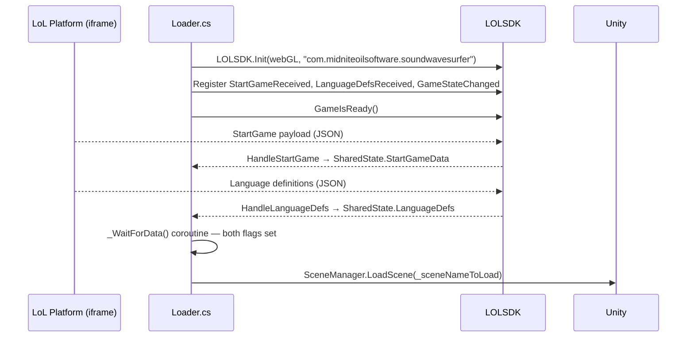
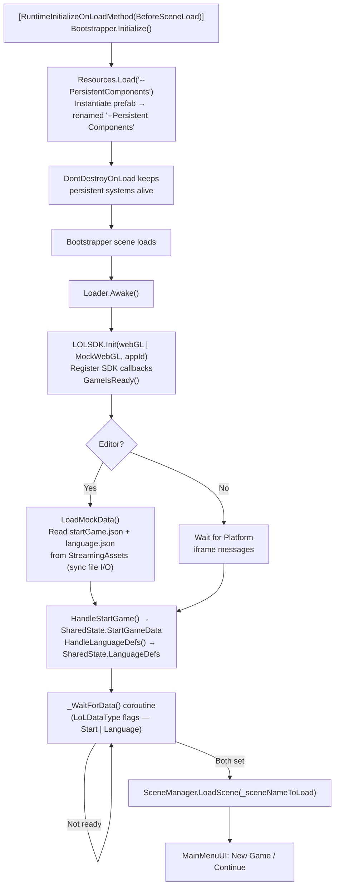
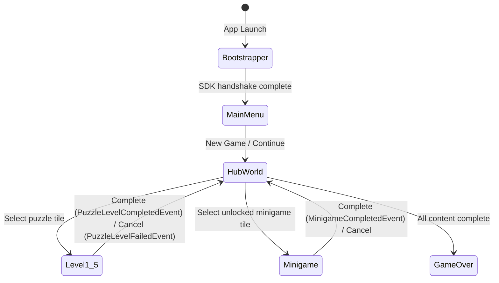
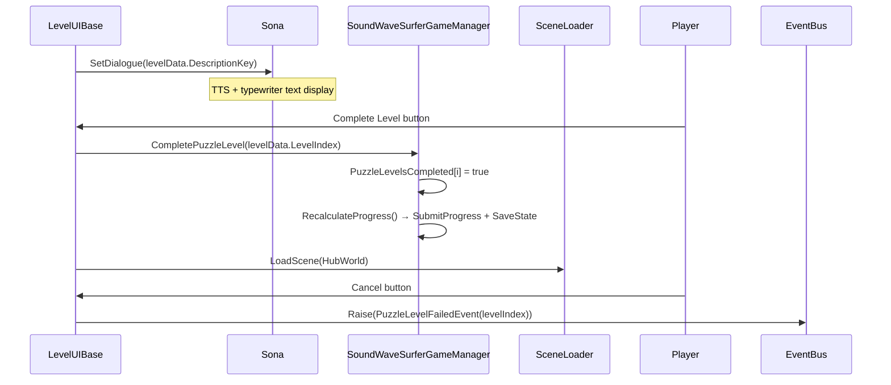
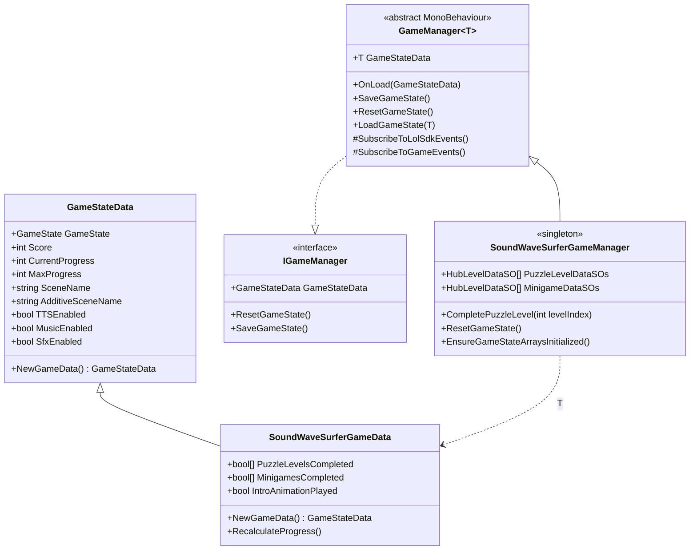
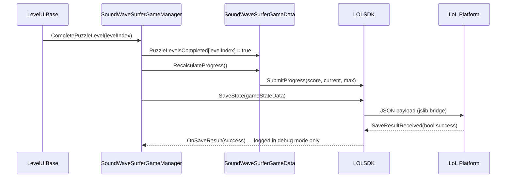
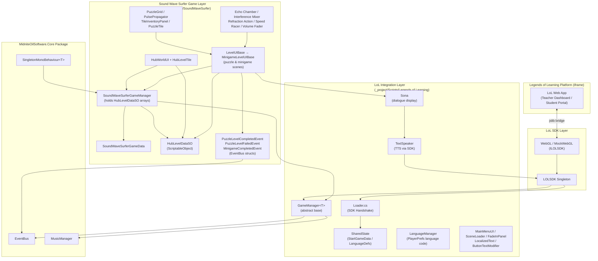

# Sound Wave Surfer — Architecture Overview

**Platform:** [Legends of Learning](https://www.legendsoflearning.com)
**Unity Version:** 2023.2
**Target:** WebGL — NGSS Standard MS-PS4-2 (Grades 6–8)
**Build Target:** Brotli-compressed WebGL, uncompressed size < 30 MB

---

## 1. What This Game Is

Sound Wave Surfer is a 2D educational puzzle/arcade game built for the [Legends of Learning](https://www.legendsoflearning.com) platform. It targets NGSS standard **MS-PS4-2**: *"A sound wave needs a medium through which it is transmitted."* Students play as a trainee sound engineer guiding sound pulses through different materials (air, water, steel, foam, vacuum) while tuning wave frequency and amplitude.

The game is delivered as a WebGL build embedded inside the Legends of Learning teacher/student platform. All platform communication — startup handshake, language localization, progress reporting, and game-state persistence — flows through the **Legends of Learning SDK** (`LoLSDK`).

---

## 2. Legends of Learning SDK

The SDK ships as a precompiled DLL (`Assets/LegendsOfLearningSDK/Plugins/LoLSDKCrossPlatform.dll`) plus a JavaScript bridge (`LoLWebGL.jslib`) that injects into the WebGL build and wires Unity calls to the surrounding iframe.

### Key SDK Types

| Type | Role |
|---|---|
| `LOLSDK` | Singleton façade; entry point for all platform calls |
| `ILOLSDK` | Interface implemented by both `WebGL` (production) and `MockWebGL` (editor) |
| `GameState` | Enum received from the platform: `Paused`, `Playing`, etc. |
| `LOLSDK.Instance.LoadState<T>(callback)` | Async load of previously saved JSON game state via callback |
| `LOLSDK.Instance.SaveState(obj)` | Serialises an object to JSON and persists via the platform |
| `LOLSDK.Instance.SubmitProgress(score, current, max)` | Reports progress to the teacher dashboard |
| `LOLSDK.Instance.SpeakText(key)` | Text-to-speech via the platform (production); editor uses `ILOLSDK_EDITOR.SpeakText` |

### SDK Event Lifecycle



In the Unity Editor, `MockWebGL` replaces the iframe. Mock data is read synchronously from `StreamingAssets/startGame.json` and `StreamingAssets/language.json`. The `languageCode` from `startGame.json` selects which language tree to parse from the full multi-language `language.json`.

---

## 3. Application Startup & Boot Sequence

The boot sequence is split across two parts: a static initialiser that runs before any scene loads, and a scene-based SDK handshake.



### Persistent Systems (--PersistentComponents prefab)

Systems that must survive scene transitions are housed in a single `DontDestroyOnLoad` prefab instantiated by `Bootstrapper` before any scene ever loads. `DontDestroyOnLoad.cs` prevents duplicate instantiation via a static instance guard.

```
--Persistent Components
├── DontDestroyOnLoad               # Singleton guard + DontDestroyOnLoad
├── MusicManager                    # MidniteOilSoftware.Core — long-form music
├── SfxManager                      # SingletonMonoBehaviour — one-shot SFX
├── TextSpeaker                     # SingletonMonoBehaviour — TTS via LoL SDK
└── SoundWaveSurferGameManager      # GameManager<SoundWaveSurferGameData>
```

---

## 4. Scene Structure & Game Flow

All scenes exist and are included in the build:

```
Bootstrapper.unity              # SDK init only; no gameplay content
Main Menu.unity                 # New Game / Continue selection
Hub World.unity                 # Central navigation hub
Game Over.unity                 # End state
Levels/
├── Level 1.unity               # Puzzle: Signal Lost
├── Level 2.unity               # Puzzle: Soft Landing
├── Level 3.unity               # Puzzle: Deep Channel
├── Level 4.unity               # Puzzle: Obstacle Course
└── Level 5.unity               # Puzzle: Full Transmission
Minigames/
├── Echo Chamber.unity
├── Interference Mixer.unity
├── Refraction Action.unity
├── Speed Racer.unity
└── Volume Fader.unity
```

The `SceneNames` enum (`Init/SceneNames.cs`) is the single source of truth for all scene name strings. Values use `[Description]` attributes so the display name used by `SceneManager` can differ from the identifier. Values 8–9 and 15–16 are reserved.

```
SceneNames enum
├── None              = -1
├── Bootstrapper      =  0
├── MainMenu          =  1  → "Main Menu"
├── HubWorld          =  2  → "Hub World"
├── Level1            =  3  → "Level 1"
├── Level2            =  4  → "Level 2"
├── Level3            =  5  → "Level 3"
├── Level4            =  6  → "Level 4"
├── Level5            =  7  → "Level 5"
├── EchoChamber       = 10  → "Echo Chamber"
├── InterferenceMixer = 11  → "Interference Mixer"
├── SpeedRacer        = 12  → "Speed Racer"
├── VolumeFader       = 13  → "Volume Fader"
├── RefractionAction  = 14  → "Refraction Action"
└── GameOver          = 17  → "Game Over"
```



Scene transitions are managed by `SceneLoader`, which:
- Plays an optional button click SFX
- Fades out music via `MusicManager.FadeOutMusic()`
- Fades the screen to black via a PrimeTween `Tween.Custom` alpha animation on a fullscreen `Image`
- Calls `SceneManager.LoadScene` after the fade duration elapses

`FadeInPanel` is a companion component used at scene entry: it starts the new scene fully opaque and tweens to transparent, blocking raycasts until complete.

---

## 5. Hub World

`HubWorldUI` is the main scene controller for `Hub World.unity`. It reads tile data from `SoundWaveSurferGameManager.Instance.PuzzleLevelDataSOs` and `MinigameDataSOs` (arrays of `HubLevelDataSO` ScriptableObjects) and dynamically instantiates `HubLevelTile` prefabs.

`HubWorldUI.Start()` is a coroutine that yields one frame before initializing, so `MusicManager.Start()` has time to subscribe to `PlayMusicEvent` first.

### HubLevelDataSO (ScriptableObject)

Each tile is driven by a `HubLevelDataSO` asset. A custom editor (`HubLevelDataSOEditor`) renders the `SceneName` field as an enum dropdown.

| Field | Purpose |
|---|---|
| `DisplayNameKey` | Localization key for the tile title |
| `DescriptionKey` | Localization key for the Sona dialogue shown when the tile is selected |
| `SceneName` | `SceneNames` enum value — which scene to load |
| `ThumbnailSprite` | Shown for puzzle tiles |
| `IconSprite` | Shown for minigame tiles |
| `LevelIndex` | Zero-based index used by `CompletePuzzleLevel` and `PuzzleLevelCompletedEvent` |
| `UnlockAfterPuzzleLevel` | `0` = always unlocked; `N` = requires puzzle N completed |
| `IsPuzzleLevel` | Toggles thumbnail vs icon display mode |

### HubLevelTile

`HubLevelTile` renders a single tile. State rules:
- **Unlocked** — border color `#00C8FF`, button interactable, padlock hidden
- **Completed** — star icon shown
- **Locked** — border color `#FF8C42`, button non-interactable, padlock visible, unlock condition label shown

### Sona Dialogue (Hub World)

`UpdateSonaDialogue(int completedLevels)` displays contextual Sona dialogue keyed by the number of completed puzzle levels (`sona_dialog_0` through `sona_dialog_3`).

### Intro Animation

On first visit (`SoundWaveSurferGameData.IntroAnimationPlayed == false`), `HubWorldUI` activates `_introAnimationRoot`, waits `_introAnimationDuration` seconds, then hides it, sets the flag, saves game state, and calls `InitializeHub()`.

---

## 6. Level & Minigame Scenes

Every level and minigame scene has a `LevelUIBase` component which provides the standard level lifecycle:



`LevelUIBase` fields:

| Field | Purpose |
|---|---|
| `_levelData` | `HubLevelDataSO` reference — provides `DescriptionKey` and `LevelIndex` |
| `_sona` | `Sona` component reference for dialogue display |
| `_returnSceneName` | Scene to return to on complete/cancel (default: `HubWorld`) |
| `_sceneLoader` | `SceneLoader` reference |
| `_completeLevelButton` | Triggers completion flow |
| `_cancelButton` | Raises `PuzzleLevelFailedEvent` |

---

## 7. Puzzle Level System

Puzzle levels (Level 1–5) use a shared tile grid system where students place sound transmission mediums to route a pulse from Emitter to Receiver.

### Core Components

| Class | Role |
|---|---|
| `PuzzleGrid` | Grid data model; tracks tile states, highlights gaps and excess absorption |
| `PuzzleTile` | Individual grid cell MonoBehaviour; handles click interaction |
| `PulsePropagator` | BFS pathfinder from Emitter to Receiver |
| `TileInventoryPanel` | Manages the player's medium inventory count and selection state |
| `PuzzleKeyboardInput` | Keyboard shortcuts for the puzzle scene |
| `MediumAudioController` | Plays medium-specific audio when the pulse traverses a tile |

### Tile Interaction Model

- **Occupied Tiles:** Clicking a non-fixed, non-vacuum tile removes the medium and returns it to inventory, regardless of current selection.
- **Empty Tiles (Vacuum):** Clicking places the currently selected medium from inventory (if count > 0).
- **Fixed Tiles:** Emitters, Receivers, and pre-placed obstacles ignore click events.

### Pulse Propagation

When "Emit" is clicked, `PulsePropagator` runs a BFS from the Emitter:
- **Valid Path:** Continuous non-vacuum path reaches the Receiver → pulse animates fully → level complete.
- **Partial Path:** Path breaks → pulse animates to the gap → `PuzzleGrid` highlights Gap tiles (vacuum) or Excess Absorption tiles (foam) for educational feedback.

### PuzzleLevelConfigSO (ScriptableObject)

Each puzzle level is configured via a `PuzzleLevelConfigSO` asset with the grid layout, fixed tile positions, and medium inventory counts. A custom editor (`PuzzleLevelConfigSOEditor`) renders the grid visually.

### MediumDefinitionSO (ScriptableObject)

Each sound transmission medium is defined by a `MediumDefinitionSO` asset:

| Asset | Type |
|---|---|
| `Medium - Air.asset` | Air |
| `Medium - Foam.asset` | Foam |
| `Medium - Steel.asset` | Steel |
| `Medium - Vacuum.asset` | Vacuum |
| `Medium - Wall.asset` | Wall |
| `Medium - Water.asset` | Water |

A custom editor (`MediumDefinitionSOEditor`) provides designer-friendly layout.

---

## 8. Minigame System

Five minigames are unlocked sequentially as puzzle levels are completed. Each minigame has:
- Its own `*ConfigSO` ScriptableObject (multiple level configs per minigame)
- A `*UI` MonoBehaviour extending `MinigameLevelUIBase` (which extends `LevelUIBase`)
- A `*KeyboardInput` MonoBehaviour for keyboard shortcuts
- Scene-specific builder/renderer components

### Echo Chamber

Students bounce a sonar ring off cave walls to reach a target. Bat avatar (`BatController`) is steered via `BatDirectionalButton`. `CaveGridBuilder` procedurally constructs the cave from `EchoChamberConfigSO`. `SonarRing` physics are custom ray-cast based. `CheckpointTrigger` detects success. `WallImpactMarker` visualises reflections.

**Config assets:** `Echo Chamber Level 1–3.asset`

### Interference Mixer

Students adjust wave sliders to match a target waveform created by wave interference. `SuperpositionRenderer` draws the combined waveform in real-time. `TargetLineScroller` animates the target line. `BeatLabel` displays beat frequency feedback. Configured via `InterferenceMixerConfigSO`.

**Config assets:** `Interference Mixer Level 1–4.asset`

### Refraction Action

Students aim a sound ray through layered medium zones to hit a target. `MediumZoneBuilder` builds the zone layout from `RefractionActionConfigSO`. `RayTracer2D` calculates refraction at medium boundaries. `ReticleAimHandle` is the drag-to-aim input control. `DirectionInputController` handles directional input. A custom editor (`RefractionActionConfigSOEditor`) supports designer-friendly puzzle authoring.

**Config assets:** `Refraction Action Puzzle 1–5.asset`

### Speed Racer

Students select the correct medium to reach a target speed. `RaceTrackBuilder` constructs the track layout from `SpeedRacerConfigSO`. `SpeedRacerCamera` follows the racer. Configured via `SpeedRacerConfigSO`.

**Config assets:** `Speed Racer Track 1–3.asset`

### Volume Fader

Students adjust a sound field grid to reach a target amplitude at a venue receiver. `VenueGridBuilder` builds the grid from `VolumeFaderConfigSO`. `SoundFieldRenderer` renders the amplitude heat-map. `VenueGridCell` tracks individual cell state. A custom editor (`VolumeFaderConfigSOEditor`) provides designer tooling.

**Config assets:** `Volume Fader Venue 1–3.asset`

### Shared Minigame Infrastructure

| Class | Role |
|---|---|
| `MinigameConfigSO` | Base ScriptableObject for all minigame configs |
| `MinigameLevelUIBase` | Extends `LevelUIBase`; handles minigame complete/fail flow |
| `MinigameCompletedEvent` | EventBus struct raised on minigame success |
| `MinigameHintsManager` | Manages minigame-specific contextual hint display |
| `MinigameHint` / `MinigameHintCondition` | Data types for hint rules |
| `IMinigameContext` | Interface implemented by each minigame UI to supply context to hints |

---

## 9. WaveShaper

`WaveShaperLevelUI` is a level scene type where students sculpt a waveform to match a target shape. `TargetWaveOverlay` renders the target waveform as an overlay. `WaveShaperKeyboardInput` handles keyboard interaction. Level data comes from `WaveShaperLevelConfigSO`.

---

## 10. Hints System

`HintsManager` (`SoundWaveSurfer/Hints`) provides contextual in-level hints driven by `PuzzleHint` assets and `HintCondition` rules. `IPuzzleContext` is the interface the puzzle scene implements to expose state to hint conditions. A custom editor (`PuzzleHintEditor`) allows designer authoring of hint rules in the Inspector.

---

## 11. Sona

`Sona` is a `MonoBehaviour` component responsible for all in-game character dialogue display. It wraps a `TMP_Text` and provides a single public method:

```csharp
public void SetDialogue(string sonaDialogueKey, bool speak = true)
```

- Resolves the key from `SharedState.LanguageDefs.GetText(key)`
- Prepends `<speed=1>` for the Text Animator typewriter effect
- Guards against re-setting the same key (no flicker on hub re-init)
- Optionally calls `TextSpeaker.Instance.Speak(key)` for TTS

`Sona` lives inside the `SONA Container` prefab placed in any scene that needs character dialogue.

---

## 12. Game State — Load & Save

All persistent player data flows through `GameStateData` (base) and `SoundWaveSurferGameData` (derived), serialised as JSON by the LoL SDK.



### Load Flow (Main Menu)

`HelperFunctions.StateButtonInitialize<GameStateData>()` is called from `MainMenuUI.Start()`:

1. Both buttons are hidden while `LOLSDK.Instance.LoadState<T>(callback)` completes asynchronously.
2. If `currentProgress > 0 && currentProgress < maximumProgress`, the **Continue** button is shown.
3. **New Game** — calls `GameStateData.NewGameData()` then invokes the callback with reset data.
4. **Continue** — calls `LOLSDK.Instance.SubmitProgress(...)` then invokes the callback with the saved data.
5. The callback calls `SoundWaveSurferGameManager.Instance.OnLoad(stateData)`, which sets game state, enables music/SFX, and subscribes to LoL SDK events before the scene transition.

`OnLoad` calls `EnsureGameStateArraysInitialized()`, which sizes `PuzzleLevelsCompleted` and `MinigamesCompleted` from the `HubLevelDataSO` arrays — guarding against deserialized saves with missing or stale array lengths.

### Save & Progress Flow



`RecalculateProgress()` counts `true` entries in `PuzzleLevelsCompleted` via LINQ `.Count(c => c)`. Minigames are tracked in `MinigamesCompleted` but **never affect progress reporting**.

---

## 13. Architecture Layers



---

## 14. Localization

- **`SharedState.LanguageDefs`** — `JSONNode` populated by `Loader`. All runtime text reads from this via the `GetText(key)` extension method (returns `"--missing--"` on a missing key).
- **`LanguageManager`** — Wraps the full multi-language `JSONNode`, persists the selected code in `PlayerPrefs` under `"SelectedLanguageCode"`, and fires `LanguageChangedEvent` on the `EventBus` via `GameManager`.
- **`LocalizedText`** — `MonoBehaviour` holding parallel lists of `string` keys and `TMP_Text` components. Resolves all keys from `SharedState.LanguageDefs` in `Start()`.
- **`ButtonTextModifier`** — Polls every 10 frames to sync `TMP_Text` color with button interactability.
- **`TextSpeaker`** — `SingletonMonoBehaviour`. In editor, calls `ILOLSDK_EDITOR.SpeakText()` and plays the returned `AudioClip`. In WebGL, delegates to `LOLSDK.Instance.SpeakText(key)`.
- **`Sona`** — Resolves dialogue keys via `SharedState.LanguageDefs.GetText()` and forwards to `TextSpeaker`.

---

## 15. Audio Architecture

| System | Class | Location | Description |
|---|---|---|---|
| Music | `MusicManager` | `MidniteOilSoftware.Core` package | Long-form background tracks. Raised via `EventBus` `PlayMusicEvent`. Faded out by `SceneLoader`. |
| SFX | `SfxManager` | `_project/Scripts/Audio/SfxManager.cs` | `SingletonMonoBehaviour`. Wraps an `AudioSource`. `AudioEvent` ScriptableObjects call `.Play(SfxManager.Instance.AudioSource)`. |
| TTS | `TextSpeaker` | `_project/Scripts/Legends of Learning/Audio/TextSpeaker.cs` | `SingletonMonoBehaviour`. Delegates to LoL SDK for TTS. |
| Echo Pool | `EchoAudioPool` | `_project/Scripts/Audio/EchoAudioPool.cs` | Pooled audio sources for Echo Chamber reverb/echo effects. |

`MusicPlayer` is a lightweight scene-level `MonoBehaviour` that raises a `PlayMusicEvent` with a `MusicClipGroup` name on `Start`. `HubWorldUI` raises the event directly after yielding a frame for `MusicManager` to subscribe.

---

## 16. EventBus Events

All event structs are value types (no heap allocation):

| Event Struct | Raised By | Consumed By |
|---|---|---|
| `PlayMusicEvent` | `HubWorldUI`, `MusicPlayer`, `MainMenuUI` | `MusicManager` |
| `PuzzleLevelCompletedEvent(int levelIndex)` | `LevelUIBase` (Complete button) | `SoundWaveSurferGameManager` |
| `PuzzleLevelFailedEvent(int levelIndex)` | `LevelUIBase` (Cancel button) | Subscribers |
| `MinigameCompletedEvent` | `MinigameLevelUIBase` | `SoundWaveSurferGameManager` |
| `HubRefreshRequestedEvent` | Hub-triggering systems | `HubWorldUI` |
| `LanguageChangedEvent` | `GameManager` (on SDK language update) | Subscribers |
| `GameStateChangedEvent` | `GameManager` (inline struct) | Subscribers |

---

## 17. UI Utilities

| Class | Role |
|---|---|
| `AttentionBorder` | Animated border highlight to draw player attention to a UI element |
| `AudioLevelLEDMeter` | LED-bar meter component for visualising audio amplitude |
| `ConceptsLearnedPanel` | Displays summary of educational concepts after level completion |
| `CursorManager` | Manages cursor sprite and visibility state |
| `GameOverUI` | End-of-game summary scene controller |
| `KeyboardInput` | Base class for scene-level keyboard shortcut handlers |
| `MinigameLevelCompleteUI` | Minigame completion overlay |
| `SoundWaveVisualizer` | Line-renderer based waveform display; custom editor (`SoundWaveVisualizerEditor`) |
| `StaticLayoutGroup` | Layout group that bakes positions and disables itself after first layout pass |
| `SummaryTextScroller` | Scrolling summary text animation |
| `TooltipDisplay` | Hover tooltip system |
| `YoYoScale` / `CameraShake` | Juice/feedback animations |
| `HoldableButton` / `ContinuousDirectionButton` | Extended button types supporting hold and repeat input |
| `ToggleButton` | Toggle-state button with custom editor (`ToggleButtonEditor`) |
| `Countdown` | Reusable countdown timer UI component |

---

## 18. Helpers & Services

| Class | Location | Role |
|---|---|---|
| `HelperFunctions` | `Scripts/Helpers` | `StateButtonInitialize`, utility methods |
| `ExtensionMethods` | `Scripts/Helpers` + `Scripts/Legends of Learning` | `JSONNode.GetText()`, general extensions |
| `GameSceneData` | `Scripts/Helpers` | Scene-level data bag |
| `GameState` | `Scripts/Helpers` | Game state enum |
| `ValidateArguments` | `Scripts/Helpers` | Argument validation helpers |
| `EnumTextAttribute` | `Scripts/Helpers` | Attribute for displaying enum values as text |
| `LogManager` | `Scripts/Helpers` | Centralised logging via LogWin |
| `Physics2DRaycasterSetup` | `Scripts/Helpers` | Auto-configures `Physics2DRaycaster` on the camera |
| `WebGLServiceProvider` | `Scripts/Services` | Registers platform services for WebGL |
| `LoLWebGLWrapper` | `Scripts/Services/WebGL` | Wraps the LoL WebGL jslib calls |
| `ILOLSDK_EXTENSION_Wrapper` | `Scripts/Services/WebGL` | Extension wrapper for editor-mode SDK mock |

---

## 19. Project Folder Conventions

```
Assets/
├── _project/                       # All game-specific source assets
│   ├── Animation/                  # Animator controllers and animation clips
│   ├── Art/
│   │   ├── Materials/              # Sprite materials
│   │   ├── Mediums/                # Medium-type artwork
│   │   ├── Meters/                 # AudioLevelLEDMeter sprites
│   │   ├── Minigame Backgrounds/   # Per-minigame background art
│   │   ├── Minigame Tiles/         # Echo Chamber tile assets
│   │   ├── Sona Avatar/            # Sona character sprites
│   │   ├── Thumbnails/             # Hub World puzzle tile thumbnails
│   │   └── UI/                     # UI sprites (buttons, cursors, panels, icons)
│   ├── Audio/
│   │   └── Waveforms/              # Waveform audio clips
│   ├── Data/
│   │   ├── Hub Levels/             # HubLevelDataSO assets (10 total)
│   │   ├── Medium Definitions/     # MediumDefinitionSO assets (6 total)
│   │   ├── Minigame Configs/       # Per-minigame *ConfigSO assets
│   │   ├── Minigame Tiles/         # Tile prefab and tile assets
│   │   └── Puzzle Level Configs/   # PuzzleLevelConfigSO assets (5 total)
│   ├── Fonts/                      # Project fonts (Honeti SciFi Blue)
│   ├── Materials/                  # Shared runtime materials
│   ├── Music/
│   │   ├── Music Clip Groups/
│   │   ├── Music Clips/
│   │   └── Music Mixes/
│   ├── Prefabs/                    # Hub Level Tile, SONA Container, shared UI prefabs
│   ├── Scenes/
│   │   ├── Bootstrapper.unity
│   │   ├── Main Menu.unity
│   │   ├── Hub World.unity
│   │   ├── Game Over.unity
│   │   ├── Levels/                 # Level 1–5
│   │   └── Minigames/              # Echo Chamber, Interference Mixer, Refraction Action, Speed Racer, Volume Fader
│   └── Scripts/
│       ├── Audio/                  # MusicPlayer, SfxManager, EchoAudioPool
│       ├── Helpers/                # HelperFunctions, ExtensionMethods, GameSceneData, GameState, ValidateArguments, LogManager
│       ├── Init/                   # Bootstrapper, Loader, SceneNames, DontDestroyOnLoad
│       │   └── Editor/             # LoaderEditor
│       ├── Legends of Learning/    # SDK integration layer
│       │   ├── Audio/              # TextSpeaker
│       │   ├── Data/               # GameStateData
│       │   └── UI/                 # MainMenuUI, SceneLoader, FadeInPanel, LocalizedText, ButtonTextModifier,
│       │                           #   HoldableButton, ContinuousDirectionButton, ToggleButton, YoYoScale,
│       │                           #   CameraShake, Countdown
│       ├── Services/               # WebGLServiceProvider
│       │   └── WebGL/              # LoLWebGLWrapper, ILOLSDK_EXTENSION_Wrapper
│       └── SoundWaveSurfer/        # Game-specific layer
│           ├── Data/               # HubLevelDataSO, SoundWaveSurferGameData, LevelConfigBaseSO
│           │   └── Editor/         # HubLevelDataSOEditor
│           ├── Events/             # PuzzleLevelCompletedEvent, PuzzleLevelFailedEvent,
│           │                       #   MinigameCompletedEvent, HubRefreshRequestedEvent
│           ├── Hints/              # HintsManager, PuzzleHint, HintCondition, IPuzzleContext
│           │   └── Editor/         # PuzzleHintEditor
│           ├── Managers/           # SoundWaveSurferGameManager
│           ├── Minigames/
│           │   ├── Data/           # MinigameConfigSO (base)
│           │   ├── Echo Chamber/   # BatController, CaveGridBuilder, SonarRing, WallImpactMarker, etc.
│           │   ├── Hints/          # MinigameHintsManager, MinigameHint, IMinigameContext
│           │   ├── Interference Mixer/ # SuperpositionRenderer, TargetLineScroller, BeatLabel
│           │   ├── Refraction Action/  # RayTracer2D, MediumZoneBuilder, ReticleAimHandle
│           │   ├── Speed Racer/    # RaceTrackBuilder, SpeedRacerCamera
│           │   └── Volume Fader/   # SoundFieldRenderer, VenueGridBuilder, VenueGridCell
│           ├── Puzzle/             # PuzzleGrid, PuzzleTile, PulsePropagator, TileInventoryPanel
│           │   ├── Audio/          # MediumAudioController
│           │   └── Data/           # MediumDefinitionSO, PuzzleLevelConfigSO, MediumType
│           │       └── Editor/     # MediumDefinitionSOEditor, PuzzleLevelConfigSOEditor
│           ├── UI/                 # HubWorldUI, HubLevelTile, LevelUIBase, MinigameLevelUIBase,
│           │                       #   SoundWaveVisualizer, Sona, AttentionBorder, AudioLevelLEDMeter,
│           │                       #   ConceptsLearnedPanel, CursorManager, GameOverUI, TooltipDisplay,
│           │                       #   StaticLayoutGroup, SummaryTextScroller, MinigameLevelCompleteUI
│           └── WaveShaper/         # WaveShaperLevelUI, TargetWaveOverlay, WaveShaperKeyboardInput
│               └── Data/           # WaveShaperLevelConfigSO
├── Bat_2D/                         # Bat sprite + animation assets (Echo Chamber avatar)
├── LegendsOfLearningSDK/           # SDK DLL, jslib, editor scripts
├── Plugins/
│   ├── Febucci/Text Animator/      # Typewriter and text animation tags
│   ├── PrimeTween/                 # (mirror of Packages/com.kyrylokuzyk.primetween)
│   └── Sirenix/Odin Inspector/     # Editor tooling
├── Resources/                      # --PersistentComponents prefab (loaded by Bootstrapper)
├── ScienceFictionGUI/              # Third-party SciFi GUI skin (fonts, textures, panels)
├── Settings/                       # Build profiles and project settings assets
├── StreamingAssets/                # language.json, startGame.json (mock data for editor)
├── TextMesh Pro/                   # TMP fonts, materials, sprite assets
└── ThirdParty/
    └── Honeti/ScifiBlueGUI/        # SciFi Blue GUI skin (prefabs, textures)
```

---

## 20. Asset Inventory

### ScriptableObject Data Assets

| Asset | Count | Type | Location |
|---|---|---|---|
| Hub Level configs | 5 | `HubLevelDataSO` | `_project/Data/Hub Levels/` |
| Minigame hub configs | 5 | `HubLevelDataSO` | `_project/Data/Hub Levels/` |
| Medium definitions | 6 | `MediumDefinitionSO` | `_project/Data/Medium Definitions/` |
| Puzzle level configs | 5 | `PuzzleLevelConfigSO` | `_project/Data/Puzzle Level Configs/` |
| Echo Chamber configs | 3 | `EchoChamberConfigSO` | `_project/Data/Minigame Configs/` |
| Interference Mixer configs | 4 | `InterferenceMixerConfigSO` | `_project/Data/Minigame Configs/` |
| Refraction Action configs | 5 | `RefractionActionConfigSO` | `_project/Data/Minigame Configs/` |
| Speed Racer configs | 3 | `SpeedRacerConfigSO` | `_project/Data/Minigame Configs/` |
| Volume Fader configs | 3 | `VolumeFaderConfigSO` | `_project/Data/Minigame Configs/` |

### Third-Party Packages (Packages/)

| Package | Version | Purpose |
|---|---|---|
| `com.midniteoilsoftware.core` | 1.9.9 | EventBus, MusicManager, TimerManager, SingletonMonoBehaviour |
| `com.kyrylokuzyk.primetween` | 1.3.8 | Zero-allocation tween animations (scene fades, UI transitions) |
| `com.unity.inputsystem` | 1.7.0 | New Input System for all player input |
| `com.unity.nuget.newtonsoft-json` | 3.2.2 | JSON serialisation utilities |
| `com.unity.memoryprofiler` | (latest) | Editor memory profiling tool |
| `com.unity.editorcoroutines` | (latest) | Editor coroutine support |
| `com.unity.feature.2d` | (latest) | 2D feature set (Tilemaps, Sprites, Physics 2D) |
| `com.unity.ugui` | 2.0.0 | UGUI with TextMesh Pro integration |

### Bundled Plugins (Assets/Plugins/)

| Plugin | Purpose |
|---|---|
| Febucci Text Animator | `<speed=N>` typewriter tags on `TMP_Text` via `TextAnimator_TMP` + `TypewriterByCharacter` |
| Sirenix Odin Inspector | Editor tooling — serialized collections, custom drawers, `[Required]` attributes |
| PrimeTween (mirror) | Tween runtime (also present in Packages/) |

### Bundled Asset Packs (Assets/)

| Asset Pack | Purpose |
|---|---|
| `Bat_2D/` | Bat sprite sheets and animations used as the Echo Chamber avatar |
| `ScienceFictionGUI/` | SciFi GUI skin: fonts, textures, panel sprites, buttons, icons |
| `ThirdParty/Honeti/ScifiBlueGUI/` | SciFi Blue GUI prefabs and textures |
| `LegendsOfLearningSDK/` | `LoLSDKCrossPlatform.dll` + `LoLWebGL.jslib` platform bridge |
| `TextMesh Pro/` | TMP font assets, materials, sprite sheets, style sheets |

### Editor-Only Tools

| Tool | Purpose |
|---|---|
| `AssetInventory/` | Unity asset inventory management editor window (third-party) |
| `VolixStudio/VolixDevPulse/` | Dev pulse analytics / editor utility |

---

## 21. WebGL Build Requirements

- **Compression:** Brotli (GZip acceptable as fallback)
- **Uncompressed size:** < 30 MB
- **WASM Streaming Instantiation:** Enabled
- **UI Navigation:** All `Button` selectables set to `Navigation: None` — enforced in `HubLevelTile.Awake()` and required by the LoL platform
- **Render Pipeline:** Built-in 2D Renderer
- **App ID:** `com.midniteoilsoftware.soundwavesurfer` (passed to `LOLSDK.Init`)
