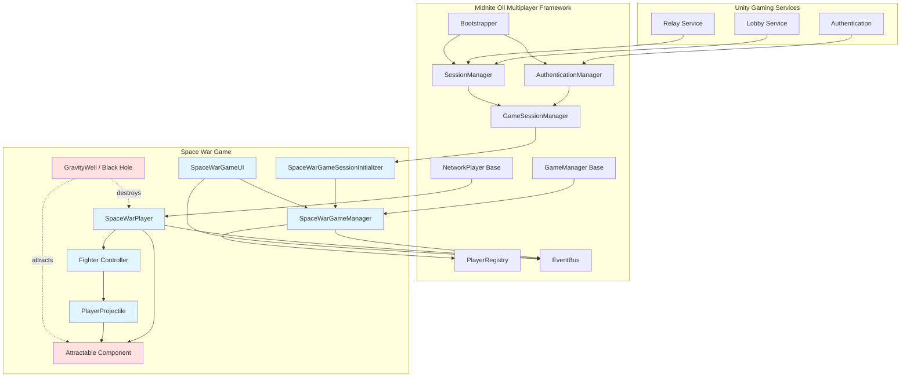
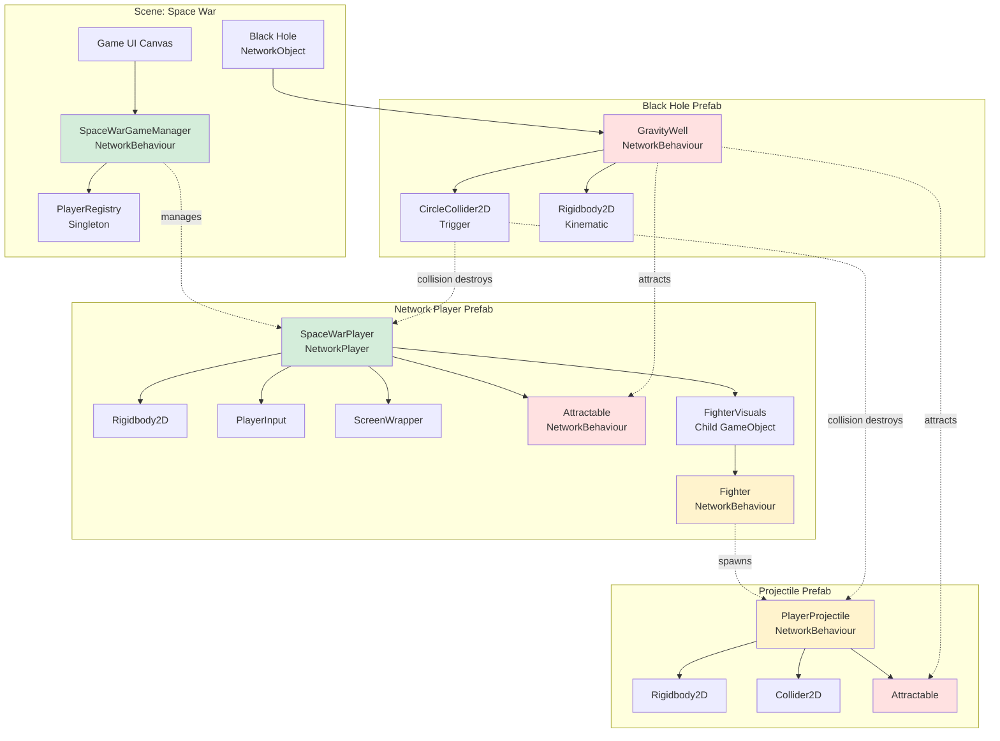
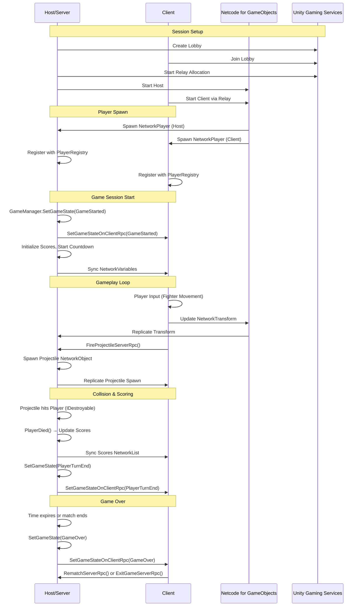
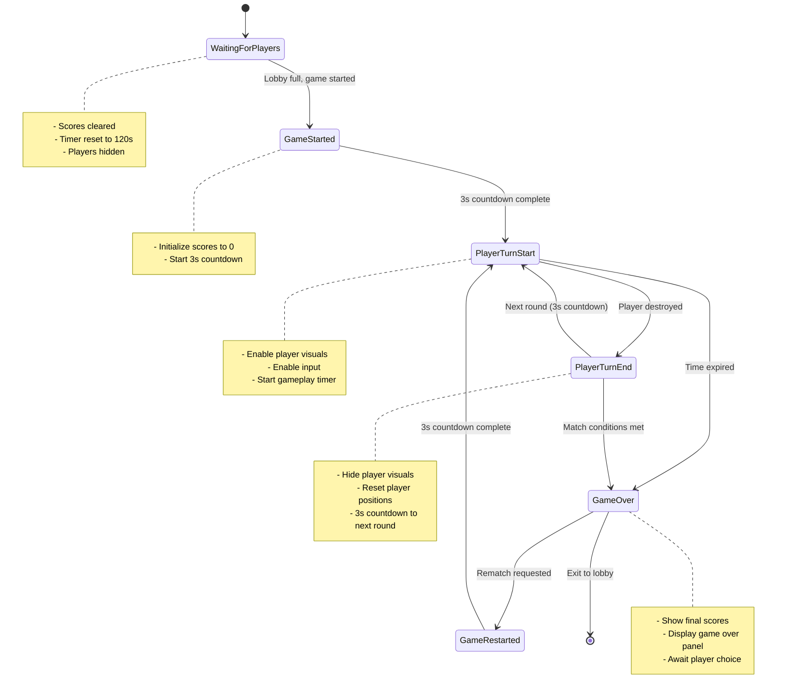
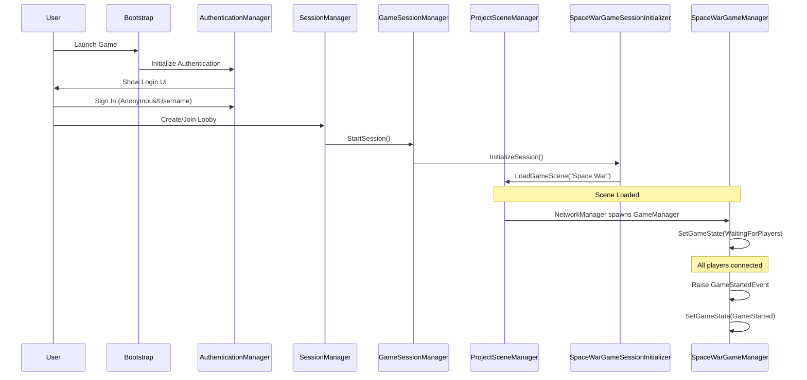

# Space War - Multiplayer Space Combat Game


A real-time multiplayer space combat game built with Unity 6 and the **Midnite Oil Software LLD Multiplayer Boilerplate**. Two players battle in a classic Asteroids-style arena with physics-based ship movement, projectile combat, and screen wrapping mechanics.

Built as part of a [Unity game dev tutorial](https://www.youtube.com/watch?v=rSoqOaSNq0Q) showing how to use the [Midnite Oil Software LLC Multiplayer Boilerplate Template package](https://github.com/Midnite-Oil-Software-L-L-C/unity_packages/tree/main/Multiplayer). 

## 📖 Table of Contents

- [Game Overview](#-game-overview)
- [Architecture](#-architecture)
  - [System Architecture](#system-architecture)
  - [Component Hierarchy](#component-hierarchy)
  - [Network Architecture](#network-architecture)
  - [Game State Flow](#game-state-flow)
  - [Multiplayer Framework Integration](#multiplayer-framework-integration)
- [Core Systems](#-core-systems)
- [Project Structure](#-project-structure)
- [Key Components](#-key-components)
- [Network Synchronization](#-network-synchronization)
- [How to Play](#-how-to-play)
- [Development Notes](#-development-notes)

## 🎮 Game Overview

Space War is a competitive two-player game where each player controls a spaceship in a zero-gravity arena. Players must outmaneuver their opponent and land shots while managing momentum and rotation in a physics-based environment.

**Features:**
- Real-time networked multiplayer using Unity Netcode for GameObjects
- Physics-based ship movement with thrust and rotation controls
- Projectile combat with collision detection
- Screen wrapping for continuous play space
- Score tracking and time-based rounds
- Player-specific collision layers for projectile targeting
- Visual feedback with engine exhaust effects
- **Black Hole gravity well** - Environmental hazard with attraction force and instant destruction

## 🏗 Architecture

### System Architecture

The game is built on top of the **Midnite Oil Software Multiplayer Boilerplate**, which provides a complete framework for networked multiplayer games including authentication, lobby management, session handling, and network synchronization.



### Component Hierarchy



### Network Architecture



### Game State Flow



### Multiplayer Framework Integration

Space War leverages the **Midnite Oil Software LLD Multiplayer Boilerplate** package, which provides:

#### Core Framework Components Used

1. **GameManager** (Base Class)
   - `SpaceWarGameManager` extends the base `GameManager`
   - Provides game state management, player turn tracking, and event-driven state transitions
   - Handles server-authoritative game logic

2. **NetworkPlayer** (Base Class)
   - `SpaceWarPlayer` extends the base `NetworkPlayer`
   - Manages player identity, connection tracking, and network spawning
   - Integrates with `PlayerRegistry` for centralized player management

3. **GameSessionInitializer** (Base Class)
   - `SpaceWarGameSessionInitializer` extends the base initializer
   - Handles scene loading and session setup when a game starts

4. **EventBus** (Core Package)
   - Decoupled event-driven communication between systems
   - Used for `GameStateChangedEvent`, `GameStartedEvent`, and custom events
   - Prevents tight coupling between GameManager, UI, and gameplay systems

5. **PlayerRegistry**
   - Singleton that tracks all connected players
   - Automatically registers/unregisters NetworkPlayer instances
   - Provides access to local player and all players in the game

6. **SessionManager & GameSessionManager**
   - Manages lobby creation, joining, and relay connections
   - Handles scene transitions between main menu and game scenes
   - Coordinates with Unity Gaming Services (Lobby, Relay, Authentication)

#### Framework Flow



#### Custom Extensions

Space War customizes the framework by:

1. **Game State Machine**
   - Overrides `ServerOnlyHandleGameStateChange()` for round-based gameplay
   - Implements countdown timers between rounds
   - Custom `PlayerDied()` method for combat resolution

2. **Network Variables**
   - `NetworkList<int> Scores` - Real-time score synchronization
   - `NetworkVariable<float> TimeRemaining` - Game timer countdown

3. **Player Customization**
   - Fighter selection system with random fighter assignment
   - Spawn position management for two players
   - Layer-based collision system for projectiles

4. **Combat System**
   - `IDestroyable` interface for damage handling
   - Server-authoritative projectile spawning
   - Collision detection with proper layer masking

## 🔧 Core Systems

### 1. Game Management System

**`SpaceWarGameManager`**
- Extends the boilerplate's `GameManager` base class
- Manages game state transitions (WaitingForPlayers → GameStarted → PlayerTurnStart → PlayerTurnEnd → GameOver)
- Tracks scores using `NetworkList<int>` for real-time synchronization
- Implements time-based gameplay with `NetworkVariable<float> TimeRemaining`
- Handles round countdown timers (3 seconds between rounds)
- Server-authoritative game logic and state management

### 2. Player System

**`SpaceWarPlayer`**
- Extends the boilerplate's `NetworkPlayer` base class
- Manages fighter visual instantiation and selection
- Handles spawn positioning and rotation for two-player setup
- Subscribes to `GameStateChangedEvent` for state-based behavior
- Implements `IDestroyable` interface for combat interactions
- Controls player visibility during different game states
- Integrates with `ScreenWrapper` for edge-of-screen teleportation
- **Includes `Attractable` component** for gravity well interactions

### 3. Fighter Control System

**`Fighter`**
- Handles player input for rotation (A/D or Arrow keys) and thrust (W or Up Arrow)
- Physics-based movement using `Rigidbody2D`
- Projectile spawning with server-authoritative RPCs
- Visual feedback through `FighterVisuals` component
- Owner-controlled with network synchronization via `NetworkTransform`

### 4. Combat System

**`PlayerProjectile`**
- Server-spawned network objects
- Layer-based collision detection (Player 1 Projectile vs Player 2, vice versa)
- Implements collision with `IDestroyable` targets
- Automatic despawn after lifetime expires
- Server-authoritative hit detection
- **Includes `Attractable` component** for gravity well interactions

**`IDestroyable` Interface**
- Contract for objects that can be destroyed by projectiles or environmental hazards
- Implemented by `SpaceWarPlayer`
- Triggers score updates and round progression

### 5. Environmental Hazard System

**`GravityWell` (Black Hole)**
- Server-authoritative `NetworkBehaviour` that provides environmental challenge
- Applies radial gravitational force to nearby objects with `Attractable` component
- Uses layer mask filtering to determine affected objects (Player 1, Player 2, projectiles)
- Maintains a registry of all `Attractable` objects in range
- Calculates distance-based force falloff for realistic physics
- Trigger collider instantly destroys any `IDestroyable` object on contact
- Visual rotation effect for aesthetic feedback
- Spawned as a `NetworkObject` in the scene at game start

**`Attractable`**
- `NetworkBehaviour` component that marks objects as affected by gravity wells
- Automatically registers/unregisters with nearby `GravityWell` instances on spawn/despawn
- Applies gravitational force to `Rigidbody2D` when within gravity well radius
- Uses server RPCs to coordinate registration with gravity wells
- Attached to both players and projectiles

### 6. UI System

**`SpaceWarGameUI`**
- Displays player names and scores synchronized from `NetworkList`
- Shows countdown timer from `NetworkVariable<float> TimeRemaining`
- Reacts to `GameStateChangedEvent` for UI state changes
- Game over panel with rematch and exit options
- "Get Ready" text during countdown phases

### 7. Supporting Systems

**`ScreenWrapper`**
- Wraps objects that exit screen boundaries to opposite side
- Calculates screen bounds based on camera settings
- Classic Asteroids-style continuous play space

**`FighterVisuals`**
- Manages ship renderer, collider, and visual effects
- Engine exhaust particle effects during thrust
- Toggle visibility during different game states

**`ClientNetworkTransform`**
- Custom network transform for smooth client-side prediction
- Synchronizes position and rotation across network

## 📁 Project Structure

```
Assets/_spacewar/
├── Art/                                    # Sprites and visual assets
│   ├── fighter1.png, fighter2.png, fighter3.png
│   ├── spacebackground1.png, spacebackground2.png
│   ├── splashscreen.png
│   └── Black Hole.png                     # Black hole sprite
├── Fonts/                                  # Custom fonts (Arcade font)
├── Materials/                              # Rendering materials
│   ├── Space Background 1.mat
│   └── Space war.mat
├── Music/                                  # Audio assets (placeholder)
├── Prefabs/                                # Network and game prefabs
│   ├── SpaceWar Player.prefab             # Main network player prefab
│   ├── Projectile.prefab                  # Networked projectile
│   ├── Black Hole.prefab                  # Networked gravity well hazard
│   ├── Explosion.prefab                   # Destruction effect
│   ├── EngineExhaust.prefab              # Thrust particle effect
│   └── fighter1_0.prefab, fighter2_0.prefab, fighter3_0.prefab
├── Scenes/                                 # Game scenes
│   ├── Bootstrapper.unity                 # Entry point, authentication setup
│   ├── Main Menu.unity                    # Lobby creation/joining
│   └── Space War.unity                    # Main game scene
├── Scripts/                                # C# game logic
│   ├── SpaceWarGameManager.cs             # Game state and scoring
│   ├── SpaceWarPlayer.cs                  # Player lifecycle and spawning
│   ├── Fighter.cs                         # Ship controls and combat
│   ├── FighterVisuals.cs                  # Visual management
│   ├── PlayerProjectile.cs                # Projectile behavior
│   ├── GravityWell.cs                     # Black hole physics and destruction
│   ├── Attractable.cs                     # Gravity-affected objects
│   ├── SpaceWarGameUI.cs                  # UI management
│   ├── SpaceWarGameSessionInitializer.cs  # Session setup
│   ├── ScreenWrapper.cs                   # Screen edge wrapping
│   ├── IDestroyable.cs                    # Combat interface
│   ├── ClientNetworkTransform.cs          # Network transform
│   ├── NetworkPSDestroy.cs               # Network particle cleanup
│   ├── SpaceWarCleanUp.cs                # Session cleanup
│   ├── UINetworkSync.cs                  # UI synchronization
│   └── Events/                            # Custom game events
├── Sounds/                                 # Sound effects
│   ├── Engine Thrust.wav
│   ├── light_blast_2.wav
│   └── 436871__mozfoo__distant-explosion.wav
└── Textures/                               # Additional texture assets
```

## 🎯 Key Components

### SpaceWarGameManager

```csharp
public class SpaceWarGameManager : GameManager
{
    public NetworkList<int> Scores { get; }
    public NetworkVariable<float> TimeRemaining { get; }
    
    // Override framework methods
    protected override void ServerOnlyHandleGameStateChange()
    protected override bool IsGameOver()
    
    // Custom game logic
    public void PlayerDied(SpaceWarPlayer spaceWarPlayer)
    public void RematchServerRpc()
}
```

**Key Responsibilities:**
- Score management via `NetworkList<int>`
- Time tracking via `NetworkVariable<float>`
- Round countdown timer management
- Game state orchestration
- Win condition evaluation

### SpaceWarPlayer

```csharp
public class SpaceWarPlayer : NetworkPlayer, IDestroyable
{
    // Fighter management
    void SpawnFighter(int index)
    void OnFighterIndexChanged(int previousValue, int newValue)
    
    // Game state reactions
    void OnGameStateChanged(GameStateChangedEvent e)
    void EnableShipVisuals()
    void ResetToSpawnPosition()
    
    // Combat interface
    public void DestroyTarget()
}
```

**Key Responsibilities:**
- Fighter visual instantiation
- Spawn position/rotation management
- Layer assignment for collision system
- Visibility management per game state
- Destruction handling with explosion effects

### Fighter

```csharp
public class Fighter : NetworkBehaviour
{
    // Input handling
    void HandleLegacyInput()
    
    // Physics
    void HandleRotation()
    void HandleThrust()
    
    // Combat
    void FireProjectileServerRpc()
}
```

**Key Responsibilities:**
- Owner-controlled input processing
- Rigidbody2D physics manipulation
- Server RPC for projectile spawning
- Visual feedback coordination

### PlayerProjectile

```csharp
public class PlayerProjectile : NetworkBehaviour
{
    public void InitializeProjectile(int projectileLayer)
    void OnTriggerEnter2D(Collider2D other)
    void DestroyProjectile()
}
```

**Key Responsibilities:**
- Server-spawned network object lifecycle
- Layer-based collision filtering
- IDestroyable interface invocation
- Automatic cleanup after lifetime

### GravityWell

```csharp
public class GravityWell : NetworkBehaviour
{
    public void RegisterAttractable(Attractable attractable)
    void UnregisterAttractable(Attractable attractable)
    void Update() // Applies gravity to registered objects
    void OnTriggerEnter2D(Collider2D other) // Destroys on contact
}
```

**Key Responsibilities:**
- Server-authoritative gravitational physics simulation
- Registry management of Attractable objects
- Distance-based force calculation with falloff
- Instant destruction on trigger collision
- Layer mask filtering for selective attraction
- Visual rotation for aesthetic effect

### Attractable

```csharp
public class Attractable : NetworkBehaviour
{
    public void Attract(float gravityStrength, float gravityRadius, Vector3 gravityWellPosition)
    void RegisterWithGravityWellServerRpc(ulong gravityWellNetworkObjectId)
    void UnregisterFromGravityWellServerRpc(ulong gravityWellNetworkObjectId)
}
```

**Key Responsibilities:**
- Automatic registration/unregistration with gravity wells
- Force application to Rigidbody2D components
- Server RPC coordination for network synchronization
- Fallback position-based movement if no Rigidbody2D

## 🌐 Network Synchronization

### NetworkVariables
- `SpaceWarGameManager.Scores` - `NetworkList<int>` for real-time score updates
- `SpaceWarGameManager.TimeRemaining` - `NetworkVariable<float>` for game timer
- `SpaceWarPlayer.PlayerName` - Inherited from `NetworkPlayer` base class
- `Fighter._thrusting` - `NetworkVariable<bool>` for exhaust visual sync

### Server RPCs
- `Fighter.FireProjectileServerRpc()` - Client requests projectile spawn from server
- `Attractable.RegisterWithGravityWellServerRpc()` - Client registers with gravity well
- `Attractable.UnregisterFromGravityWellServerRpc()` - Client unregisters from gravity well
- `SpaceWarGameManager.RematchServerRpc()` - Client requests game restart
- `GameManager.ExitGameServerRpc()` - Client requests session cleanup

### Client RPCs
- `GameManager.SetGameStateOnClientRpc()` - Server broadcasts state changes to all clients

### Network Objects
- **SpaceWar Player.prefab** - Player NetworkObject (spawned by framework)
- **Projectile.prefab** - Projectile NetworkObject (spawned by Fighter on server)
- **Black Hole.prefab** - Environmental hazard NetworkObject (placed in scene)
- **Explosion.prefab** - Explosion NetworkObject (spawned on player death)

## 🎮 How to Play

### Controls
- **W / Up Arrow**: Thrust forward
- **A / Left Arrow**: Rotate counter-clockwise
- **D / Right Arrow**: Rotate clockwise
- **Space**: Fire projectile

### Gameplay
1. Launch the game and sign in (anonymous or username/password)
2. Create a lobby or join an existing one
3. Wait for a second player to join
4. Game starts with a 3-second countdown
5. Maneuver your ship and shoot the opponent
6. **Avoid the Black Hole** - It will pull you in and destroy you on contact
7. Each successful hit scores a point for the shooter
8. When hit, players respawn after a 3-second countdown
9. Game ends when the 120-second timer expires
10. Choose to rematch or return to lobby

### Game Mechanics
- **Physics-Based Movement**: Ships maintain momentum; use rotation and thrust carefully
- **Screen Wrapping**: Exit one side of the screen to appear on the opposite side
- **Collision Layers**: Your projectiles cannot hit you, only your opponent
- **Black Hole Gravity**: The black hole pulls both ships and projectiles toward it with distance-based force
- **Environmental Hazard**: Contact with the black hole results in instant destruction
- **Time Limit**: 120 seconds per match
- **Round System**: Each player death triggers a round reset with countdown

## 💡 Development Notes

### Built With Midnite Oil Software LLD Multiplayer Boilerplate

This game demonstrates the power of the multiplayer framework:

1. **Rapid Development**: Core game logic in ~800 lines of code
2. **Framework Integration**: Inherits authentication, lobby, relay, session management
3. **Event-Driven Architecture**: Clean separation via `EventBus` pattern
4. **Network Best Practices**: Server-authoritative design, NetworkVariables for state, RPCs for actions
5. **Extensible Design**: Override base classes for custom game logic

### Layer System

The game uses Unity layers for collision filtering:

- **Player 1**: Layer for first player's ship
- **Player 2**: Layer for second player's ship
- **Player 1 Projectile**: Layer for first player's shots (collides with Player 2 only)
- **Player 2 Projectile**: Layer for second player's shots (collides with Player 1 only)
- **Gravity Well**: Layer for the black hole environmental hazard

This prevents self-damage and ensures projectiles only hit opponents.

### Server Authority

All critical game logic runs on the server:
- Projectile spawning
- Collision detection
- Gravitational force application
- Black hole destruction triggers
- Score updates
- Game state transitions
- Timer countdown

Clients send input and receive state updates, ensuring fair gameplay.

### Design Patterns Used

- **Inheritance**: Extending framework base classes (`GameManager`, `NetworkPlayer`, `GameSessionInitializer`)
- **Interface Segregation**: `IDestroyable` for combat interactions
- **Observer Pattern**: `EventBus` for decoupled communication and `Attractable` registration with `GravityWell`
- **Singleton Pattern**: Framework managers (`PlayerRegistry`, `SessionManager`, `EventBus`)
- **State Machine**: Game state enumeration with transition logic
- **Component Pattern**: Modular components on network prefabs
- **Registry Pattern**: `GravityWell` maintains list of `Attractable` objects for efficient physics updates

### Future Enhancements

Potential improvements:
- Power-ups (shields, rapid fire, speed boost)
- Multiple game modes (elimination, king of the hill)
- More than 2 players (requires lobby system adjustment)
- **Multiple black holes** or dynamically spawning gravity wells
- **Adjustable gravity well strength** as a match modifier
- Asteroid obstacles in the play area
- Progressive difficulty (increasing speed/fire rate)
- Persistent player statistics
- Custom ship loadouts
- Audio integration (currently sound assets exist but are not fully implemented)

---

**Built with Unity 6000.2 using the Midnite Oil Software LLD Multiplayer Boilerplate**

For more information about the multiplayer framework, see:
- `/Packages/com.midniteoilsoftware.multiplayer/README.md`
- `/Packages/com.midniteoilsoftware.core/README.md`
