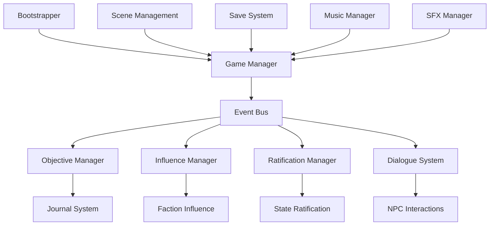
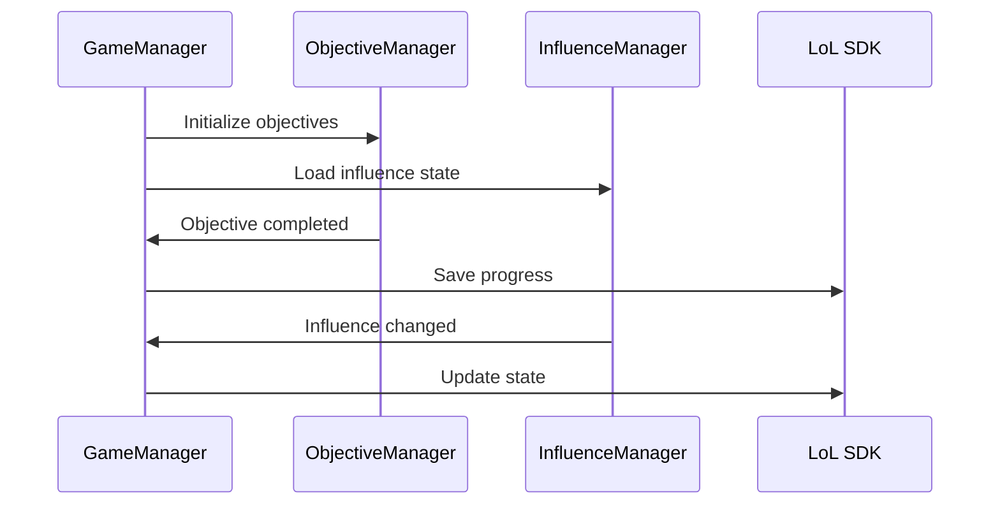
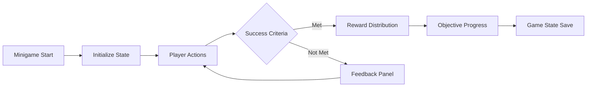
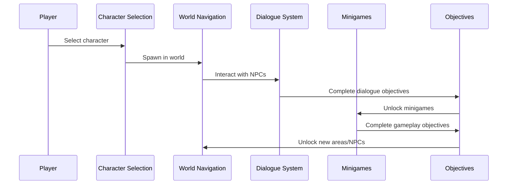

# We The People - Unity Game Architecture

## Table of Contents

1. [System Overview](#system-overview)
2. [Core Architecture](#core-architecture)
3. [Component Systems](#component-systems)
4. [Minigame Systems](#minigame-systems)
5. [Gameplay Flow](#gameplay-flow)
6. [Technical Implementation](#technical-implementation)

## System Overview

"We The People" is an educational Unity game focused on the American Revolutionary period and Constitutional ratification. The project follows a modular, event-driven architecture with sophisticated systems for dialogue, objective management, influence tracking, and interactive minigames.

**Unity Version:** 6000.0  
**Target Platform:** WebGL (Legends of Learning compliance)  
**Architecture Pattern:** Event-driven with Singleton managers

## Core Architecture

The game is built around a centralized event bus system with specialized managers handling different aspects of gameplay:



### System Hierarchy

```
Bootstrapper Scene
├── Music Manager___________________# Audio management
├── LoL Loader______________________# Legends of Learning integration  
├── Event Bus_______________________# Central communication hub
├── Timer Manager___________________# Game timing systems
├── Audio Settings__________________# Audio configuration
├── Settings Manager________________# Game preferences
├── Text Speaker____________________# TTS functionality
├── EventSystem_____________________# Unity UI events
├── Sfx Manager_____________________# Sound effects
├── Toolbar Manager_________________# UI toolbar control
├── Objectives Manager______________# Quest/objective tracking
├── Influence Manager_______________# Faction influence system
├── Glossary Manager________________# Educational terms
├── Governmental Architect Manager__# Government structure
├── Dialogue Manager________________# NPC conversations
├── Hint Canvas_____________________# Player guidance
├── Character Provider______________# Character management
├── Game Manager____________________# Core game state
└── CharacterSpawner________________# Player character spawning
```

## Component Systems

### 1. Game Manager (Core State Management)

The `GameManager` serves as the central coordinator for all game systems:

- **Responsibilities:** Game state persistence, LoL SDK integration, system coordination
- **Key Features:** Auto-save on major events, knowledge point tracking, character selection
- **State Management:** Maintains `WeThePeopleGameStateData` for comprehensive save/load



### 2. Objective System (Quest Management)

The objective system provides structured gameplay progression:

- **Components:** `ObjectiveManager`, `Objective`, `CompletionCriteria`
- **Criteria Types:** Talk to NPC, Complete Minigame, Custom Events
- **Features:** Prerequisite chains, progress tracking, reward distribution

### 3. Influence System (Faction Relations)

Tracks player relationships with historical factions:

- **Factions:** Revolutionary groups and political entities
- **Range:** 0-100 influence points per faction
- **Integration:** Affects dialogue options, objective availability, game outcomes

### 4. Navigation System (Pathfinding)

Optimized A* pathfinding for 2D environments:

- **Features:** Grid-based pathfinding, path caching, object pooling
- **Performance:** Dynamic grid sizing, LOD gizmos, cache cleanup
- **Integration:** Walkable area detection, click-to-move player control

## Minigame Systems

The project includes three major interactive minigames:

### 1. Currency Exchange
- **Purpose:** Economic education about colonial currency systems
- **Mechanics:** Trading different currency types with time pressure
- **Learning Goals:** Understanding exchange rates and economic principles

### 2. Militia Mobilization  
- **Purpose:** Military strategy during revolutionary period
- **Mechanics:** State-by-state resource management and strategic decisions
- **Learning Goals:** Revolutionary War logistics and state cooperation

### 3. Ratification Map
- **Purpose:** Constitutional ratification process
- **Mechanics:** Influence state decisions to achieve 9/13 ratifications
- **Learning Goals:** Understanding the ratification debate and compromise



## Gameplay Flow

The game follows a structured progression through historical events:



### Core Gameplay Loop

1. **Character Selection:** Choose historical perspective
2. **World Exploration:** Navigate historical locations (Philadelphia, Independence Hall)
3. **NPC Interactions:** Engage in educational dialogues
4. **Objective Completion:** Progress through structured learning goals
5. **Minigame Participation:** Interactive historical scenarios
6. **Knowledge Accumulation:** Earn points and influence factions
7. **Constitutional Ratification:** Culminate in the ratification process

## Technical Implementation

### Event-Driven Architecture

The system uses a centralized event bus for loose coupling:

```csharp
// Event subscription
EventBus.Instance.Subscribe<ObjectiveCompletedEvent>(OnObjectiveCompleted);

// Event broadcasting  
EventBus.Instance.Raise(new InfluenceChangedEvent 
{ 
    Faction = faction, 
    ChangeAmount = amount 
});
```

### Performance Optimizations

- **Object Pooling:** Navigation system uses pooled collections
- **Caching:** Path caching with distance tolerance
- **LOD Systems:** Gizmo rendering with level-of-detail
- **Memory Management:** Proper cleanup and disposal patterns

### Save System Integration

- **LoL SDK Compliance:** Seamless integration with Legends of Learning platform
- **State Persistence:** Comprehensive game state serialization
- **Progress Tracking:** Real-time progress updates to platform

### Scene Management

- **Bootstrapper Pattern:** Ensures core systems load first
- **Additive Loading:** UI scenes loaded additively for modularity
- **Scene Transitions:** Smooth transitions between game areas

## Summary

The "We The People" architecture demonstrates sophisticated Unity development practices with educational game design principles. The modular, event-driven approach enables complex gameplay systems while maintaining code clarity and performance. The integration with the Legends of Learning platform ensures educational compliance and seamless deployment.

The system successfully combines historical education with engaging gameplay mechanics, providing students with an interactive exploration of American Revolutionary history and Constitutional development.
