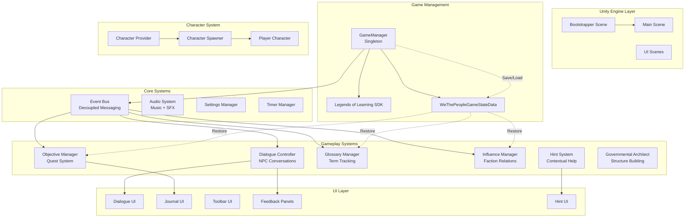
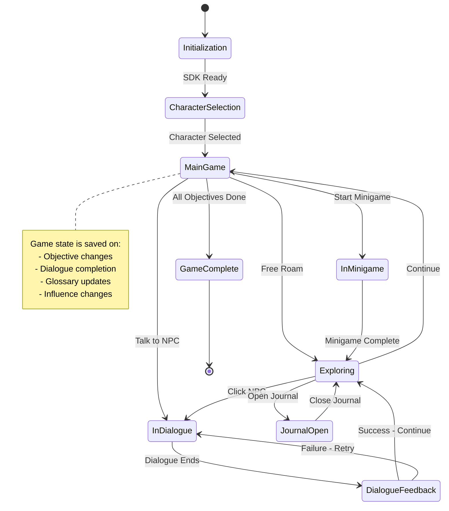
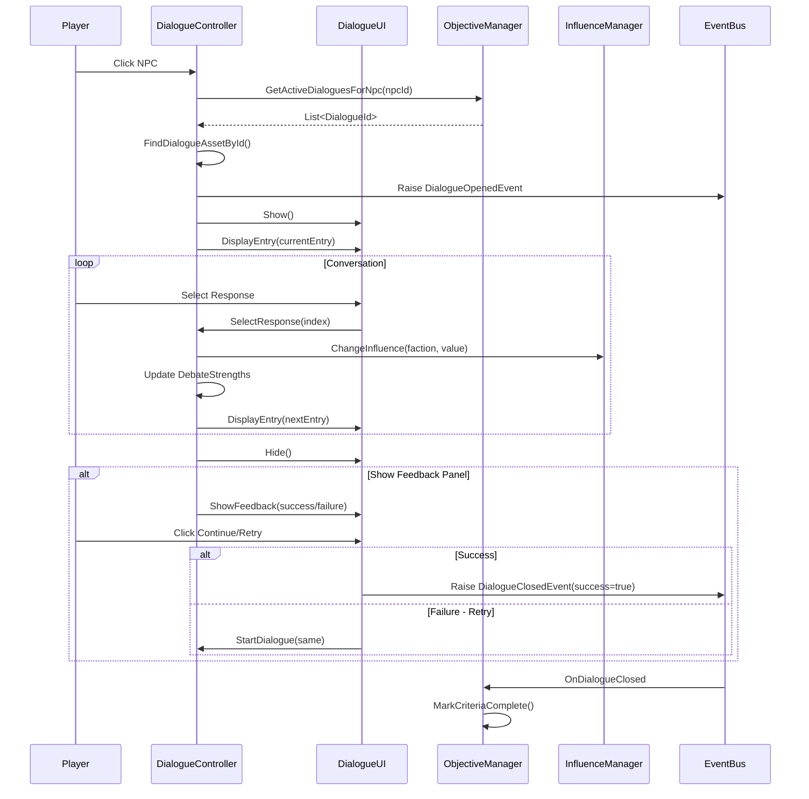
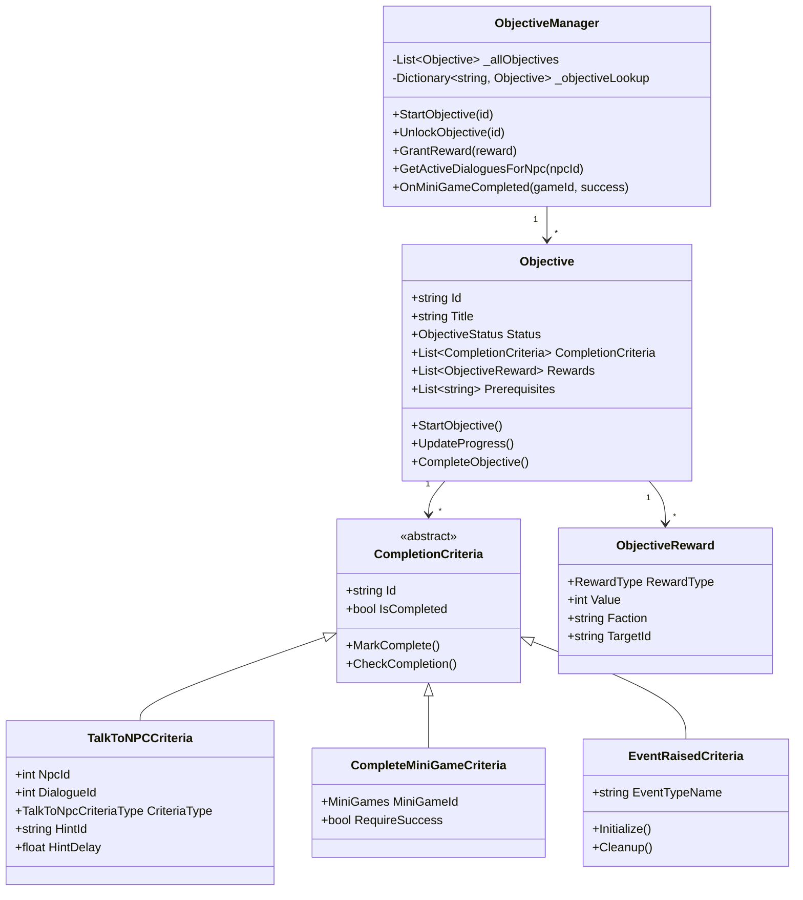
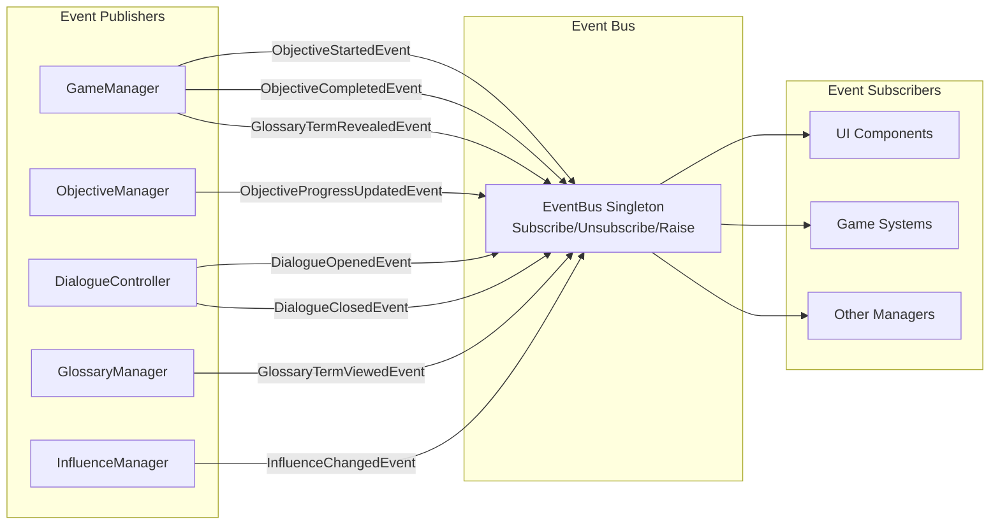

# We The People

**An Educational Game About the Formation of the United States Constitution**

[](https://unity.com/)
[](https://legendsoflearning.com/)

## 📖 Table of Contents

- [Overview](#overview)
- [Gameplay](#gameplay)
- [Game Progress & Features](#game-progress--features)
- [Architecture](#architecture)
- [Core Systems](#core-systems)
- [Installation & Setup](#installation--setup)
- [Development](#development)
- [Credits](#credits)

---

## Overview

**We The People** is an educational game designed for the Legends of Learning platform that teaches students about the Constitutional Convention and the ratification debates that led to the formation of the United States Constitution. Players take on the role of historical figures navigating the political landscape of early America, engaging in dialogues, completing objectives, and making decisions that influence the outcome of the Constitutional ratification process.

### Key Learning Objectives

- Understanding the compromises and debates during the Constitutional Convention
- Learning about the Federalist and Anti-Federalist perspectives
- Exploring the balance of power between state and federal government
- Discovering the roles of key historical figures in American history

---

## Gameplay

### Core Mechanics

1. **Character Selection**: Choose from various historical figures, each with unique perspectives and backgrounds
2. **Exploration**: Navigate through historically significant locations like Independence Hall and Philadelphia
3. **Dialogue System**: Engage in debates with NPCs representing different political factions
4. **Objective System**: Complete missions that teach about constitutional principles
5. **Mini-Games**: Participate in educational activities that reinforce learning concepts
6. **Influence System**: Build relationships with different political factions through your choices

### Available Mini-Games

```
Continental Currency Exchange
├── Teach economic principles of early America
├── Currency valuation and exchange mechanics
└── Decision-making under economic pressure

Militia Mobilization
├── Strategic resource allocation
├── State coordination mechanics
└── Understanding federal vs. state powers

Printing the Pamphlet
├── Information dissemination strategies
├── Persuasion mechanics
└── Public opinion influence

Governmental Architect
├── Design government structure
├── Separation of powers
└── Checks and balances implementation

Battle for Ratification
├── State-by-state ratification tracking
├── Debate mechanics
└── Coalition building
```

---

## Game Progress & Features

### Implemented Features

#### ✅ Core Systems
- **Game State Management**: Full save/load functionality with Legends of Learning SDK integration
- **Scene Management**: Multi-scene architecture with bootstrapper pattern
- **Audio System**: Music and SFX management with user preferences
- **Event System**: Decoupled event bus for system communication
- **Input System**: Unity's New Input System integration

#### ✅ Gameplay Features
- **Character System**: Player character selection and customization
- **Navigation System**: Click-to-move navigation with walkable areas
- **Dialogue System**: 
  - Branching conversations with NPCs
  - Debate mechanics with success/failure outcomes
  - Feedback panels with learning content
  - Text-to-speech support
- **Objective/Quest System**:
  - Multi-criteria objectives
  - Progress tracking
  - Prerequisite management
  - Event-driven completion
- **Glossary System**: 
  - Automatic term revelation
  - Historical context for key terms
  - Track viewed/revealed terms
- **Hint System**: Contextual hints with timed display
- **Influence System**: Track player's standing with political factions
- **Journal System**: Track objectives, glossary, and influence

#### ✅ Educational Features
- **Governmental Architect**: Interactive government structure building
- **Ratification Tracking**: Monitor state-by-state constitutional ratification
- **Historical Accuracy**: Authentic dialogue and scenarios from the era
- **Knowledge Points**: Reward system for learning achievements

#### 🚧 Current Progress Tracking
- Objective completion percentage
- Knowledge points earned
- Glossary terms discovered
- NPC relationships
- Faction influence levels
- State ratification progress

---

## Architecture

### High-Level System Architecture



### Game State Flow



### Dialogue System Flow



### Objective System Architecture



### Event System



---

## Core Systems

### 1. Game State Management

The game uses a robust save/load system integrated with the Legends of Learning SDK:

**Key Components:**
- `GameManager`: Central singleton managing game state
- `WeThePeopleGameStateData`: Serializable state container
- `LOLSDK`: Integration with learning platform

**Tracked State:**
- Player progress (objectives completed)
- Knowledge points earned
- Character selection
- Player position in scenes
- Glossary terms (revealed/viewed)
- Influence with factions
- Government powers unlocked
- NPC unlock status
- State ratification progress
- Audio/TTS preferences

### 2. Objective System

Quest-based progression system with multiple criteria types:

**Features:**
- Prerequisite chains
- Multiple completion criteria types
- Progress tracking
- Reward system (influence, knowledge points, unlocks)
- Event-driven completion
- Object pooling for performance

**Criteria Types:**
- Talk to NPC (dialogue-based)
- Complete Mini-game
- Event raised (custom game events)

### 3. Dialogue System

Branching conversation system with educational feedback:

**Features:**
- Multi-participant debates
- Influence adjustments based on responses
- Knowledge point rewards
- Success/failure outcomes
- Learning content panels
- Debate strength tracking
- Text-to-speech support
- Memory-optimized with object pooling

### 4. Influence System

Tracks player relationships with political factions:

**Factions:**
- Federalists
- Anti-Federalists
- State Representatives
- Various historical groups

**Integration:**
- Dialogue responses affect influence
- Objective rewards grant influence
- Persistent across game sessions
- UI visualization in Journal

### 5. Glossary System

Educational term tracking and revelation:

**Features:**
- Automatic term detection in text
- Reveal/view tracking
- Historical context for each term
- Integration with dialogue system
- Persistent state

### 6. Audio System

Comprehensive audio management:

**Components:**
- `MusicManager`: Background music with mix support
- `SfxManager`: Sound effects playback
- `AudioEvent`: ScriptableObject-based audio data
- User preference persistence

---

## Installation & Setup

### Prerequisites

- Unity 6000.0.0f1 or later
- Git for version control
- Text editor or IDE (Rider recommended based on project config)

### Required Packages

The project uses the following Unity packages:

```json
{
  "com.unity.inputsystem": "1.14.2",
  "com.unity.ugui": "2.0.0",
  "com.unity.textmeshpro": "Latest",
  "com.unity.nuget.newtonsoft-json": "3.2.1",
  "com.kyrylokuzyk.primetween": "Custom TGZ"
}
```

### Third-Party Assets

- **Odin Inspector**: Serialization and editor tools
- **PrimeTween**: Animation system
- **Text Animator (Febucci)**: Text animation effects
- **Legends of Learning SDK**: Educational platform integration

### Setup Steps

1. Clone the repository
2. Open project in Unity 6000.0
3. Let Unity import all packages and assets
4. Open `Bootstrapper.unity` scene
5. Configure Legends of Learning SDK credentials (if needed)
6. Enter Play mode to test

---

## Development

### Project Structure

```
Assets/
├── _project/
│   ├── Common/                    # Shared systems and utilities
│   │   ├── Scripts/
│   │   │   ├── Events/           # Event definitions
│   │   │   ├── Helpers/          # Utility classes
│   │   │   ├── Managers and Controllers/
│   │   │   └── UI/               # Common UI components
│   │   ├── Prefabs/              # Reusable prefabs
│   │   ├── Scenes/               # Bootstrap and common scenes
│   │   └── Audio/                # Sound effects
│   │
│   ├── We The People/            # Game-specific content
│   │   ├── Scripts/
│   │   │   ├── Data/             # Data structures
│   │   │   ├── Events/           # Game events
│   │   │   ├── Journal System/   # Objectives & tracking
│   │   │   ├── Minigames/        # Educational mini-games
│   │   │   ├── Navigation/       # Movement system
│   │   │   ├── Ratification/     # Ratification mechanics
│   │   │   └── UI/               # Game UI
│   │   ├── Art/                  # Sprites and visual assets
│   │   ├── Prefabs/              # Game prefabs
│   │   ├── Scenes/               # Game scenes
│   │   ├── Data/                 # ScriptableObjects
│   │   │   ├── Dialogues/        # Dialogue assets
│   │   │   └── NPCs/             # NPC definitions
│   │   └── Music/                # Background music
│   │
│   ├── Legends of Learning/      # LoL SDK integration
│   │   ├── Dialogue System/      # Base dialogue framework
│   │   └── Scripts/              # SDK utilities
│   │
│   └── MidniteOilSoftware/       # Studio-specific systems
│       ├── EventBus/             # Event system
│       ├── Music/                # Music management
│       └── Settings/             # Settings system
│
├── Plugins/                      # Third-party plugins
│   ├── Sirenix/                  # Odin Inspector
│   ├── PrimeTween/               # Animation
│   └── Febucci/                  # Text Animator
│
└── Resources/                    # Runtime resources
```

### Coding Standards

Based on project rules:

1. **Naming Conventions:**
   - Private fields: `_camelCase` (underscore prefix)
   - Public properties/methods: `PascalCase`
   - Local variables: `camelCase`
   - Constants: `PascalCase` as fields

2. **Code Style:**
   - Use `var` when type is obvious
   - Expression-bodied members for single-line methods
   - Early-exit guard clauses to reduce nesting
   - Prefer switch expressions
   - Public properties with private setters over backing fields

3. **Unity-Specific:**
   - Use `Logwin.Log` instead of `Debug.Log`
   - Add `bool _debugMode` to MonoBehaviours for conditional logging
   - Derive singletons from `SingletonMonoBehaviour<T>`
   - Never edit Unity-generated Input System files

4. **Events:**
   - Use structs for events to avoid heap allocations
   - Public constructor to initialize fields
   - No interface implementation needed

### Performance Considerations

1. **Object Pooling**: Used in ObjectiveManager and DialogueController
2. **Cached Collections**: Reduce allocations in hot paths
3. **Event Subscription**: Cached delegates to avoid allocations
4. **HashSet Lookups**: O(1) lookups in game state data
5. **StringBuilder**: Used for string concatenation in loops

### Testing

- Use editor debug tools (Odin Validator)
- Context menu items for testing objectives
- Debug mode flags for detailed logging
- Play mode testing from Bootstrapper scene

---

## Credits

### Development Team
- **MidniteOil Software**: Primary development studio

### Technology & Assets
- **Unity Technologies**: Game engine
- **Sirenix**: Odin Inspector & Serializer
- **Febucci**: Text Animator
- **Kyrylо Kuzyk**: PrimeTween
- **Legends of Learning**: Educational platform & SDK

### Educational Content
Historical content based on authentic documents and speeches from the Constitutional Convention era.

---

## License

Proprietary - Educational Use
© MidniteOil Software

This project is developed for the Legends of Learning educational platform.

---

## Contact & Support

For technical issues or questions about the game:
- Check the in-game Journal for gameplay help
- Review objective hints for guidance
- Consult the Glossary for historical context

---

**Version**: 1.0  
**Unity Version**: 6000.0  
**Last Updated**: 2024

*"We the People of the United States, in Order to form a more perfect Union..."*
