# Letter Grove (Word Board) — Architecture

This document covers the design and architecture of **Letter Grove**, a single-player, portrait-first crossword tile game (a player versus a bot) built in Unity 6 with URP (2D renderer). The game code lives under `Assets/_WordBoard` in the `WordBoard.*` namespaces.

---

## Table of Contents

1. [Goals and Design Principles](#1-goals-and-design-principles)
2. [Project Layout](#2-project-layout)
3. [High-Level Architecture](#3-high-level-architecture)
4. [Scene Composition](#4-scene-composition)
5. [Core Domain Model](#5-core-domain-model)
6. [Rules Engine](#6-rules-engine)
7. [Match Lifecycle — MatchController](#7-match-lifecycle--matchcontroller)
8. [Event Bus Contract](#8-event-bus-contract)
9. [Bot Opponent](#9-bot-opponent)
10. [Dictionary](#10-dictionary)
11. [Determinism and Randomness](#11-determinism-and-randomness)
12. [Progression and Daily Challenge](#12-progression-and-daily-challenge)
13. [Persistence](#13-persistence)
14. [Presentation Layer (UI)](#14-presentation-layer-ui)
15. [Feedback Layer (Audio, Haptics, VFX)](#15-feedback-layer-audio-haptics-vfx)
16. [Configuration](#16-configuration)
17. [Platform Considerations](#17-platform-considerations)
18. [Third-Party Dependencies](#18-third-party-dependencies)
19. [Extension Guide](#19-extension-guide)
20. [Known Constraints and Future Work](#20-known-constraints-and-future-work)

---

## 1. Goals and Design Principles

The codebase follows a handful of strict rules, and most classes cite them in their XML doc comments:

| Principle | How it is enforced |
|---|---|
| **One authority for match state** | Only `MatchController` mutates `MatchState`, and only through `MoveRules.Apply`. The UI and the bot *propose*; the controller *disposes*. |
| **Pure, Unity-free rules** | `RuleSet`, `MoveRules`, `BoardState`, `TileBag`, `MatchState`, etc. are plain C# with no `MonoBehaviour` or scene dependencies. They are safe to use on worker threads. |
| **Validate, then apply** | Every action produces a `MoveResult`. Only a result that is valid *for the current turn number* can be applied. |
| **The event bus carries notifications, not state** | Events are `readonly struct`s. Consumers read `MatchController.CurrentMatch` for the truth. |
| **The view owns only view state** | `WordBoardScreen` owns the pending placement, rack order, selection, and drag state. It never owns game state. |
| **Presentation is decoupled from rules** | Audio, haptics, shake, and VFX react to events only. `WordBoardFeedbackConfig` is never read by the rules. |
| **Determinism** | An explicit, serializable xorshift32 RNG state makes daily seeds, restores, and bot choices reproducible. |
| **Fail closed** | Bad config, a missing dictionary, or a corrupt save stops the game with a clear error. A bad save file is quarantined rather than crashing the game or being silently deleted. |

---

## 2. Project Layout

```
Assets/_WordBoard
├── Config/                              # ScriptableObject instances
│   ├── DefaultWordGameConfig.asset          # Rules, tiles, premiums, bot tuning, XP
│   └── DefaultWordBoardFeedbackConfig.asset # Music, SFX, VFX, shake, haptics
├── Prefabs/
│   ├── BoardCell.prefab                 # BoardCellView (one board square)
│   ├── LetterTile.prefab                # LetterTileView (rack / board / ghost / picker tile)
│   └── WordBoardServices.prefab         # MatchController + BotOpponent
├── Resources/
│   ├── WordLists/enable1.txt            # ENABLE lexicon (loaded by WordDictionary)
│   ├── Music/, Audio Clips/             # Audio referenced by the feedback config
│   └── Logo.png, Word Board Background.png
├── Scenes/
│   └── WordBoard.unity                  # The only gameplay scene
└── Scripts/
    ├── Core/         # Domain model, rules engine, match authority, RNG, dictionary
    ├── Bot/          # Move generator + bot turn driver
    ├── Config/       # ScriptableObject definitions
    ├── Events/       # EventBus payload structs
    ├── Progression/  # Player profile/XP, daily challenge
    ├── Storage/      # JSON repository, save slots, preferences
    ├── Feedback/     # Music, SFX, haptics, shakes, particles
    └── UI/           # Runtime-built portrait UI
```

Supporting folders outside `_WordBoard`:

- `Assets/WebGLTemplates/WordBoardTouch` is a custom touch-friendly WebGL page template.
- `Assets/Settings/Build Profiles` has two profiles: `iOS` and `Web-Dev - Mobile - Development`.
- `Assets/Feel`, `Assets/Layer Lab`, `Assets/Lana Studio`, `Assets/ThirdParty`, and `Assets/TextMesh Pro` hold third-party assets (see [section 18](#18-third-party-dependencies)).
- `Packages/com.midniteoilsoftware.core` provides `EventBus`, `SingletonMonoBehaviour<T>`, `TimerManager`, and `SettingsManager`.

There are no assembly definitions for the game code; it compiles into `Assembly-CSharp`.

---

## 3. High-Level Architecture

The game is layered. Dependencies point **downward** only. The Core layer knows nothing about UI, Bot, or Feedback.

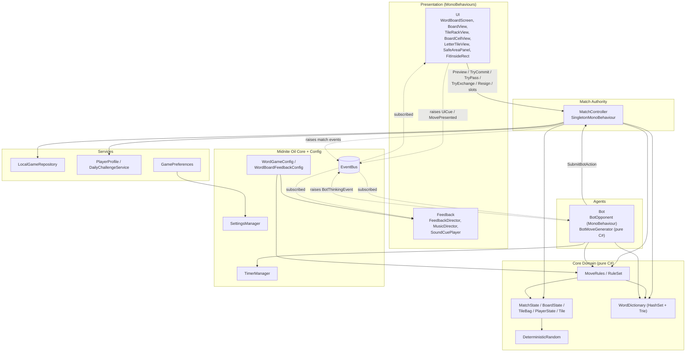

### Responsibilities at a glance

| Layer | Owns | Must never |
|---|---|---|
| Core | Rules, scoring, board and bag data, RNG | Reference `UnityEngine` scene objects (it only uses `JsonUtility` and `TextAsset`) |
| `MatchController` | The `CurrentMatch` instance, commit pipeline, saving, XP awards, raising events | Contain rules logic (it delegates to `MoveRules`) |
| Bot | Searching for moves on a snapshot and picking one | Mutate the live `MatchState` |
| UI | Pending tiles, rack order, selection, overlays | Call `MoveRules.Apply` or mutate `MatchState` |
| Feedback | Sound, haptics, shake, particles | Affect gameplay or read rules config |
| Storage | JSON files, schema validation, quarantine | Decide game flow |

---

## 4. Scene Composition

The game runs from a single scene, `Assets/_WordBoard/Scenes/WordBoard.unity`.

```
WordBoard.unity
├── Main Camera            # Camera + URP data + AudioListener; renders the canvas
├── Canvas                 # Canvas (Screen Space - Camera), CanvasScaler, GraphicRaycaster, WordBoardScreen
│   ├── Background         # Full-screen Image
│   └── SafeArea           # SafeAreaPanel — every runtime UI element is built under here
├── EventSystem            # EventSystem + InputSystemUIInputModule (New Input System)
├── WordBoardServices      # [Prefab] MatchController + BotOpponent
├── MMSoundManager         # Feel's pooled audio manager
└── Feedback               # MusicDirector + FeedbackDirector
```

Key scene settings:

- **Canvas**: `ScreenSpaceCamera` bound to `Main Camera` (plane distance 10), so particle FX can render in front of the UI.
- **CanvasScaler**: `ScaleWithScreenSize`, reference resolution **540×960** (portrait), `Expand` match mode.
- **Input**: `InputSystemUIInputModule`. All interaction goes through uGUI pointer events (`IPointerClickHandler` and the drag handlers), so touch and mouse work the same way.

### Startup order

`MatchController.Awake` creates the services. `WordBoardScreen.Start` builds the UI, so the order of `Awake` calls between objects doesn't matter.

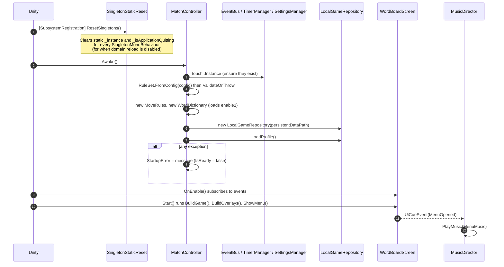

---

## 5. Core Domain Model

All domain types are `[Serializable]` plain C# classes or structs, so `JsonUtility` can store a whole match in one pass and deep-clone it for the bot.

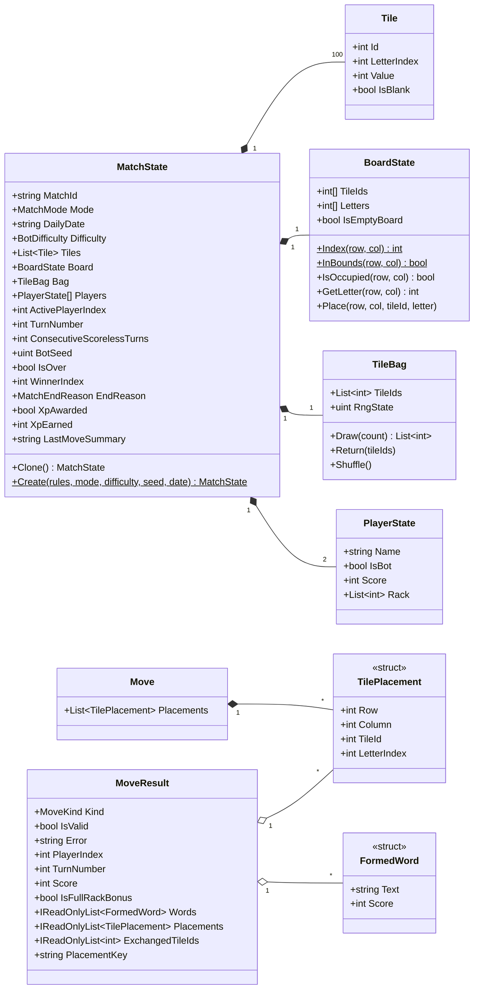

### Tile identity model

- Each match creates **100 `Tile` objects** with stable IDs `0..99`, in letter order (A..Z, then 2 blanks).
- Racks, the bag, and the board store only **tile IDs** (`int`). This makes validation cheap ("is this tile in your rack?") and lets the save validator check that **every tile appears in exactly one place** (bag, a rack, or the board).
- A blank keeps `LetterIndex = 26` (`RuleSet.BlankIndex`). The letter it stands for is stored in `BoardState.Letters[]`, not on the tile.
- `BoardState` is two flat 225-element arrays (`TileIds`, `Letters`) indexed by `row * 15 + column`. Empty squares hold `-1`.
- Letter indices are `0..25` for A–Z. `LetterCodes` converts between indices, characters, and display symbols (`?` for a blank).

### Enums

| Enum | Values |
|---|---|
| `MatchMode` | `Standard`, `Daily` |
| `MatchEndReason` | `None`, `WentOut`, `ScorelessTurns`, `Resigned` |
| `MoveKind` | `Play`, `Pass`, `Exchange`, `Resign` |
| `BotDifficulty` | `Easy`, `Medium`, `Hard` |
| `PremiumSquare` | `None`, `DoubleLetter`, `TripleLetter`, `DoubleWord`, `TripleWord` |

---

## 6. Rules Engine

### `RuleSet` — immutable config snapshot

`RuleSet.FromConfig(WordGameConfig)` validates the ScriptableObject and copies it into readonly arrays: premium squares, tile counts and values, bot node budgets, score fractions, and XP milestones. After it's built, nothing references the `ScriptableObject` any more, so worker threads can read it safely.

### `MoveRules` — stateless validator and applier

`MoveRules` has four validators, which never mutate anything, and one mutator.

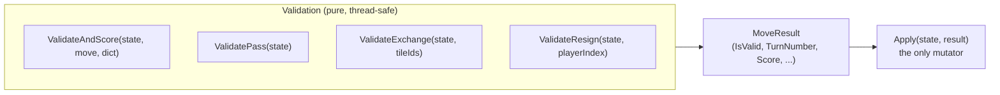

#### Play validation pipeline (`ValidateAndScore`)

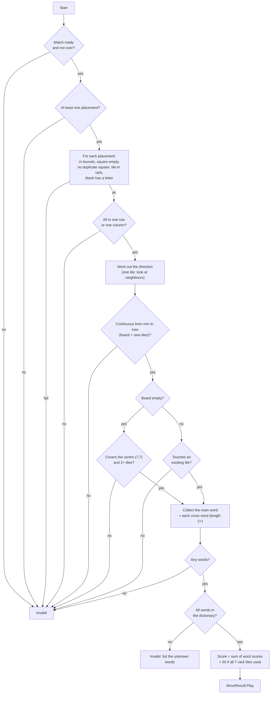

**Scoring**: letter and word multipliers apply only to **newly placed** tiles. Existing board tiles count at face value. Blanks are worth 0.

#### `Apply` state transitions

`Apply` refuses any result that isn't valid, was validated for a different turn, or belongs to the wrong player. It then increments `TurnNumber` and applies the move:

| Kind | Effects |
|---|---|
| `Play` | Place tiles, remove them from the rack, add the score, refill the rack from the bag, reset the scoreless counter if score > 0. If the rack **and** bag are empty, the player has **gone out**. |
| `Pass` | Scoreless counter +1 |
| `Exchange` | Remove the tiles, draw replacements, return the old tiles to the bag and reshuffle, scoreless counter +1 |
| `Resign` | The opponent wins immediately |

End conditions are settled **inside `Apply`**, before anyone announces the next turn:

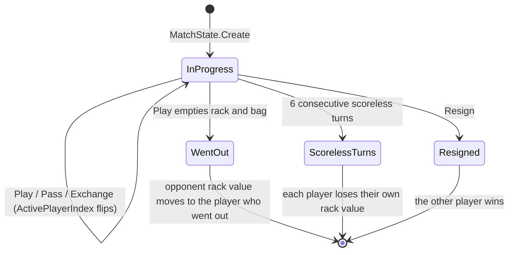

The winner is whoever has the higher score; `WinnerIndex = -1` means a draw. The exception is resignation, which always makes the opponent the winner.

---

## 7. Match Lifecycle — MatchController

`MatchController` is a `SingletonMonoBehaviour<MatchController>` on the `WordBoardServices` prefab. It is the **only** entry point for anything that changes a match.

### Public API

| Group | Members |
|---|---|
| State | `Config`, `RuleSet`, `Rules`, `Dictionary`, `Repository`, `Profile`, `CurrentMatch`, `StartupError`, `IsReady`, `IsHumanTurn`, `IsBotTurn`, `HasResumableMatch` |
| Start | `TryStartStandardMatch(difficulty)`, `TryStartDailyMatch()`, `TryResumeMatch()` |
| Slots | `GetSaveSlots()`, `TrySaveToSlot(slot)`, `TryLoadFromSlot(slot)`, `DeleteSaveSlot(slot)` |
| Human actions | `Preview(move)` (validate only), `TryCommit(move, out result)`, `TryPass()`, `TryExchange(tileIds)`, `Resign()` |
| Bot | `SubmitBotAction(matchId, expectedTurn, proposed)` |
| Persistence | `SaveCurrentMatch()` (also called from `OnApplicationPause(true)` and `OnApplicationQuit`) |

### Commit pipeline

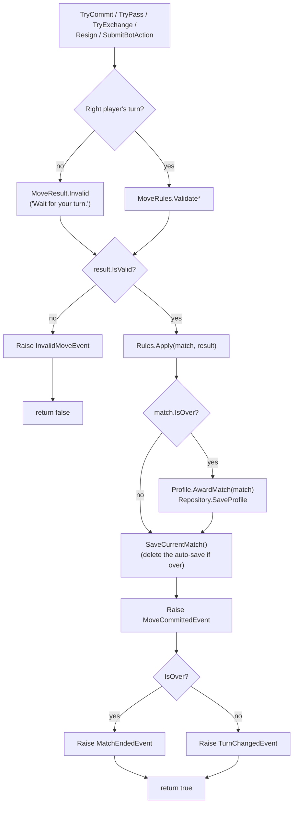

For the bot, `SubmitBotAction` adds two safeguards:

1. **Stale-result guard**: the move is discarded unless it's still the bot's turn, in the same `MatchId`, at the `expectedTurn`.
2. **Re-validation**: the proposed move is validated again against the *live* state, because the bot searched a snapshot. If that fails, the bot passes instead.

### Human play sequence

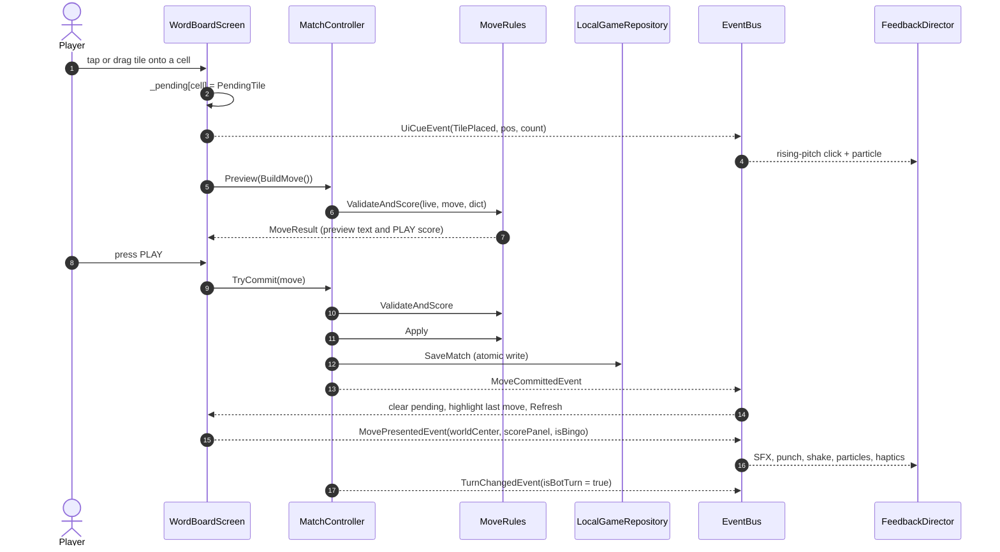

---

## 8. Event Bus Contract

All events go through `MidniteOilSoftware.Core.EventBus` and are immutable `readonly struct`s.

### Match events (`Events/MatchEvents.cs`) — raised by the game logic

| Event | Payload | Raised by |
|---|---|---|
| `MatchStartedEvent` | `Mode`, `Resumed` | `MatchController.BeginMatch` |
| `MoveCommittedEvent` | `PlayerIndex`, `Kind`, `Score`, `TurnNumber`, `Summary` | `MatchController.Commit` |
| `TurnChangedEvent` | `ActivePlayerIndex`, `IsBotTurn`, `TurnNumber` | `MatchController` (after a start or a non-final commit) |
| `InvalidMoveEvent` | `Kind`, `Reason` | `MatchController.Commit` |
| `MatchEndedEvent` | `WinnerIndex`, `Reason`, `HumanScore`, `BotScore`, `XpEarned` | `MatchController.Commit` |
| `BotThinkingEvent` | `IsThinking`, `BudgetLimited`, `CandidateCount` | `BotOpponent` |

### Feedback events (`Events/FeedbackEvents.cs`) — presentation only

| Event | Payload | Raised by |
|---|---|---|
| `UiCueEvent` | `Cue` (`ButtonClick`, `TileLifted`, `TilePlaced`, `TileRecalled`, `Shuffle`, `MenuOpened`, `GameShown`, `SoundToggled`), optional `WorldPosition`, `Count` | `WordBoardScreen` |
| `MovePresentedEvent` | `PlayerIndex`, `Kind`, `Score`, `TileCount`, `IsBingo`, `WorldCenter`, `ScorePanel` | `WordBoardScreen.PresentMove` (after the move has been rendered) |

`MovePresentedEvent` is separate from `MoveCommittedEvent` because effects need **screen positions**, such as where the word landed and which score panel to punch. Only the view knows those.

### Subscription map

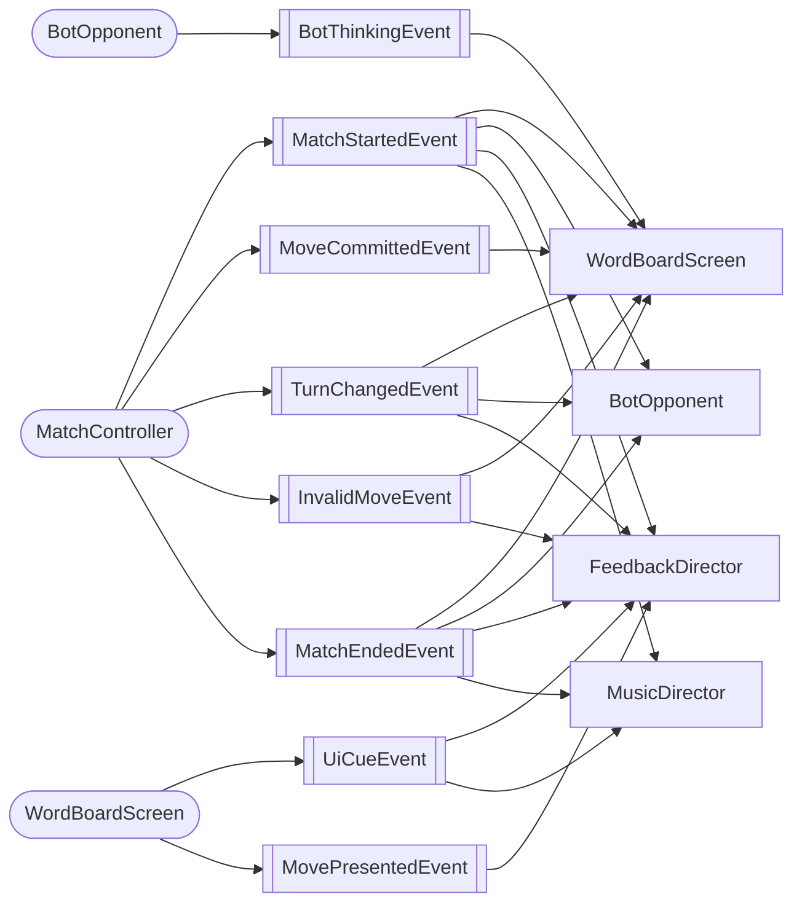

**Subscription convention**: subscribe in `OnEnable` and unsubscribe in `OnDisable`, with a guard like `if (!bus) return;`. Events are raised through a small static `Raise<T>` helper that checks the bus exists first.

---

## 9. Bot Opponent

The bot is split into a **driver** (`BotOpponent`, a `MonoBehaviour`) and a **search** (`BotMoveGenerator`, pure C#).

### Turn flow

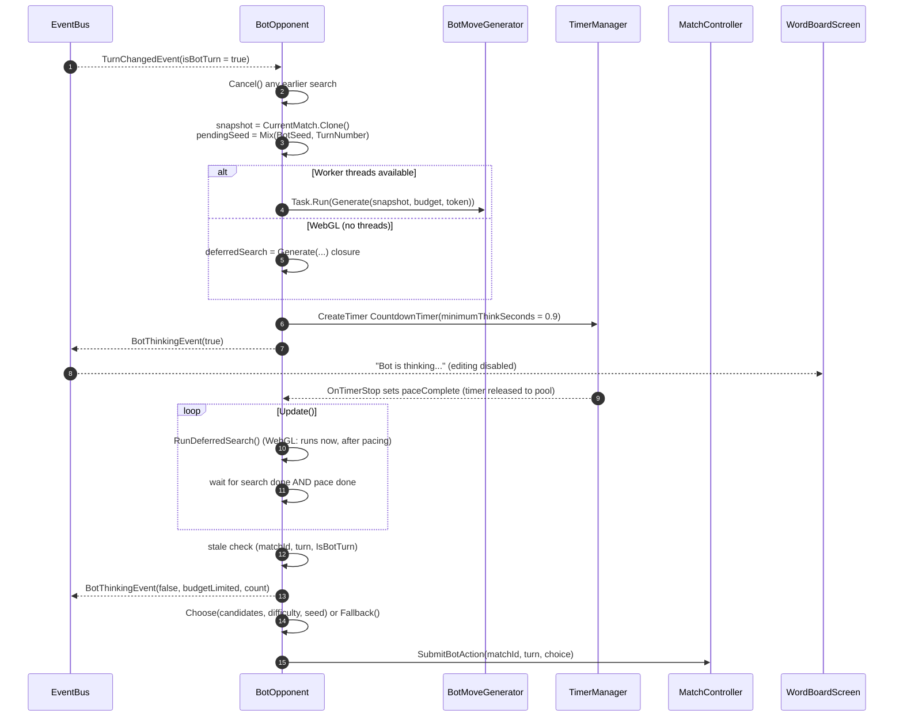

**Cancellation**: `MatchStartedEvent`, `MatchEndedEvent`, a new `TurnChangedEvent`, or `OnDisable` cancels the `CancellationTokenSource`, drops any pending search, and releases the pooled timer. The timer's callback is unhooked first, so a reused timer never calls back into an old bot turn.

### Move generation (`BotMoveGenerator`)

The generator uses the anchor-based **Appel–Jacobson** algorithm, with trie pruning and perpendicular cross-checks.

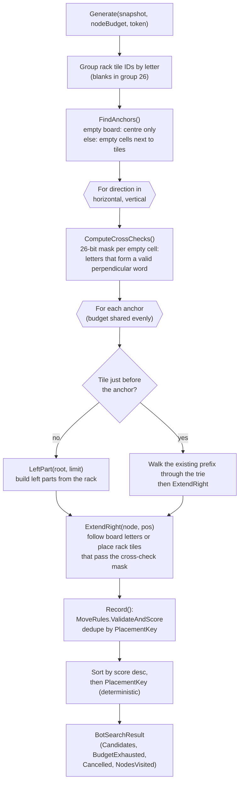

Implementation details:

- **Budget**: each trie edge costs one node (`Spend()`). The budget is spread across the anchors in both directions so a limited search doesn't favour the top-left of the board. Budgets per difficulty: Easy 5,000, Medium 20,000, Hard 80,000.
- **Cancellation** is checked every 256 nodes.
- **Blank handling**: `ForEachTile` tries the real tile first, then a blank standing in for that letter.
- **Correctness**: every candidate goes through `MoveRules.ValidateAndScore`, so the bot can never propose a move the rules would reject.
- If the budget ran out, the UI appends "(Bot searched a limited set of moves.)" to the bot's move summary.

### Difficulty selection (`BotOpponent.Choose`)

| Difficulty | Picks from | Rule |
|---|---|---|
| **Hard** | the best move | `sorted[0]` |
| **Medium** | moves scoring 80% or more of the best | random (seeded) |
| **Easy** | moves scoring > 0 and no more than 40% of the best | random (seeded); falls back to the lowest-scoring move |

If there are no candidates, the bot exchanges its whole rack when that's legal, and passes otherwise. Because the random pick is seeded with `Mix(BotSeed, TurnNumber)`, a restored or daily match makes the same choice every time.

---

## 10. Dictionary

`WordDictionary` loads `Resources/WordLists/enable1.txt` once, unless the `MatchController` inspector supplies a different `TextAsset`.

- A **`HashSet<string>`** (ordinal comparison) gives O(1) `Contains` for validation.
- A **26-way trie** (`TrieNode[]`) backs prefix lookup and the bot search. `TrieCursor` is a read-only struct handle, safe for concurrent reads once loading finishes.
- Words are normalized to uppercase A–Z with at least 2 letters. Anything else is skipped.
- If the list is missing or empty, the constructor **throws**. That sets `MatchController.StartupError`, and the menu shows the error instead of letting a match start.
- `DictionaryId = "ENABLE1"` is written into every match save. A save made with a different word list is rejected on load.
- `FindCandidates(prefix, rack, maxResults, nodeBudget)` is a general-purpose rack-anagram search. The bot doesn't use it; it walks the trie directly.

---

## 11. Determinism and Randomness

`DeterministicRandom` is a **xorshift32** PRNG. Its state is an explicit `ref uint` that gets serialized, so it can resume exactly.

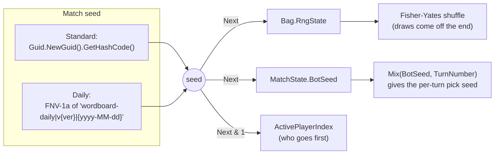

What this guarantees:

- The **bag order is fully stored**. `Draw` takes from the end of `TileIds`, and `Return` reshuffles using the saved `RngState`, so a restored match draws exactly the tiles it would have drawn.
- **Daily matches are the same for every player on a given UTC date**, for the same ruleset version (`DailySeedVersion`).
- `Hash` uses FNV-1a instead of `string.GetHashCode`, which isn't stable across runtimes.
- Presentation-only randomness uses `UnityEngine.Random` and doesn't affect any of the above: rack shuffle order in the UI, music track choice, SFX clip and pitch variation.

---

## 12. Progression and Daily Challenge

### `PlayerProfile` (local only)

| Field | Purpose |
|---|---|
| `TotalXp` | Total XP earned. The level is **calculated** from this, never stored. |
| `MatchesPlayed`, `Wins`, `HighScore` | Stats |
| `DailyAwardDates` | UTC dates whose daily XP has been claimed (keeps the last 90) |
| `AwardedMatchIds` | Match IDs already credited, so reloading a save slot can't award XP twice (keeps the last 200) |

**XP formula** (`CalculateMatchXp`):

```
if resigned and the human lost -> 0
else  20 (participation)
    + 30 win | 15 draw | 0 loss
    + clamp(humanScore / 10, 0, 50)
```

Daily matches give XP **only once per original UTC date**; replays give none. The level is looked up from `xpMilestones` (default: `0, 100, 250, 500, 900, 1500, 2400, 3600, 5200, 7500`, which gives 10 levels).

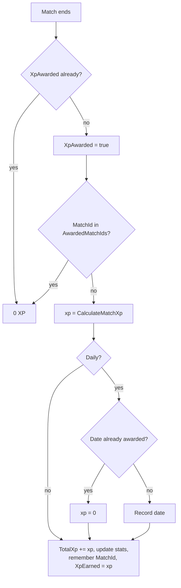

### `DailyChallengeService`

- There is one match per UTC date, always against a **Medium** bot.
- The seed comes from the date plus the ruleset version (see [section 11](#11-determinism-and-randomness)).
- A daily match that's already started keeps its original date after midnight UTC.
- The menu label changes between **DAILY CHALLENGE** and **DAILY (REPLAY)** depending on `IsXpAvailable`.

---

## 13. Persistence

There are two separate stores:

| Store | Technology | Contents |
|---|---|---|
| `LocalGameRepository` | Versioned JSON files via `JsonUtility` + `System.IO` | Auto-save match, 3 manual slots, player profile |
| `GamePreferences` | `MidniteOilSoftware.Core.Settings.SettingsManager` | `WordBoard.Difficulty`, `WordBoard.SoundEnabled` |

### File layout

```
{Application.persistentDataPath}/WordBoard/
├── match.json                      # Auto-save (CONTINUE); deleted when the match ends
├── match.json.bak                  # Previous version, kept by the atomic replace
├── slot1.json … slot3.json         # Manual save slots (+ .bak)
├── profile.json                    # PlayerProfile (+ .bak)
└── *.corrupt-yyyyMMddHHmmss.json   # Quarantined unreadable or incompatible files
```

### Save envelope

```json
{
  "SchemaVersion": 1,
  "RulesetVersion": 1,
  "DictionaryId": "ENABLE1",
  "SavedUtc": "2025-01-01T12:00:00.0000000Z",
  "Match": { "...": "full MatchState, including Bag.RngState and BotSeed" }
}
```

### Write and read paths

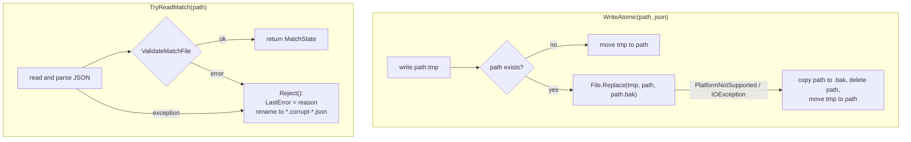

**`ValidateMatchFile`** checks everything before it trusts a save:

1. Schema version, ruleset version, and dictionary ID match.
2. Required arrays exist. The board is 225 cells. The active player and enums are valid. A daily save has a date.
3. The tile count matches the ruleset. Each tile's `Id` matches its index. Each tile's value and the overall letter distribution match the ruleset.
4. **Every tile is in exactly one place**: the bag, one of the racks, or the board. No tile is duplicated or missing.
5. No rack holds more than `RackSize` tiles. Board letters match their tiles, unless the tile is a blank.

`GetSlotInfo` reads a slot only to show a summary in the save/load list. It doesn't validate or quarantine; full validation happens when the slot is actually loaded.

### When saves happen

| Trigger | Action |
|---|---|
| `BeginMatch` (new, resumed, or loaded) | Auto-save |
| Every successful commit | Auto-save; profile save if the match ended |
| Pause overlay → MAIN MENU | `SaveCurrentMatch()` |
| `OnApplicationPause(true)` / `OnApplicationQuit` | `SaveCurrentMatch()` |
| Pause → SAVE GAME → slot | `TrySaveToSlot` (auto-save untouched) |
| Load slot | The slot is copied into the auto-save. The slot itself is left alone so it can be loaded again. |

---

## 14. Presentation Layer (UI)

All UI is **built at runtime** by `WordBoardScreen`, using the Layer Lab *GUI Pro – Casual Game* button prefabs and sprites plus the `BoardCell` and `LetterTile` prefabs. The scene only contains `Canvas → SafeArea`.

### Component hierarchy (runtime)

```
Canvas [WordBoardScreen]
└── SafeArea [SafeAreaPanel]
    ├── Game
    │   ├── Hud (HorizontalLayoutGroup)
    │   │   ├── MENU button
    │   │   ├── HumanScore panel
    │   │   ├── Bag counter
    │   │   ├── BotScore panel
    │   │   └── ZOOM button
    │   ├── Status text
    │   ├── Board [BoardView + RectMask2D + ScrollRect]
    │   │   └── Content
    │   │       └── Cell_00_00 … Cell_14_14 [BoardCellView → LetterTileView]
    │   ├── Preview text
    │   ├── Rack [TileRackView] → RackTile_0..6 [LetterTileView]
    │   ├── ControlsTop: SHUFFLE · RECALL · SWAP · PASS
    │   └── ControlsBottom: PLAY
    ├── DragLayer → DragGhost [LetterTileView]
    └── Overlays (each: dim Image + Panel [VerticalLayoutGroup, ContentSizeFitter, FitInsideRect])
        ├── MenuOverlay
        ├── PauseOverlay
        ├── RulesOverlay
        ├── BlankOverlay (A–Z picker)
        ├── ExchangeOverlay
        ├── EndOverlay
        ├── SaveSlotsOverlay
        └── ConfirmOverlay (always on top)
```

### UI class responsibilities

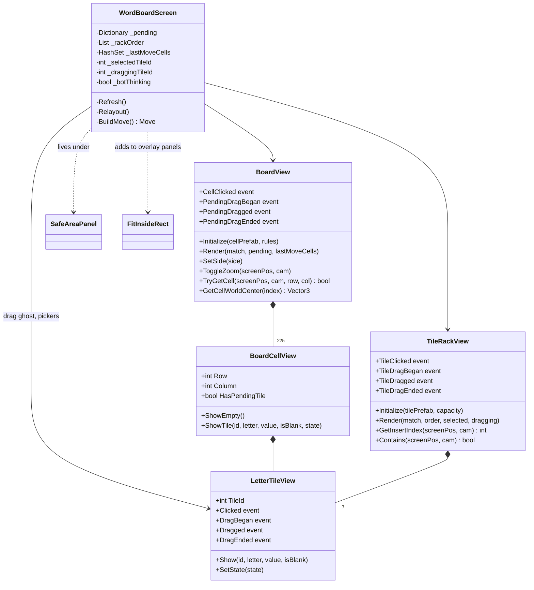

- The views only **render** and **forward input** through C# `event`s. `WordBoardScreen` is the only view-level controller.
- `TileVisualState` is one of `Normal`, `Selected`, `Pending`, `Committed`, `LastMove`, or `Ghost`, and drives the tile face colour and scale.

### Input model

| Gesture | Result |
|---|---|
| Tap a rack tile | Select it or deselect it (`TileLifted` cue) |
| Tap an empty cell while a tile is selected | Place it as pending. A blank opens the letter picker first. |
| Tap a pending tile on the board | Return it to the rack |
| Drag a rack tile | A ghost follows the pointer. Drop on a free cell to place, or on the rack to reorder. |
| Drag a pending tile | Pick it up again; same drop rules |
| Drag an empty or committed cell | Passed to the `ScrollRect` to pan the zoomed board |
| Double-tap an empty cell / press ZOOM | Toggle 1.9× zoom around the point tapped |

Editing is blocked unless `CanEdit` is true: `IsHumanTurn && !_botThinking && !AnyOverlayOpen`.

### Rendering and keeping view state in sync

`Refresh()` is the single render path:

1. `SyncRack`: remove tiles from `_rackOrder` that have left the rack, add new ones, and drop pending tiles that are no longer valid.
2. `BoardView.Render` draws committed tiles, the last move highlighted, pending tiles, and premium squares.
3. `TileRackView.Render` draws the visible rack (rack order minus pending tiles).
4. Update the HUD scores and bag count, and highlight the active player's panel.
5. `UpdatePreview` calls `MatchController.Preview` on the pending move. It shows the words and score, or the validation error.

The last move's cells are found by comparing the board's `TileIds` with the copy taken on the previous commit.

### Screen flow

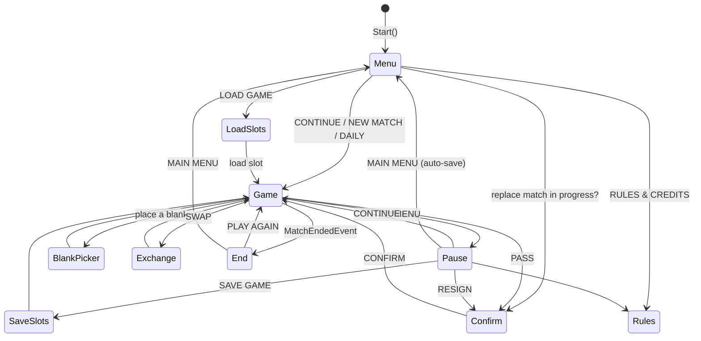

### Responsive layout

- `SafeAreaPanel` fits its `RectTransform` to `Screen.safeArea` (notch, Dynamic Island, home indicator) and reapplies it whenever the screen size or safe area changes.
- `WordBoardScreen.Relayout()` runs whenever the safe-area size changes. It stacks the HUD, status, board, preview, rack, and controls vertically. The board gets whatever square space is left. The column is limited to a 0.7 aspect ratio so it stays readable on wide or desktop screens.
- `FitInsideRect` shrinks overlay panels (never enlarges them) so they always fit inside the safe area.
- `BoardView` builds its own `RectMask2D` + `ScrollRect`. Zoom resizes `Content` and repositions every cell.

---

## 15. Feedback Layer (Audio, Haptics, VFX)

This layer reacts to events only. You can remove the `Feedback` GameObject and the game still plays correctly.

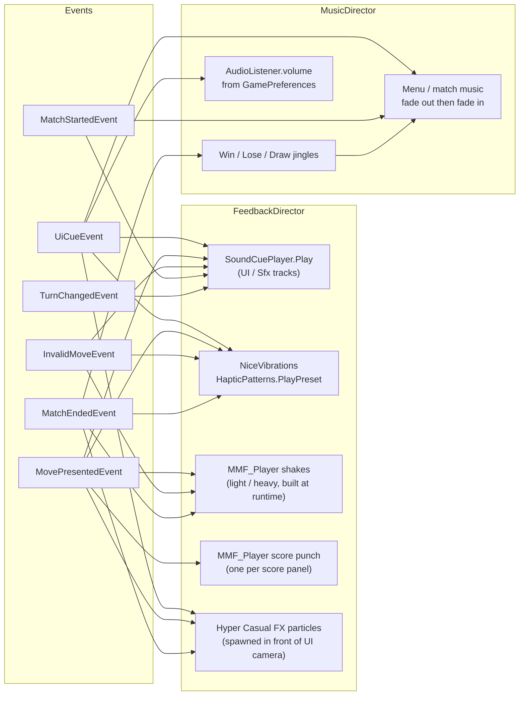

### What each word play triggers

| Situation | Sound | Shake | Other |
|---|---|---|---|
| Human bingo (all 7 tiles) | `Bingo` | Heavy | `BingoFx`, Success haptic |
| Human score at or above `BigWordScore` (30) | `BigWordScored` | Light | `BigWordFx`, MediumImpact haptic |
| Human normal word | `WordScored` | — | `WordFx`, LightImpact haptic |
| Bot word | `BotWordScored` (or `Bingo`) | Light, bingo only | `BotWordFx` / `BingoFx` |
| Invalid move | `InvalidMove` | Light | Failure haptic |
| Human wins | Win jingle | — | `WinFx` + two `WinSideFx`, Success haptic |
| Bot wins | Lose jingle | Heavy | Failure haptic |
| Draw | Draw jingle | — | Warning haptic |

Implementation notes:

- **`SoundCuePlayer`** wraps Feel's `MMSoundManager` (pooled `AudioSource`s). One-shots go to the `UI` or `Sfx` track and music goes to the `Music` track. `FadeOutAndFree` stops any fade-in still running before starting the fade-out, so the two don't fight over the volume.
- **`MusicDirector`** never overlaps two tracks. It fades the current one out and then fades the next one in. After a match it plays a jingle, waits for `MusicReturnDelay`, and brings back the menu music. When picking the next match track it avoids repeating the last one.
- **Tile placement pitch** rises by `TilePlacePitchStep` for each pending tile, so building a word sounds like a rising scale.
- **VFX** are projected onto a plane `FxDepth` in front of the UI camera. They're scaled per cue, and their sorting order is raised by `FxSortingOrder` so they draw over the canvas. A coroutine stops emission after `EmitSeconds` and destroys the effect after `Lifetime`.

---

## 16. Configuration

### `WordGameConfig` (`Word Board/Game Config`)

This asset holds the gameplay rules. `ValidateOrThrow()` runs in `OnValidate` (logs an error in the editor) and in `OnEnable` during play (throws), and **deliberately only accepts the standard English setup**:

| Setting | Default | Validation |
|---|---|---|
| `tileCounts[27]` / `tileValues[27]` | Standard English distribution | Must match exactly. 100 tiles in total, including 2 zero-point blanks. |
| `premiumRows[15]` | Standard layout (`.` plain, `2` DL, `3` TL, `4` DW, `5` TW) | 15×15, rotationally symmetric, centre is DW, exactly 24 DL / 12 TL / 17 DW / 8 TW |
| `rackSize` | 7 | Must be 7 |
| `fullRackBonus` | 50 | Must be 50 |
| `scorelessTurnLimit` | 6 | Must be 6 |
| `easy/medium/hardBotNodeBudget` | 5,000 / 20,000 / 80,000 | Must not decrease from Easy to Hard |
| `easy/mediumBotTopScoreFraction` | 0.4 / 0.8 | 0 ≤ easy ≤ medium ≤ 1 |
| `xpMilestones` | 10 levels | Starts at 0 and strictly increases |
| `dailySeedVersion` | 1 | At least 1. Changing it changes every daily puzzle and makes existing saves incompatible. |

### `WordBoardFeedbackConfig` (`Word Board/Feedback Config`)

This asset holds presentation settings only. It is organised into sections: Music, Jingles, UI sounds, Gameplay sounds, Thresholds, Visual effects, Shake, Score punch, and Haptics. Two serializable helper types are used:

- `SoundCue` — `Clips[]` (one is picked at random), `Volume`, `PitchRange`
- `FxCue` — `Prefab`, `Scale`, `EmitSeconds`, `Lifetime`

### Inspector-level settings

| Component | Field | Purpose |
|---|---|---|
| `MatchController` | `_config`, `_wordList` | Rules asset; optional word-list override |
| `BotOpponent` | `_minimumThinkSeconds` (0.9) | Minimum "thinking" time, for presentation only |
| `WordBoardScreen` | `_gameTitle`, prefabs, sprites, font, colours | Runtime UI styling |
| `BoardView` | `_zoomScale` (1.9) | Zoom factor |
| `TileRackView` | `_spacing` (10) | Gap between rack tiles |
| `FeedbackDirector` | `_config`, `_shakeTarget` (SafeArea), `_fxCamera` | Feedback wiring |
| `MusicDirector` | `_config` | Feedback config reference |

---

## 17. Platform Considerations

| Concern | Handling |
|---|---|
| **Targets** | iOS and Web (mobile-focused WebGL) build profiles. The WebGL build uses the `WordBoardTouch` template. |
| **WebGL has no threads** | `BotOpponent` switches on `UNITY_WEBGL && !UNITY_EDITOR`. The search runs synchronously on the main thread **after** the pacing timer, so the "Bot is thinking…" state has already been drawn. |
| **Thread safety** | The worker thread only touches a `MatchState.Clone()` (via `JsonUtility`, which is safe off the main thread), the immutable `RuleSet`, the stateless `MoveRules`, and the read-only `WordDictionary`. |
| **Mobile lifecycle** | `OnApplicationPause(true)` saves the match, because iOS may kill a suspended app without calling `OnApplicationQuit`. |
| **`File.Replace` support** | `WriteAtomic` falls back to copy, delete, and move where `File.Replace` isn't supported (for example, the WebGL IndexedDB file system). |
| **Enter Play Mode without domain reload** | `SingletonStaticReset` uses reflection at `SubsystemRegistration` to clear static fields on every `SingletonMonoBehaviour<T>`. |
| **Safe areas and aspect ratios** | `SafeAreaPanel`, the 0.7 max aspect in `Relayout`, `FitInsideRect`, and `CanvasScaler` in Expand mode at 540×960 |
| **Input** | New Input System through `InputSystemUIInputModule`. All gameplay input goes through uGUI pointer and drag events. |
| **Haptics** | NiceVibrations presets, which can be switched off with `HapticsEnabled` |

---

## 18. Third-Party Dependencies

| Dependency | Used for |
|---|---|
| `com.midniteoilsoftware.core` | `EventBus`, `SingletonMonoBehaviour<T>`, `TimerManager` / `CountdownTimer` (pooled), `SettingsManager` |
| **Feel** (MoreMountains) — `MMFeedbacks`, `MMTools` | `MMF_Player`, `MMF_PositionShake`, `MMF_Scale`, `MMPositionShaker`, `MMSoundManager`, `MMTween` |
| **NiceVibrations** (Lofelt, bundled with Feel) | `HapticPatterns` presets |
| **Layer Lab — GUI Pro Casual Game** | Button prefabs, panel and dim sprites |
| **Lana Studio — Hyper Casual FX** | Particle prefabs referenced by `FxCue`s |
| **TextMesh Pro** | All text (Lilita One font, SIL OFL) |
| Audio packs (`Assets/ThirdParty`) | Jingles, UI clicks, casual SFX |
| **ENABLE word list** | Public-domain lexicon (credited on the Rules screen) |
| Unity packages | URP (2D renderer), uGUI, Input System |

Editor-only tooling in the project (Asset Inventory, Sasquatch Inspector) isn't used by the game at runtime.

---

## 19. Extension Guide

### Adding a new match action

1. Add a value to `MoveKind` and a factory method on `MoveResult`.
2. Add `MoveRules.ValidateX(...)` (pure) and a `case` in `MoveRules.Apply`.
3. Add a `TryX` method on `MatchController` that goes through `Commit(...)`.
4. If the bot can take the action, handle it in the `SubmitBotAction` switch.
5. Add a button in `WordBoardScreen` that calls the controller, never the rules directly.

### Adding a new event

1. Add a `readonly struct` to `Events/MatchEvents.cs` (gameplay) or `Events/FeedbackEvents.cs` (presentation).
2. Raise it from its **owning** layer: the controller for gameplay, the view for presentation.
3. Subscribe in `OnEnable` and unsubscribe in `OnDisable`, guarding on `EventBus.Instance`.

### Adding a new sound or effect

1. Add a `SoundCue` or `FxCue` property to `WordBoardFeedbackConfig`.
2. Play it from `FeedbackDirector` in response to an existing event.
3. Assign the clips or prefab in `DefaultWordBoardFeedbackConfig.asset`.

### Changing rules or the save format

- If you change the ruleset in a way that affects saves or daily puzzles, bump `dailySeedVersion`. Existing saves with the old version will be rejected and quarantined.
- If you change the shape of `MatchState` or `PlayerProfile`, bump `LocalGameRepository.SchemaVersion` and add a migration step before validation. At the moment an old-version file is quarantined, not migrated.

---

## 20. Known Constraints and Future Work

| Area | Current state | Possible direction |
|---|---|---|
| Player count | Exactly two players are hard-coded (`HumanIndex = 0`, `BotIndex = 1`, `1 - index` turn flipping). | Generalize `PlayerState[]` and turn order before adding local or online multiplayer. |
| Ruleset flexibility | `ValidateOrThrow` only accepts the standard English setup. | Loosen validation behind a variant flag for other languages or house rules. |
| `WordBoardScreen` size | About 1,280 lines covering input, rendering, menu flow, and runtime construction | Split it into `GameHudView`, `OverlayController`, `PlacementController`, and a UI builder. |
| VFX lifetime | `Instantiate`/`Destroy` for every effect | Pool the particle instances. |
| Bot search on WebGL | Runs synchronously on the main thread, so a Hard budget can cause a frame hitch | Split the search across frames (a coroutine with a per-frame node budget). |
| Save migrations | An incompatible schema is quarantined | Add versioned migration handlers. |
| Standard match seed | `Guid.NewGuid().GetHashCode()` | Fine for variety. Store or expose the seed if you want shareable games. |
| Localization | Player-facing strings are hard-coded in `WordBoardScreen` and `MoveRules` error messages | Route them through a localization table. |